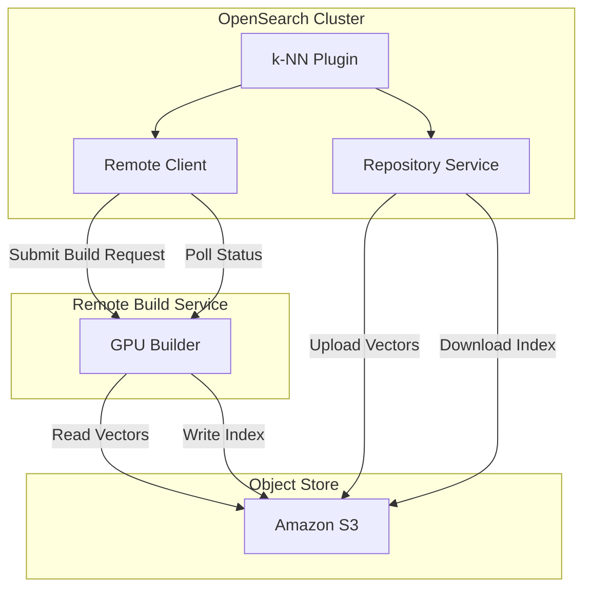

---
tags:
  - domain/search
  - component/server
  - indexing
  - k-nn
  - observability
---
# Remote Vector Index Build

## Summary

OpenSearch 3.0 introduces experimental support for building vector indexes remotely using GPU-accelerated services. This feature offloads the computationally intensive HNSW index construction to external GPU-powered infrastructure, dramatically reducing index build times and costs for large-scale vector workloads.

## Details

### What's New in v3.0.0

This release introduces the foundational components for remote vector index building:

- **Remote Index Client**: HTTP client with polling mechanism to communicate with external build services
- **Repository Integration**: Support for Amazon S3 as intermediate storage between OpenSearch and the build service
- **Metric Collection**: Comprehensive statistics for monitoring remote build operations
- **COSINESIMIL Support**: Bug fix to properly handle cosine similarity space type conversion for Faiss

### Technical Changes

#### Architecture Changes



#### New Components

| Component | Description |
|-----------|-------------|
| `RemoteIndexClient` | Interface for communicating with remote build services |
| `RemoteIndexHTTPClient` | HTTP implementation with connection pooling |
| `RemoteIndexWaiter` | Interface for awaiting build completion |
| `RemoteIndexPoller` | Polling-based implementation for status checks |
| `RemoteIndexBuildStrategy` | Strategy pattern for local vs remote build decisions |
| `remote-index-build-client` | Separate module for client code |

#### New Configuration

| Setting | Description | Default |
|---------|-------------|---------|
| `knn.feature.remote_index_build.enabled` | Enable remote build for cluster | `false` |
| `index.knn.remote_index_build.enabled` | Enable remote build for index | `false` |
| `knn.remote_index_build.client.endpoint` | Remote builder service endpoint | - |
| `knn.remote_index_build.vector_repo` | S3 repository name for vectors | - |
| `index.knn.remote_index_build.size_threshold` | Minimum segment size for remote build | - |

#### New Metrics

The `/stats` API returns remote build statistics when the feature is enabled:

```json
{
  "remote_vector_index_build_stats": {
    "repository_stats": {
      "read_success_count": 0,
      "read_failure_count": 0,
      "successful_read_time_in_millis": 0,
      "write_success_count": 0,
      "write_failure_count": 0,
      "successful_write_time_in_millis": 0
    },
    "client_stats": {
      "status_request_failure_count": 0,
      "status_request_success_count": 0,
      "index_build_success_count": 0,
      "index_build_failure_count": 0,
      "build_request_failure_count": 0,
      "build_request_success_count": 0,
      "waiting_time_in_ms": 0
    },
    "build_stats": {
      "remote_index_build_flush_time_in_millis": 0,
      "remote_index_build_current_merge_operations": 0,
      "remote_index_build_current_flush_operations": 0,
      "remote_index_build_current_merge_size": 0,
      "remote_index_build_current_flush_size": 0,
      "remote_index_build_merge_time_in_millis": 0
    }
  }
}
```

### Usage Example

```yaml
# 1. Enable the feature flag
PUT _cluster/settings
{
  "persistent": {
    "knn.feature.remote_index_build.enabled": true,
    "knn.remote_index_build.client.endpoint": "http://gpu-builder:8080",
    "knn.remote_index_build.vector_repo": "vector-repo"
  }
}

# 2. Create index with remote build enabled
PUT my-vector-index
{
  "settings": {
    "index.knn": true,
    "index.knn.remote_index_build.enabled": true
  },
  "mappings": {
    "properties": {
      "my_vector": {
        "type": "knn_vector",
        "dimension": 768,
        "method": {
          "name": "hnsw",
          "engine": "faiss"
        }
      }
    }
  }
}
```

### Migration Notes

This is an experimental feature requiring:
1. A running [remote-vector-index-builder](https://github.com/opensearch-project/remote-vector-index-builder) service
2. An S3 repository registered with OpenSearch
3. Network connectivity between OpenSearch, S3, and the build service

## Limitations

- **Experimental**: Not recommended for production use
- **Engine Support**: Only Faiss HNSW indexes with FP32 vectors
- **Encoder Support**: Only `HNSWFlat` (no product quantization)
- **Repository**: Only Amazon S3 repositories supported
- **Space Types**: L2, inner product, and cosine similarity

## References

### Documentation
- [Documentation](https://docs.opensearch.org/3.0/vector-search/remote-index-build/): Official docs
- [Remote Vector Index Builder](https://github.com/opensearch-project/remote-vector-index-builder): Build service repository

### Blog Posts
- [GPU Acceleration Blog](https://opensearch.org/blog/GPU-Accelerated-Vector-Search-OpenSearch-New-Frontier/): Benchmarking results

### Pull Requests
| PR | Description |
|----|-------------|
| [#2576](https://github.com/opensearch-project/k-NN/pull/2576) | Client polling mechanism, encoder check, method parameter retrieval |
| [#2603](https://github.com/opensearch-project/k-NN/pull/2603) | Move client to separate module |
| [#2615](https://github.com/opensearch-project/k-NN/pull/2615) | Add metric collection for remote build process |
| [#2627](https://github.com/opensearch-project/k-NN/pull/2627) | Fix COSINESIMIL space type support |

### Issues (Design / RFC)
- [Issue #2391](https://github.com/opensearch-project/k-NN/issues/2391): Meta issue for remote vector index build

## Related Feature Report

- [Full feature documentation](../../../features/k-nn/k-nn-remote-vector-index-build.md)
