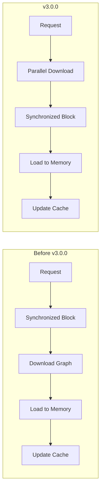

# Vector Search (k-NN)

## Summary

OpenSearch 3.0.0 introduces significant breaking changes and new features to the k-NN plugin. The breaking changes remove deprecated index-level settings (`index.knn.algo_param.ef_construction`, `index.knn.algo_param.m`, `index.knn.space_type`, and `knn.plugin.enabled`) that were previously deprecated in favor of method-level parameters. New features include node-level circuit breakers for heterogeneous clusters, filter functions in KNNQueryBuilder, concurrency optimizations for graph loading, and the foundation for Remote Native Index Build capability.

## Details

### What's New in v3.0.0

#### Breaking Changes

The following deprecated settings have been removed:

| Removed Setting | Migration Path |
|-----------------|----------------|
| `index.knn.algo_param.ef_construction` | Use `method.parameters.ef_construction` in field mapping |
| `index.knn.algo_param.m` | Use `method.parameters.m` in field mapping |
| `index.knn.space_type` | Use `method.space_type` in field mapping |
| `knn.plugin.enabled` | Setting removed; plugin is always enabled when installed |

**Migration Example:**

Before (deprecated):
```json
PUT /my-index
{
  "settings": {
    "index.knn": true,
    "index.knn.algo_param.ef_construction": 256,
    "index.knn.algo_param.m": 16,
    "index.knn.space_type": "l2"
  }
}
```

After (v3.0.0):
```json
PUT /my-index
{
  "settings": {
    "index.knn": true
  },
  "mappings": {
    "properties": {
      "my_vector": {
        "type": "knn_vector",
        "dimension": 128,
        "method": {
          "name": "hnsw",
          "space_type": "l2",
          "engine": "faiss",
          "parameters": {
            "ef_construction": 256,
            "m": 16
          }
        }
      }
    }
  }
}
```

#### New Features

##### Node-Level Circuit Breakers

Introduces node-specific circuit breaker limits using node attributes, enabling heterogeneous memory limits across nodes with different capacities.

**Configuration:**

1. Set node attribute in `opensearch.yml`:
```yaml
node.attr.knn_cb_tier: "large"
```

2. Configure limit for that tier:
```json
PUT /_cluster/settings
{
  "persistent": {
    "knn.memory.circuit_breaker.limit.large": "75%"
  }
}
```

| Setting | Description | Default |
|---------|-------------|---------|
| `knn.memory.circuit_breaker.limit.<tier>` | Memory limit for nodes with `knn_cb_tier` attribute | Falls back to cluster default |

##### Filter Function in KNNQueryBuilder

Adds filter function support to KNNQueryBuilder, enabling filtered k-NN searches with custom scoring functions.

##### Concurrency Optimizations for Graph Loading

Refactors graph loading into a 2-step approach that moves file operations outside synchronized blocks, enabling parallel graph file downloads while maintaining thread safety for cache operations.



##### Remote Native Index Build (Foundation)

Introduces the foundation for building k-NN indexes on remote infrastructure:

| Component | Description |
|-----------|-------------|
| `RemoteNativeIndexBuildStrategy` | Strategy skeleton for remote index building |
| `RemoteIndexClient` | HTTP client for communicating with remote build service |
| Vector data upload | Parallel blob upload to remote repository (S3) |
| Graph download | Sequential download with 64KB buffer for memory efficiency |

**New Settings:**

| Setting | Description | Default |
|---------|-------------|---------|
| `knn.remote_index_build.enabled` | Feature flag for remote index build | `false` |
| `knn.remote_index_build.size_threshold` | Size threshold above which remote build is used | - |
| `knn.remote_index_build.repository` | Repository name for vector storage | - |

### Bug Fixes

| PR | Description |
|----|-------------|
| [#2556](https://github.com/opensearch-project/k-NN/pull/2556) | Fix NullPointerException during PUT mappings |
| [#2629](https://github.com/opensearch-project/k-NN/pull/2629) | Add index operation listener to update translog source |
| [#2647](https://github.com/opensearch-project/k-NN/pull/2647) | Add parent join support for faiss hnsw cagra |
| [#2646](https://github.com/opensearch-project/k-NN/pull/2646) | Disable doc value storage for vector field storage |
| [#2666](https://github.com/opensearch-project/k-NN/pull/2666) | Fix KNN Quantization state cache invalid weight threshold |
| [#2671](https://github.com/opensearch-project/k-NN/pull/2671) | Fix enable rescoring when dimensions > 1000 |
| [#2533](https://github.com/opensearch-project/k-NN/pull/2533) | Fix derived source for binary and byte vectors |
| [#2542](https://github.com/opensearch-project/k-NN/pull/2542) | Fix put mapping issue for already created index with flat mapper |
| [#2445](https://github.com/opensearch-project/k-NN/pull/2445) | Prevent index.knn setting from being modified on restore snapshot |
| [#2429](https://github.com/opensearch-project/k-NN/pull/2429) | Fix Lucene912Codec BWC issue for Lucene 10.0.1 upgrade |

### Enhancements

| PR | Description |
|----|-------------|
| [#688](https://github.com/opensearch-project/OpenSearch-Dashboards/pull/688) | Add callout if knn query does not have knn index |
| [#2378](https://github.com/opensearch-project/k-NN/pull/2378) | Add detailed error messages for KNN model training |

## Limitations

- Remote Native Index Build is behind a feature flag and not production-ready
- Node-level circuit breakers require manual node attribute configuration
- Parallel graph download not yet implemented for Remote Index Build

## Related PRs

| PR | Description |
|----|-------------|
| [#2564](https://github.com/opensearch-project/k-NN/pull/2564) | 3.0.0 Breaking Changes for KNN |
| [#2509](https://github.com/opensearch-project/k-NN/pull/2509) | Introduce node level circuit breaker settings |
| [#2599](https://github.com/opensearch-project/k-NN/pull/2599) | Add filter function to KNNQueryBuilder |
| [#2345](https://github.com/opensearch-project/k-NN/pull/2345) | Concurrency optimization for native graph loading |
| [#2525](https://github.com/opensearch-project/k-NN/pull/2525) | Remote Native Index Build skeleton |
| [#2550](https://github.com/opensearch-project/k-NN/pull/2550) | Vector data upload implementation |
| [#2554](https://github.com/opensearch-project/k-NN/pull/2554) | Data download and IndexOutput write |
| [#2560](https://github.com/opensearch-project/k-NN/pull/2560) | RemoteIndexClient skeleton and Build Request |

## References

- [Issue #2263](https://github.com/opensearch-project/k-NN/issues/2263): Node level circuit breaker feature request
- [Issue #2265](https://github.com/opensearch-project/k-NN/issues/2265): Concurrency optimizations feature request
- [Issue #2465](https://github.com/opensearch-project/k-NN/issues/2465): Remote Native Index Build design
- [Vector Search Documentation](https://docs.opensearch.org/3.0/vector-search/): Official docs
- [k-NN API Documentation](https://docs.opensearch.org/3.0/vector-search/api/knn/): API reference
- [OpenSearch 3.0 Blog](https://opensearch.org/blog/opensearch-3-0-what-to-expect/): Release overview

## Related Feature Report

- [Full feature documentation](../../../features/k-nn/vector-search-k-nn.md)
