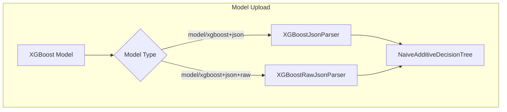

# Learning to Rank Bug Fixes

## Summary

OpenSearch v3.0.0 includes two bug fixes for the Learning to Rank (LTR) plugin: a new XGBoost model parser for the correct serialization format (`save_model` output), and a test fix for `ApproximateScoreQuery`.

## Details

### What's New in v3.0.0

#### XGBoost Raw JSON Parser (PR #151)

The LTR plugin previously used the wrong method for loading XGBoost models. It expected the output format of the `get_dump` method, which is only meant for visualization purposes and cannot be loaded back into XGBoost. This PR adds a new parser (`XGBoostRawJsonParser`) that correctly handles the output format of XGBoost's `save_model` method.

**Problem**: The existing `model/xgboost+json` type expected the `get_dump` format, which is human-readable but not the correct serialization format.

**Solution**: A new model type `model/xgboost+json+raw` was added that parses the proper `save_model` JSON output.

#### ApproximateScoreQuery Test Fix (PR #158)

A test assertion was updated to match the correct query type. The test expected `MatchAllDocsQuery` but the actual query type is `ApproximateScoreQuery`.

### Technical Changes

#### New Components

| Component | Description |
|-----------|-------------|
| `XGBoostRawJsonParser` | New parser for XGBoost `save_model` JSON format |
| Model type `model/xgboost+json+raw` | New model type identifier for raw XGBoost models |

#### Architecture Changes



#### Key Implementation Details

The new `XGBoostRawJsonParser` handles:
- Feature name mapping from model to feature set
- Feature reordering to match the feature set order
- Objective function normalization (sigmoid for logistic, noop for linear/ranking)
- Tree structure parsing from the raw JSON format

**Supported Objectives**:
- `binary:logistic`, `reg:logistic` → Sigmoid normalization
- `binary:logitraw`, `rank:ndcg`, `rank:map`, `rank:pairwise`, `reg:linear` → No normalization

### Usage Example

Upload an XGBoost model using the new raw format:

```json
POST _ltr/_featureset/my_features/_createmodel
{
    "model": {
        "name": "my_xgboost_model",
        "model": {
            "type": "model/xgboost+json+raw",
            "definition": "{\"learner\":{\"feature_names\":[\"feat1\"],\"feature_types\":[\"float\"],\"gradient_booster\":{\"model\":{\"trees\":[...]}},\"objective\":{\"name\":\"reg:linear\"}}}"
        }
    }
}
```

### Migration Notes

- Existing models using `model/xgboost+json` continue to work unchanged
- For new XGBoost models, use `model/xgboost+json+raw` with the output from `booster.save_model()`
- The raw format includes feature names, allowing automatic feature mapping

## Limitations

- Only `float` feature types are supported (OpenSearch scores are always float32)
- Feature names in the model must match feature names in the feature set

## Related PRs

| PR | Description |
|----|-------------|
| [#151](https://github.com/opensearch-project/opensearch-learning-to-rank-base/pull/151) | Add XGBoost model parser for correct serialization format |
| [#158](https://github.com/opensearch-project/opensearch-learning-to-rank-base/pull/158) | Fix test for ApproximateScoreQuery |

## References

- [Original Issue (o19s)](https://github.com/o19s/elasticsearch-learning-to-rank/issues/497): XGBoost model loading issue
- [Port from o19s](https://github.com/o19s/elasticsearch-learning-to-rank/pull/500): Original fix in Elasticsearch LTR
- [XGBoost save_model documentation](https://xgboost.readthedocs.io/en/stable/python/python_api.html#xgboost.Booster.save_model)
- [Learning to Rank Documentation](https://docs.opensearch.org/3.0/search-plugins/ltr/index/)
- [Uploading trained models](https://docs.opensearch.org/3.0/search-plugins/ltr/training-models/)

## Related Feature Report

- [Full feature documentation](../../../features/learning/learning-to-rank.md)
