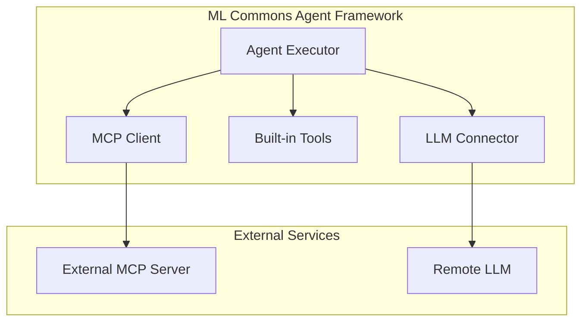

# ML Commons Bugfixes and Improvements

## Summary

OpenSearch 3.0.0 includes 29 changes to the ML Commons plugin, addressing critical bugfixes, stability improvements, and new features for the agent framework. Key highlights include MCP (Model Context Protocol) integration, new agent types, function calling support, and numerous fixes for circuit breakers, tools, and session management.

## Details

### What's New in v3.0.0

This release focuses on three major areas:

1. **MCP Integration**: Full support for Model Context Protocol, enabling agents to connect to external MCP servers and use their tools
2. **Agent Framework Enhancements**: New Plan-Execute-Reflect agent type, async execution mode, and function calling support
3. **Stability Improvements**: Fixes for circuit breakers, tool execution, and session management

### Technical Changes

#### Architecture Changes



#### New Features

| Feature | Description | PR |
|---------|-------------|-----|
| MCP Client Onboarding | Connect agents to external MCP servers | [#3721](https://github.com/opensearch-project/ml-commons/pull/3721) |
| MCP Server Support | Built-in MCP server in OpenSearch | [#3781](https://github.com/opensearch-project/ml-commons/pull/3781) |
| Plan-Execute-Reflect Agent | New agent type for complex task decomposition | [#3716](https://github.com/opensearch-project/ml-commons/pull/3716) |
| Async Agent Execution | Asynchronous mode for agent execution | [#3714](https://github.com/opensearch-project/ml-commons/pull/3714) |
| Function Calling | Support for OpenAI v1, Bedrock Claude, DeepSeek | [#3712](https://github.com/opensearch-project/ml-commons/pull/3712) |
| Custom Prompts | User-controlled prompts for PlanExecuteReflect agent | [#3731](https://github.com/opensearch-project/ml-commons/pull/3731) |
| Sentence Highlighting QA | Support for sentence highlighting in QA models | [#3600](https://github.com/opensearch-project/ml-commons/pull/3600) |
| Highlighting Model Translator | Updated translator for new highlighting models | [#3699](https://github.com/opensearch-project/ml-commons/pull/3699) |
| ModelTensorOutput Parser | Parser for ModelTensorOutput and ModelTensors | [#3658](https://github.com/opensearch-project/ml-commons/pull/3658) |

#### Breaking Changes

| Change | Description | Migration |
|--------|-------------|-----------|
| CatIndexTool API Change | Uses `_list/indices` API instead of `_cat/index` | Update tool configurations | [#3243](https://github.com/opensearch-project/ml-commons/pull/3243) |
| Batch Ingestion API Deprecated | REST API for batch ingestion removed | Use alternative ingestion methods | [#3688](https://github.com/opensearch-project/ml-commons/pull/3688) |

#### Bugfixes

| Issue | Fix | PR |
|-------|-----|-----|
| Circuit Breaker for Remote Models | Fixed circuit breaker triggering incorrectly | [#3652](https://github.com/opensearch-project/ml-commons/pull/3652) |
| Circuit Breaker for Agents | Excluded agents from circuit breaker | [#3814](https://github.com/opensearch-project/ml-commons/pull/3814) |
| ListIndexTool and SearchIndexTool | Fixed tool execution issues | [#3720](https://github.com/opensearch-project/ml-commons/pull/3720) |
| SearchIndexTool NaN Handling | Parse special floating point values and NaN | [#3754](https://github.com/opensearch-project/ml-commons/pull/3754) |
| Model Response toolUse | Handle responses without accompanying text | [#3755](https://github.com/opensearch-project/ml-commons/pull/3755) |
| React Agent max_iterations | Allow user control to prevent empty responses | [#3756](https://github.com/opensearch-project/ml-commons/pull/3756) |
| GetResponse null handling | Replace null with valid response | [#3759](https://github.com/opensearch-project/ml-commons/pull/3759) |
| Input/Output Map Length | Improved error message for mismatched lengths | [#3730](https://github.com/opensearch-project/ml-commons/pull/3730) |
| Config Index Masterkey | Fixed multi-tenancy masterkey pull up | [#3700](https://github.com/opensearch-project/ml-commons/pull/3700) |
| MCP Session Management | Support for MCP session management | [#3803](https://github.com/opensearch-project/ml-commons/pull/3803) |
| Customized Message Endpoint | Support for customized endpoints | [#3810](https://github.com/opensearch-project/ml-commons/pull/3810) |
| Metadata Client Responses | Return Response objects directly | [#3768](https://github.com/opensearch-project/ml-commons/pull/3768) |
| Data Source Compatibility | Fixed prerelease compatibility | [#411](https://github.com/opensearch-project/ml-commons/pull/411) |
| Build/CI Fixes | Multiple workflow and compilation fixes | [#421](https://github.com/opensearch-project/ml-commons/pull/421), [#3617](https://github.com/opensearch-project/ml-commons/pull/3617), [#3667](https://github.com/opensearch-project/ml-commons/pull/3667), [#3674](https://github.com/opensearch-project/ml-commons/pull/3674) |
| Accidental File Removal | Removed mistakenly added zip file | [#3763](https://github.com/opensearch-project/ml-commons/pull/3763) |

### Usage Example

#### Using MCP Connector with Agent

```json
POST /_plugins/_ml/agents/_register
{
  "name": "MCP-enabled Agent",
  "type": "conversational",
  "llm": {
    "model_id": "<your_model_id>"
  },
  "parameters": {
    "_llm_interface": "openai/v1/chat/completions",
    "mcp_connectors": [
      {
        "mcp_connector_id": "<your_mcp_connector_id>",
        "tool_filters": ["^get_", "search_"]
      }
    ]
  }
}
```

#### Async Agent Execution

```json
POST /_plugins/_ml/agents/<agent_id>/_execute?async=true
{
  "parameters": {
    "question": "Analyze the sales data for Q4"
  }
}
```

### Migration Notes

1. **CatIndexTool Users**: Update any configurations using CatIndexTool to expect the new `_list/indices` API response format
2. **Batch Ingestion Users**: The `POST /_plugins/_ml/_batch_ingestion` endpoint is deprecated; migrate to alternative ingestion methods
3. **Circuit Breaker Configuration**: Review circuit breaker settings if experiencing issues with remote model or agent execution

## Limitations

- MCP integration is experimental and requires enabling `transport-reactor-netty4`
- Plan-Execute-Reflect agent is experimental
- MCP tools can only be used with conversational or plan-execute-reflect agent types

## Related PRs

| PR | Description |
|----|-------------|
| [#411](https://github.com/opensearch-project/ml-commons/pull/411) | Fix data source not compatible with prerelease |
| [#421](https://github.com/opensearch-project/ml-commons/pull/421) | Fix verify install binary workflow failed |
| [#3243](https://github.com/opensearch-project/ml-commons/pull/3243) | Use _list/indices API instead of _cat/index API in CatIndexTool |
| [#3600](https://github.com/opensearch-project/ml-commons/pull/3600) | Support sentence highlighting QA model |
| [#3617](https://github.com/opensearch-project/ml-commons/pull/3617) | Fix building error due to a breaking change from core |
| [#3652](https://github.com/opensearch-project/ml-commons/pull/3652) | Fixing the circuit breaker issue for remote model |
| [#3658](https://github.com/opensearch-project/ml-commons/pull/3658) | Add parser for ModelTensorOutput and ModelTensors |
| [#3667](https://github.com/opensearch-project/ml-commons/pull/3667) | Fix compilation error |
| [#3674](https://github.com/opensearch-project/ml-commons/pull/3674) | Revert CI workflow changes |
| [#3688](https://github.com/opensearch-project/ml-commons/pull/3688) | Deprecate the restful API of batch ingestion |
| [#3699](https://github.com/opensearch-project/ml-commons/pull/3699) | Update highlighting model translator to adapt new model |
| [#3700](https://github.com/opensearch-project/ml-commons/pull/3700) | Fix config index masterkey pull up for multi-tenancy |
| [#3712](https://github.com/opensearch-project/ml-commons/pull/3712) | Function calling for openai v1, bedrock claude and deepseek |
| [#3714](https://github.com/opensearch-project/ml-commons/pull/3714) | Implement async mode in agent execution |
| [#3716](https://github.com/opensearch-project/ml-commons/pull/3716) | Plan, Execute and Reflect Agent Type |
| [#3720](https://github.com/opensearch-project/ml-commons/pull/3720) | Fix ListIndexTool and SearchIndexTool |
| [#3721](https://github.com/opensearch-project/ml-commons/pull/3721) | Onboard MCP |
| [#3730](https://github.com/opensearch-project/ml-commons/pull/3730) | Fix error message when input map and output map length not match |
| [#3731](https://github.com/opensearch-project/ml-commons/pull/3731) | Support custom prompts from user |
| [#3754](https://github.com/opensearch-project/ml-commons/pull/3754) | Agent framework: Fix SearchIndexTool to parse special floating point values and NaN |
| [#3755](https://github.com/opensearch-project/ml-commons/pull/3755) | Agent Framework: Handle model response when toolUse is not accompanied by text |
| [#3756](https://github.com/opensearch-project/ml-commons/pull/3756) | Allow user to control react agent max_interations value to prevent empty response |
| [#3759](https://github.com/opensearch-project/ml-commons/pull/3759) | Replace null GetResponse with valid response and not exists |
| [#3763](https://github.com/opensearch-project/ml-commons/pull/3763) | Remove opensearch-ml-2.4.0.0.zip file that was added by random mistake |
| [#3768](https://github.com/opensearch-project/ml-commons/pull/3768) | Directly return Response objects from metadata client responses |
| [#3781](https://github.com/opensearch-project/ml-commons/pull/3781) | Support MCP server in OpenSearch |
| [#3803](https://github.com/opensearch-project/ml-commons/pull/3803) | Support MCP session management |
| [#3810](https://github.com/opensearch-project/ml-commons/pull/3810) | Support customized message endpoint and addressing comments |
| [#3814](https://github.com/opensearch-project/ml-commons/pull/3814) | Excluding circuit breaker for Agent |

## References

- [MCP Server APIs Documentation](https://docs.opensearch.org/3.0/ml-commons-plugin/api/mcp-server-apis/index/)
- [Using MCP Tools](https://docs.opensearch.org/3.0/ml-commons-plugin/agents-tools/mcp/index/)
- [Introducing MCP in OpenSearch Blog](https://opensearch.org/blog/introducing-mcp-in-opensearch/)
- [Plan-Execute-Reflect Agent](https://docs.opensearch.org/3.0/ml-commons-plugin/agents-tools/agents/plan-execute-reflect/)
- [Issue #3762](https://github.com/opensearch-project/ml-commons/issues/3762): Async agent execution request
- [Issue #3660](https://github.com/opensearch-project/ml-commons/issues/3660): MCP onboarding request
- [Issue #3182](https://github.com/opensearch-project/ml-commons/issues/3182): CatIndexTool migration request

## Related Feature Report

- [ML Commons MCP Feature](../../../features/ml-commons/ml-commons-mcp.md)
