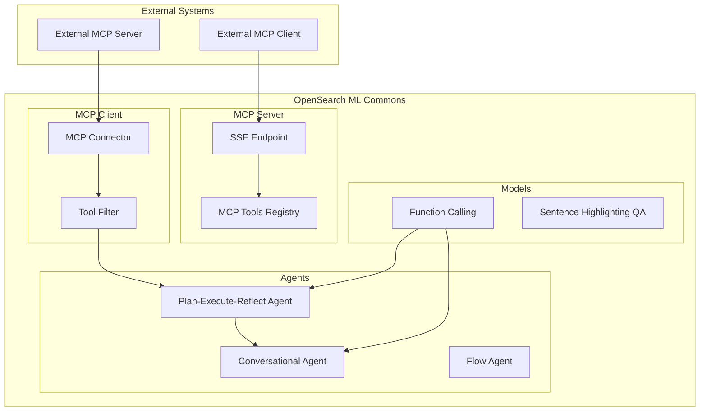

---
tags:
  - ml
---

# ML Commons / MCP

## Summary

OpenSearch 3.0 introduces Model Context Protocol (MCP) support in ML Commons, enabling standardized integration between AI agents and external tools. This release includes MCP client support (connecting to external MCP servers), MCP server support (exposing OpenSearch tools via MCP), a new Plan-Execute-Reflect agent type for complex multi-step reasoning, function calling support for multiple LLM providers, async agent execution, and sentence highlighting QA models.

## Details

### What's New in v3.0.0

This release brings significant agentic AI capabilities to OpenSearch:

1. **MCP Client Support**: Connect OpenSearch agents to external MCP servers via MCP Connectors
2. **MCP Server Support**: Expose OpenSearch tools to external MCP clients via SSE endpoints
3. **Plan-Execute-Reflect Agent**: New agent type for complex multi-step task execution
4. **Function Calling**: Support for OpenAI v1, Bedrock Claude, and DeepSeek models
5. **Async Agent Execution**: Execute agents asynchronously for long-running tasks
6. **Sentence Highlighting QA**: New model type for highlighting relevant sentences

### Technical Changes

#### Architecture Changes



#### New Components

| Component | Description |
|-----------|-------------|
| MCP Connector | New connector type for connecting to external MCP servers |
| MCP Server APIs | SSE-based endpoints for exposing OpenSearch tools via MCP |
| Plan-Execute-Reflect Agent | Agent that plans, executes, and refines multi-step workflows |
| Function Calling Interface | Standardized function calling for ChatAgent |
| Async Agent Execution | Support for asynchronous agent execution with task tracking |
| Sentence Highlighting Translator | Model translator for QA sentence highlighting |

#### New APIs

| API | Method | Description |
|-----|--------|-------------|
| `/_plugins/_ml/mcp_tools/_register` | POST | Register MCP tools for the server |
| `/_plugins/_ml/mcp_tools/_remove` | POST | Remove registered MCP tools |
| `/_plugins/_ml/sse` | GET | Create SSE session for MCP communication |
| `/_plugins/_ml/sse/message` | POST | Send MCP messages via SSE |

#### New Configuration

| Setting | Description | Default |
|---------|-------------|---------|
| `plugins.ml_commons.mcp_server_enabled` | Enable MCP server functionality | `false` |
| Agent `async` parameter | Execute agent asynchronously | `false` |

### Usage Examples

#### Creating an MCP Connector (Client)

```json
POST /_plugins/_ml/connectors/_create
{
  "name": "My MCP Connector",
  "description": "Connect to external MCP server",
  "version": "1",
  "protocol": "mcp",
  "parameters": {
    "endpoint": "http://external-mcp-server:8080"
  }
}
```

#### Registering MCP Tools (Server)

```json
POST /_plugins/_ml/mcp_tools/_register
{
  "tools": [
    {
      "name": "ListIndexTool",
      "description": "List indices in the cluster",
      "params": {},
      "schema": {
        "type": "object",
        "properties": {
          "indices": {
            "type": "array",
            "items": {"type": "string"},
            "description": "Index names to list"
          }
        }
      }
    }
  ]
}
```

#### Creating a Plan-Execute-Reflect Agent

```json
POST /_plugins/_ml/agents/_register
{
  "name": "research-agent",
  "type": "plan_execute_and_reflect",
  "llm": {
    "model_id": "<model_id>"
  },
  "tools": [
    {"type": "SearchIndexTool"},
    {"type": "PPLTool"}
  ]
}
```

#### Async Agent Execution

```json
POST /_plugins/_ml/agents/<agent_id>/_execute?async=true
{
  "parameters": {
    "question": "Analyze cluster performance"
  }
}
```

### Breaking Changes

| Change | Impact | Migration |
|--------|--------|-----------|
| CatIndexTool uses `_list/indices` API | Tool output format changed | Update any parsing logic for CatIndexTool output |
| Batch ingestion REST API deprecated | `POST /_plugins/_ml/_batch_ingestion` removed | Use alternative ingestion methods |

### Migration Notes

1. **CatIndexTool Migration**: The CatIndexTool now uses the `_list/indices` API instead of `_cat/index`. If you have workflows parsing CatIndexTool output, update them to handle the new JSON format.

2. **Batch Ingestion**: The REST API for batch ingestion has been deprecated. Existing batch ingestion workflows should be migrated to use the SDK or alternative approaches.

3. **MCP Server Setup**: To use MCP server functionality, enable `transport-reactor-netty4` in your network settings.

## Limitations

- MCP server requires `transport-reactor-netty4` to be enabled (experimental)
- Plan-Execute-Reflect agent is experimental
- MCP connector is experimental
- Async agent execution requires task management for result retrieval

## References

### Documentation
- [MCP Server APIs Documentation](https://docs.opensearch.org/3.0/ml-commons-plugin/api/mcp-server-apis/index/)
- [Using MCP Tools Documentation](https://docs.opensearch.org/3.0/ml-commons-plugin/agents-tools/mcp/index/)
- [Connecting to External MCP Server](https://docs.opensearch.org/3.0/ml-commons-plugin/agents-tools/mcp/mcp-connector/)
- [Plan-Execute-Reflect Agents](https://docs.opensearch.org/3.0/ml-commons-plugin/agents-tools/agents/plan-execute-reflect/)
- [Building a Plan-Execute-Reflect Agent Tutorial](https://docs.opensearch.org/3.0/tutorials/gen-ai/agents/build-plan-execute-reflect-agent/)

### Pull Requests
| PR | Description |
|----|-------------|
| [#3721](https://github.com/opensearch-project/ml-commons/pull/3721) | Onboard MCP - MCP connector support |
| [#3781](https://github.com/opensearch-project/ml-commons/pull/3781) | Support MCP server in OpenSearch |
| [#3716](https://github.com/opensearch-project/ml-commons/pull/3716) | Plan, Execute and Reflect Agent Type |
| [#3731](https://github.com/opensearch-project/ml-commons/pull/3731) | Support custom prompts for PlanExecuteReflect agent |
| [#3712](https://github.com/opensearch-project/ml-commons/pull/3712) | Function calling for OpenAI v1, Bedrock Claude, DeepSeek |
| [#3714](https://github.com/opensearch-project/ml-commons/pull/3714) | Implement async mode in agent execution |
| [#3600](https://github.com/opensearch-project/ml-commons/pull/3600) | Support sentence highlighting QA model |
| [#3699](https://github.com/opensearch-project/ml-commons/pull/3699) | Update highlighting model translator |
| [#3658](https://github.com/opensearch-project/ml-commons/pull/3658) | Add parser for ModelTensorOutput and ModelTensors |
| [#3243](https://github.com/opensearch-project/ml-commons/pull/3243) | Use _list/indices API in CatIndexTool (breaking) |
| [#3688](https://github.com/opensearch-project/ml-commons/pull/3688) | Deprecate batch ingestion REST API (breaking) |

### Issues (Design / RFC)
- [Issue #3660](https://github.com/opensearch-project/ml-commons/issues/3660): Feature request for MCP protocol support

## Related Feature Report

- [Full feature documentation](../../../features/ml-commons/ml-commons-mcp.md)
