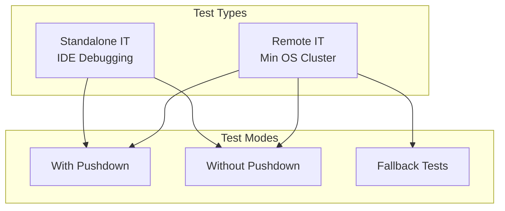

---
tags:
  - indexing
  - k-nn
  - search
  - sql
---

# CI/CD & Testing Infrastructure

## Summary

OpenSearch v3.0.0 includes significant improvements to CI/CD pipelines and testing infrastructure across multiple plugins. Key changes include new GitHub Actions for remote index builder testing in k-NN, a comprehensive integration test framework for the SQL plugin's Calcite engine migration, and various build fixes to ensure reliable CI workflows.

## Details

### What's New in v3.0.0

#### k-NN: Remote Index Builder Integration Tests

A new GitHub Action workflow was added to run integration tests against the remote vector index builder. This provides sanity checks for the remote index builder feature with three test scenarios:

| Test Case | Description |
|-----------|-------------|
| End-to-end radial search | Indexing → refresh → radial search → force merge → radial search |
| Filtering search | Indexing → refresh → force merge → filtered search |
| KNN search | Indexing → refresh → force merge → KNN unfiltered search |

Tests cover all space types (L2, IP, Cosine) with fp_32 precision.

#### SQL: Calcite Integration Test Framework

A comprehensive integration test framework was built for the Calcite engine migration:



**New Configuration Options:**
| Setting | Description |
|---------|-------------|
| `plugins.calcite.enabled` | Enable/disable Calcite engine |
| `plugins.calcite.fallback.allowed` | Allow fallback to v2 engine |

**Key Components Added:**
| Component | Description |
|-----------|-------------|
| `CalciteToolsHelper.java` | Creates customized Connection, JavaTypeFactory, RelBuilder, RelRunner |
| `EnumerableIndexScanRule` | Converts CalciteLogicalTableScan to CalciteOpenSearchIndexScan |
| `valueForCalcite()` method | New method in ExprValue for Calcite data reading |

#### SQL: Test Optimization

The Calcite IT suite was refactored to:
- Unify `Calcite*IT` with `NonFallbackCalcite*IT` test classes
- Enable fallback only for tests that specifically need it
- Reduce unnecessary test duplication and CI time

#### SQL: Dependency Fixes

- **Bouncycastle version**: Set inline after removal from OpenSearch core's gradle version catalog
- **Shadow JAR fix**: Use entire shadow jar to resolve security issues from job-scheduler

### Usage Example

Running Calcite integration tests:

```bash
# Run standalone IT (for IDE debugging)
./gradlew :integ-test:integTest --tests "CalciteIT"

# Run remote IT against cluster
./gradlew :integ-test:integTestRemote --tests "CalciteIT"

# Run without pushdown
./gradlew :integ-test:integTest -Dplugins.calcite.pushdown=false
```

### Migration Notes

For SQL plugin developers:
1. Use `valueForCalcite()` instead of `value()` when reading OpenSearch data in Calcite context
2. New tests should extend the unified Calcite IT framework
3. Only enable fallback for tests that specifically test fallback behavior

## Limitations

- Remote index builder tests currently limited to fp_32 precision
- Calcite IT framework requires specific cluster configuration for remote tests

## References

### Documentation
- [remote-vector-index-builder](https://github.com/opensearch-project/remote-vector-index-builder): Remote index builder repository

### Pull Requests
| PR | Repository | Description |
|----|------------|-------------|
| [#2620](https://github.com/opensearch-project/k-NN/pull/2620) | k-NN | GitHub Action for remote index builder ITs |
| [#3342](https://github.com/opensearch-project/sql/pull/3342) | sql | Build Calcite integration test framework |
| [#3413](https://github.com/opensearch-project/sql/pull/3413) | sql | Separate with/without pushdown ITs |
| [#3447](https://github.com/opensearch-project/sql/pull/3447) | sql | Use entire shadow jar to fix IT |
| [#3469](https://github.com/opensearch-project/sql/pull/3469) | sql | Set bouncycastle version inline |
| [#3544](https://github.com/opensearch-project/sql/pull/3544) | sql | Only enable fallback for tests that need it |

### Issues (Design / RFC)
- [Issue #2553](https://github.com/opensearch-project/k-NN/issues/2553): Remote index builder testing task
- [Issue #3330](https://github.com/opensearch-project/sql/issues/3330): Calcite IT framework request
- [Issue #3411](https://github.com/opensearch-project/sql/issues/3411): Separate pushdown ITs
- [Issue #3546](https://github.com/opensearch-project/sql/issues/3546): IT refactoring request

## Related Feature Report

- [Full feature documentation](../../../../features/multi-plugin/ci-cd-testing-infrastructure.md)
