---
tags:
  - dashboards
  - ml
  - security
  - sql
---

# CVE Fixes & Dependency Updates (Batch 2)

## Summary

OpenSearch v3.0.0 includes additional security fixes and dependency updates across the learning, security, reporting, and sql plugins. This batch focuses on addressing critical CVEs including json-smart, Spring framework, and various frontend library vulnerabilities, along with Gradle and JDK 23 compatibility updates.

## Details

### What's New in v3.0.0

This batch of updates addresses multiple security vulnerabilities and ensures compatibility with JDK 23 through Gradle updates across several OpenSearch plugins.

### Technical Changes

#### CVEs Addressed

| CVE | Severity | Description | Affected Component | Fix |
|-----|----------|-------------|-------------------|-----|
| CVE-2024-57699 | High | json-smart vulnerability allowing denial of service | sql | Upgrade json-smart dependency |
| CVE-2024-38827 | - | Spring Security authorization bypass | security | Bump Spring version |
| CVE-2025-27789 | - | @babel/runtime vulnerability | security-dashboards | Bump babel to 7.27.0 |
| CVE-2025-29774 | - | xml-crypto signature verification bypass | security-dashboards | Bump xlm-crypto |
| CVE-2025-29775 | - | xml-crypto signature verification bypass | security-dashboards | Bump xlm-crypto |
| GHSA-vjh7-7g9h-fjfh | - | elliptic ECDSA signature malleability | security-dashboards | Bump elliptic |

#### Dependency Updates by Repository

##### Learning (ml-commons)
| Dependency | Change | Purpose |
|------------|--------|---------|
| http5client | Use core's dependency | Address http5client CVE |

##### Security Plugin
| Dependency | Old Version | New Version | Purpose |
|------------|-------------|-------------|---------|
| commons jar | - | Updated | CVE fixes |
| Gradle | < 8.10.2 | 8.10.2 | JDK 23 support |
| Gradle | 8.10.2 | 8.13 | Further updates |
| Spring | - | Updated | CVE-2024-38827 fix |
| awaitility | 4.2.2 | 4.3.0 | Dependency update |
| spring-kafka-test | 3.3.2 | 3.3.4 | Dependency update |
| junit-jupiter | 5.11.4 | 5.12.2 | Dependency update |
| logback-classic | 1.5.16 | 1.5.18 | Security update |
| checker-qual | 3.49.0 | 3.49.2 | Dependency update |
| mockito-core | 5.15.2 | 5.17.0 | Dependency update |
| camel-xmlsecurity | 3.22.3 | 3.22.4 | Dependency update |
| guava | 33.4.0-jre | 33.4.6-jre | Dependency update |

##### Security Dashboards Plugin
| Dependency | Change | Purpose |
|------------|--------|---------|
| xlm-crypto | Bumped | CVE-2025-29774, CVE-2025-29775 |
| elliptic | Bumped | GHSA-vjh7-7g9h-fjfh |
| typescript | Removed | Dependency cleanup |
| babel | Bumped to 7.27.0 | CVE-2025-27789 |
| express | Bumped to 5.1.0 | Security update |

##### Reporting Plugin
| Dependency | Old Version | New Version | Purpose |
|------------|-------------|-------------|---------|
| Gradle | < 8.12.0 | 8.12.0 | JDK 23 support |

##### SQL Plugin
| Dependency | Change | Purpose |
|------------|--------|---------|
| json-smart | Updated | CVE-2024-57699 fix |

### JDK 23 Support

Multiple plugins received Gradle updates to support JDK 23:

```mermaid
graph TB
    subgraph "JDK 23 Compatibility Updates"
        A[Gradle Updates] --> B[security: 8.10.2 → 8.13]
        A --> C[reporting: 8.12.0]
        A --> D[security: JDK23 workflow fixes]
    end
```

### Migration Notes

These are dependency-only changes with no breaking API changes. Users upgrading to v3.0.0 will automatically benefit from these security fixes.

## Limitations

- Some plugins (like reporting) note that detekt is not yet supporting JDK 23, so workflow updates may follow separately.

## References

### Documentation
- [CVE-2024-57699](https://advisories.opensearch.org/advisories/CVE-2024-57699): json-smart vulnerability (High severity)
- [CVE-2024-38827](https://nvd.nist.gov/vuln/detail/CVE-2024-38827): Spring Security authorization bypass
- [CVE-2025-29774](https://nvd.nist.gov/vuln/detail/CVE-2025-29774): xml-crypto signature verification bypass
- [CVE-2025-29775](https://nvd.nist.gov/vuln/detail/CVE-2025-29775): xml-crypto signature verification bypass
- [GHSA-vjh7-7g9h-fjfh](https://github.com/advisories/GHSA-vjh7-7g9h-fjfh): elliptic ECDSA signature malleability

### Pull Requests
| PR | Description |
|----|-------------|
| [#171](https://github.com/opensearch-project/ml-commons/pull/171) | [Backport 3.0] Address http5client CVE, use core's dependency |
| PR | Description |
|----|-------------|
| [#1481](https://github.com/opensearch-project/security/pull/1481) | Updated commons jar with CVE fixes |
| [#1492](https://github.com/opensearch-project/security/pull/1492) | Update gradle 8.10.2 and support jdk23 |
| [#1494](https://github.com/opensearch-project/security/pull/1494) | Fix security-enabled test workflow for 3.0-alpha1 |
| [#1270](https://github.com/opensearch-project/security/pull/1270) | Fix CVE |
| [#1276](https://github.com/opensearch-project/security/pull/1276) | Fix CVE 2025 27789 |
| [#1278](https://github.com/opensearch-project/security/pull/1278) | Fix CVE-2025 27789 |
| [#5126](https://github.com/opensearch-project/security/pull/5126) | Bump org.awaitility:awaitility from 4.2.2 to 4.3.0 |
| [#5125](https://github.com/opensearch-project/security/pull/5125) | Bump org.springframework.kafka:spring-kafka-test from 3.3.2 to 3.3.4 |
| [#5127](https://github.com/opensearch-project/security/pull/5127) | Bump org.junit.jupiter:junit-jupiter from 5.11.4 to 5.12.2 |
| [#5148](https://github.com/opensearch-project/security/pull/5148) | Bump Gradle to 8.13 |
| [#5149](https://github.com/opensearch-project/security/pull/5149) | Bump ch.qos.logback:logback-classic from 1.5.16 to 1.5.17 |
| [#5173](https://github.com/opensearch-project/security/pull/5173) | Bump Spring version to fix CVE-2024-38827 |
| [#5162](https://github.com/opensearch-project/security/pull/5162) | Bump org.checkerframework:checker-qual from 3.49.0 to 3.49.2 |
| [#5161](https://github.com/opensearch-project/security/pull/5161) | Bump org.mockito:mockito-core from 5.15.2 to 5.17.0 |
| [#5163](https://github.com/opensearch-project/security/pull/5163) | Bump org.apache.camel:camel-xmlsecurity from 3.22.3 to 3.22.4 |
| [#5205](https://github.com/opensearch-project/security/pull/5205) | Bump com.google.guava:guava from 33.4.0-jre to 33.4.6-jre |
| [#5204](https://github.com/opensearch-project/security/pull/5204) | Bump ch.qos.logback:logback-classic from 1.5.17 to 1.5.18 |
| PR | Description |
|----|-------------|
| [#2196](https://github.com/opensearch-project/security-dashboards-plugin/pull/2196) | Bump xlm-crypto and elliptic |
| [#2198](https://github.com/opensearch-project/security-dashboards-plugin/pull/2198) | Remove typescript dependency |
| [#2200](https://github.com/opensearch-project/security-dashboards-plugin/pull/2200) | Bump babel to 7.27.0 |
| [#2232](https://github.com/opensearch-project/security-dashboards-plugin/pull/2232) | Bump express to 5.1.0 |
| PR | Description |
|----|-------------|
| [#1077](https://github.com/opensearch-project/reporting/pull/1077) | Update gradle version to 8.12.0 for JDK23 support |
| PR | Description |
|----|-------------|
| [#3484](https://github.com/opensearch-project/sql/pull/3484) | CVE-2024-57699 High: Fix json-smart vulnerability |

### Issues (Design / RFC)
- [Issue #3485](https://github.com/opensearch-project/sql/issues/3485): SQL json-smart CVE tracking
- [Issue #3747](https://github.com/opensearch-project/opensearch-build/issues/3747): JDK 23 support tracking

## Related Feature Report

- [CVE Fixes & Dependency Updates (Batch 1)](cve-fixes-opensearch-dashboards-dependency-updates.md)
