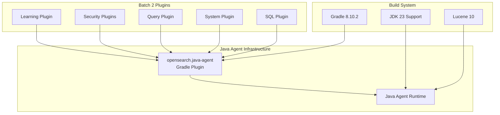

# Java Agent / SecurityManager Migration (Batch 2)

## Summary

This release item covers the second batch of plugin migrations from Java Security Manager to the Java Agent-based security model in OpenSearch 3.0.0. The migration affects multiple plugins across the learning, security, query, system, and sql repositories, ensuring all plugins are compatible with JDK 24+ where SecurityManager will be permanently disabled.

## Details

### What's New in v3.0.0

This batch completes the Java Agent migration for additional OpenSearch plugins that were not covered in the initial migration wave. Each plugin now uses the `opensearch.java-agent` Gradle plugin to replace SecurityManager-based security checks with the new Java Agent instrumentation approach.

### Technical Changes

#### Architecture Changes



#### Migration Flow


#### Affected Repositories

| Repository | PR | Description | Related Issue |
|------------|-----|-------------|---------------|
| learning | #156 | Support phasing off SecurityManager usage in favor of Java Agent |   |
| security | #157, #303, #1505, #1504, #68, #3551 | Java Agent Gradle plugin migration and build fixes |   |
| query | #296 | Support phasing off SecurityManager usage in favor of Java Agent |   |
| system | #62 | Update Gradle 8.10.2, JDK 23, and Lucene 10 support |   |
| sql | #3539 | Fix build due to phasing off SecurityManager usage |   |

#### New Configuration

| Setting | Description | Default |
|---------|-------------|---------|
| `apply plugin: 'opensearch.java-agent'` | Enables Java Agent for plugin tests | Required for all plugins |
| `sourceCompatibility` | Java source version | `JavaVersion.VERSION_21` |
| `targetCompatibility` | Java target version | `JavaVersion.VERSION_21` |

### Usage Example

```groovy
// build.gradle - Plugin migration example
plugins {
    id 'opensearch.opensearchplugin'
    id 'opensearch.java-agent'  // Replaces SecurityManager
}

java {
    sourceCompatibility = JavaVersion.VERSION_21
    targetCompatibility = JavaVersion.VERSION_21
}
```

### Migration Notes

1. **Apply Java Agent Plugin**: All plugins must add `apply plugin: 'opensearch.java-agent'` to their build.gradle
2. **Build Compatibility**: Some plugins required additional fixes to resolve build issues after the SecurityManager removal
3. **JDK 23 Support**: The system plugin also adds JDK 23 compatibility alongside the Java Agent migration
4. **Lucene 10**: Build updates include compatibility with Lucene 10

## Limitations

- **Breaking Change**: Plugins compiled without the Java Agent plugin will fail to build against OpenSearch 3.0
- **SecurityManager Removal**: Any code relying on SecurityManager permissions must be refactored
- **Plugin Dependencies**: Plugins depending on other plugins must ensure all dependencies are also migrated

## References

### Documentation
- [PR #17861](https://github.com/opensearch-project/OpenSearch/pull/17861): Core SecurityManager replacement implementation
- [PR #17900](https://github.com/opensearch-project/OpenSearch/pull/17900): Custom Gradle plugin for Java Agent
- [JEP 411](https://openjdk.org/jeps/411): Deprecate the Security Manager for Removal
- [JEP 486](https://openjdk.org/jeps/486): Permanently Disable the Security Manager

### Pull Requests
| PR | Repository | Description |
|----|------------|-------------|
| [#156](https://github.com/opensearch-project/opensearch-learning-to-rank-base/pull/156) | learning | Support phasing off SecurityManager usage in favor of Java Agent |
| [#157](https://github.com/opensearch-project/security/pull/157) | security | Using java-agent gradle plugin to phase off Security Manager |
| [#296](https://github.com/opensearch-project/query-insights/pull/296) | query | Support phasing off SecurityManager usage in favor of Java Agent |
| [#303](https://github.com/opensearch-project/security/pull/303) | security | Using java-agent gradle plugin to phase off Security Manager |
| [#1505](https://github.com/opensearch-project/security/pull/1505) | security | Using java-agent gradle plugin to phase off Security Manager |
| [#1504](https://github.com/opensearch-project/security/pull/1504) | security | Fix build due to phasing off SecurityManager usage |
| [#62](https://github.com/opensearch-project/opensearch-system-templates/pull/62) | system | Update Gradle 8.10.2, JDK 23, and Lucene 10 support |
| [#68](https://github.com/opensearch-project/security/pull/68) | security | Using java-agent gradle plugin to phase off Security Manager |
| [#3551](https://github.com/opensearch-project/security/pull/3551) | security | Using java-agent gradle plugin to phase off Security Manager |
| [#3539](https://github.com/opensearch-project/sql/pull/3539) | sql | Fix build due to phasing off SecurityManager usage |

### Issues (Design / RFC)
- [Issue #17658](https://github.com/opensearch-project/OpenSearch/issues/17658): META - Security Manager Replacement with Java Agent
- [Issue #17662](https://github.com/opensearch-project/OpenSearch/issues/17662): Phase off SecurityManager usage in favor of Java Agent

## Related Feature Report

- [Full feature documentation](../../../features/multi-plugin/jdk-21-java-agent-migration.md)
- [Security Manager Replacement](../../../features/opensearch/security-manager-replacement.md)
