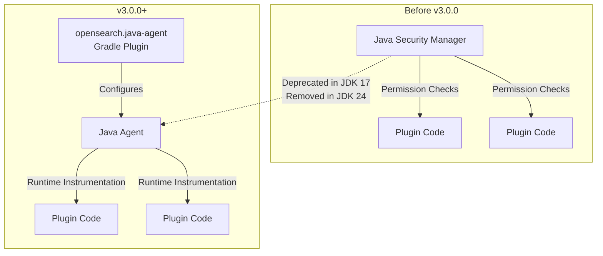
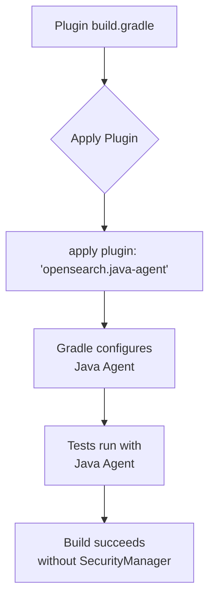

---
tags:
  - k-nn
  - ml
  - security
---

# JDK 21 & Java Agent Migration

## Summary

OpenSearch 3.0.0 requires JDK 21 as the minimum runtime version and introduces a Java Agent-based approach to replace the deprecated Java Security Manager. This migration affects all OpenSearch plugins, requiring updates to build configurations, CI/CD pipelines, and security-related code. The changes ensure compatibility with JDK 24+ where SecurityManager will be permanently disabled.

## Details

### What's New in v3.0.0

1. **JDK 21 Baseline**: All plugins now require JDK 21 as the minimum version
2. **Java Agent Gradle Plugin**: New `opensearch.java-agent` plugin for phasing off SecurityManager
3. **CI/CD Updates**: Removed JDK 11/17 from CI runs, added JDK 21/23 support
4. **Dependency Updates**: Gradle 8.10.2, shadow plugin migration to `com.gradleup.shadow`
5. **Cryptography Migration**: BC (BouncyCastle) to BCFIPS libraries

### Technical Changes

#### Architecture Changes



#### Plugin Migration Flow



#### Affected Repositories

| Repository | Changes | Key PRs |
|------------|---------|---------|
| flow-framework | JDK 21 target, Java Agent plugin, BC→BCFIPS | #730, #1108, #1087 |
| k-NN | JDK 21 minimum, removed JDK 11/17 CI | #1921, #2422 |
| security | Java Agent plugin migration | #1917, #1086, #1406 |
| asynchronous-search | Java Agent plugin | #719 |
| geospatial | JDK 21 baseline, Gradle 8.10.2, JDK 23 | #695, #723 |
| job-scheduler | Shadow plugin update | #722 |
| dashboards-observability | JDK 21 for OpenSearch 3.0 | #563 |

#### New Configuration

| Setting | Description | Default |
|---------|-------------|---------|
| `sourceCompatibility` | Java source version | `JavaVersion.VERSION_21` |
| `targetCompatibility` | Java target version | `JavaVersion.VERSION_21` |
| `opensearch.java-agent` | Gradle plugin for Java Agent | Applied in build.gradle |

### Usage Example

```groovy
// build.gradle - Plugin migration example
plugins {
    id 'opensearch.opensearchplugin'
    id 'opensearch.java-agent'  // New: replaces SecurityManager
}

java {
    sourceCompatibility = JavaVersion.VERSION_21
    targetCompatibility = JavaVersion.VERSION_21
}

// Shadow plugin migration (if applicable)
plugins {
    id 'com.gradleup.shadow'  // Replaces 'com.github.johnrengelman.shadow'
}
```

### Migration Notes

1. **Update JDK**: Ensure JDK 21+ is installed and configured
2. **Apply Java Agent Plugin**: Add `apply plugin: 'opensearch.java-agent'` to build.gradle
3. **Update CI Workflows**: Remove JDK 11/17 matrix entries, add JDK 21/23
4. **Shadow Plugin**: Migrate from `com.github.johnrengelman.shadow` to `com.gradleup.shadow`
5. **Cryptography**: Update BouncyCastle imports from BC to BCFIPS if applicable

## Limitations

- **Breaking Change**: Plugins compiled for JDK 11/17 are incompatible with OpenSearch 3.0
- **SecurityManager Removal**: Code relying on SecurityManager permissions must be refactored
- **CI Matrix**: Older JDK versions no longer tested in CI pipelines

## References

### Documentation
- [JEP 411](https://openjdk.org/jeps/411): Deprecate the Security Manager for Removal
- [JDK 24 Project](https://openjdk.org/projects/jdk/24/): SecurityManager permanently disabled

### Pull Requests
| PR | Repository | Description |
|----|------------|-------------|
| [#17900](https://github.com/opensearch-project/OpenSearch/pull/17900) | OpenSearch | Custom Gradle plugin for Java Agent |
| [#730](https://github.com/opensearch-project/flow-framework/pull/730) | flow-framework | Set Java target compatibility to JDK 21 |
| [#1108](https://github.com/opensearch-project/flow-framework/pull/1108) | flow-framework | Java Agent Gradle plugin |
| [#1087](https://github.com/opensearch-project/flow-framework/pull/1087) | flow-framework | BC to BCFIPS migration |
| [#2422](https://github.com/opensearch-project/k-NN/pull/2422) | k-NN | Upgrade min JDK to 21 |
| [#1921](https://github.com/opensearch-project/k-NN/pull/1921) | k-NN | Remove JDK 11/17 from CI |
| [#719](https://github.com/opensearch-project/asynchronous-search/pull/719) | asynchronous-search | Java Agent migration |
| [#695](https://github.com/opensearch-project/geospatial/pull/695) | geospatial | JDK 21 baseline |
| [#723](https://github.com/opensearch-project/geospatial/pull/723) | geospatial | Gradle 8.10.2, JDK 23 support |
| [#722](https://github.com/opensearch-project/job-scheduler/pull/722) | job-scheduler | Shadow plugin update |

### Issues (Design / RFC)
- [Issue #10745](https://github.com/opensearch-project/OpenSearch/issues/10745): Set OpenSearch 3.0.0 baseline JDK to JDK-21
- [Issue #16634](https://github.com/opensearch-project/OpenSearch/issues/16634): META - Replace Java Security Manager

## Related Feature Report

- [Full feature documentation](../../../features/multi-plugin/multi-plugin-jdk-21-reporting-java-agent-migration.md)
