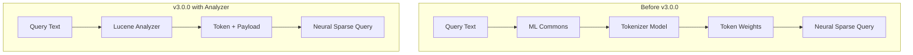

---
tags:
  - indexing
  - ml
  - neural-search
  - search
---

# Analyzer-Based Neural Sparse Query

## Summary

OpenSearch 3.0.0 introduces analyzer-based neural sparse query support, enabling users to perform neural sparse search using Lucene analyzers instead of ML models. This simplifies the doc-only mode workflow by eliminating the need to register and manage tokenizer models through ML Commons, reducing operational overhead and network traffic.

## Details

### What's New in v3.0.0

The `neural_sparse` query now supports an `analyzer` parameter that allows query text tokenization using Lucene analyzers bound to index fields. This is particularly beneficial for doc-only mode neural sparse search where only a tokenizer (not a full sparse encoding model) is needed at query time.

### Technical Changes

#### Architecture Changes



#### New Components

| Component | Description |
|-----------|-------------|
| `NeuralSparseQueryTwoPhaseInfo` | New class encapsulating two-phase execution state, prune ratio, and prune type |
| `analyzer` field | New query parameter to specify the Lucene analyzer for tokenization |

#### New Configuration

| Setting | Description | Default |
|---------|-------------|---------|
| `analyzer` | Name of the Lucene analyzer to use for query tokenization | `bert-uncased` |

#### API Changes

The `neural_sparse` query now accepts an optional `analyzer` parameter:

```json
{
  "query": {
    "neural_sparse": {
      "<field_name>": {
        "query_text": "<query_text>",
        "analyzer": "<analyzer_name>"
      }
    }
  }
}
```

When `analyzer` is specified, the query bypasses ML Commons model inference and uses the specified Lucene analyzer directly.

### Usage Example

```json
GET my-nlp-index/_search
{
  "query": {
    "neural_sparse": {
      "passage_embedding": {
        "query_text": "Hello world",
        "analyzer": "bert-uncased"
      }
    }
  }
}
```

The analyzer extracts tokens and their weights from the payload attribute. If no payload is present, tokens receive a default weight of 1.0.

### Migration Notes

- Existing queries using `model_id` continue to work unchanged
- To use analyzer-based queries, ensure the analyzer is configured in your index settings
- The `analyzer` parameter defaults to `bert-uncased` if not specified and `model_id` is not provided
- Token weights are extracted from the Lucene `PayloadAttribute` as 4-byte floats

## Limitations

- Analyzer must be configured in the index settings before use
- Token weights must be encoded as 4-byte floats in the payload attribute
- Two-phase processing with analyzer requires token splitting at query time (not during rewrite)

## References

### Documentation
- [Neural Sparse Query Documentation](https://docs.opensearch.org/3.0/query-dsl/specialized/neural-sparse/)
- [Neural Search API Documentation](https://docs.opensearch.org/3.0/vector-search/api/neural/)

### Pull Requests
| PR | Description |
|----|-------------|
| [#1088](https://github.com/opensearch-project/neural-search/pull/1088) | Implement analyzer-based neural sparse query |

### Issues (Design / RFC)
- [Issue #1052](https://github.com/opensearch-project/neural-search/issues/1052): RFC for analyzer-based neural sparse query

## Related Feature Report

- [Full feature documentation](../../../features/neural-search/neural-sparse-search.md)
