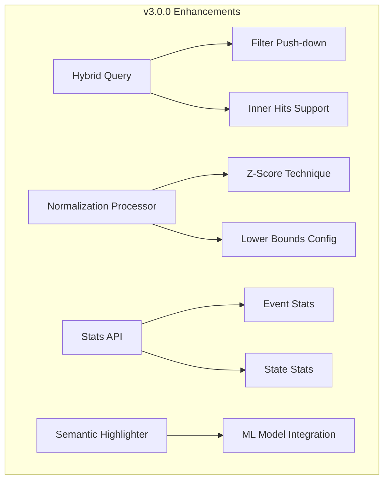

---
tags:
  - ml
  - neural-search
  - observability
  - performance
  - search
---

# Neural Search / Hybrid Query

## Summary

OpenSearch 3.0.0 brings significant enhancements to the neural-search plugin's hybrid query capabilities, including new normalization techniques (Z-Score, lower bounds for min-max), filter support for HybridQueryBuilder and NeuralQueryBuilder, inner hits support, a new Stats API, semantic sentence highlighting, analyzer-based neural sparse queries, and optimized embedding generation across multiple processors. These improvements enhance search relevance, performance, and observability.

## Details

### What's New in v3.0.0

#### 1. Z-Score Normalization Technique
A new Z-Score normalization technique for hybrid queries that standardizes scores based on statistical distribution.

```json
PUT /_search/pipeline/zscore-pipeline
{
  "phase_results_processors": [
    {
      "normalization-processor": {
        "normalization": {
          "technique": "z_score"
        },
        "combination": {
          "technique": "arithmetic_mean"
        }
      }
    }
  ]
}
```

#### 2. Lower Bounds for Min-Max Normalization
Added `lower_bounds` parameter for min-max normalization to control score floor behavior per sub-query.

```json
PUT /_search/pipeline/minmax-lower-bounds
{
  "phase_results_processors": [
    {
      "normalization-processor": {
        "normalization": {
          "technique": "min_max",
          "parameters": {
            "lower_bounds": [
              { "mode": "apply", "min_score": 0.1 },
              { "mode": "clip", "min_score": 0.1 },
              { "mode": "ignore" }
            ]
          }
        },
        "combination": {
          "technique": "arithmetic_mean"
        }
      }
    }
  ]
}
```

| Mode | Description |
|------|-------------|
| `apply` | Apply the min_score as the lower bound |
| `clip` | Clip scores below min_score to min_score |
| `ignore` | No lower bound applied |

#### 3. Filter Support for Query Builders
HybridQueryBuilder and NeuralQueryBuilder now support a `filter` function for pushing down filters.

```json
GET /my-index/_search
{
  "query": {
    "hybrid": {
      "queries": [
        { "match": { "text": "search query" } },
        { "neural": { "embedding": { "query_text": "semantic query", "model_id": "xxx" } } }
      ],
      "filter": {
        "term": { "category": "electronics" }
      }
    }
  }
}
```

#### 4. Inner Hits Support
Hybrid queries now support `inner_hits` for nested queries, enabling retrieval of matching nested documents.

```json
GET /my-index/_search
{
  "query": {
    "hybrid": {
      "queries": [
        {
          "nested": {
            "path": "comments",
            "query": { "match": { "comments.text": "great" } },
            "inner_hits": {}
          }
        }
      ]
    }
  }
}
```

#### 5. Neural Stats API
A new Stats API provides observability into neural search operations.

```
GET /_plugins/_neural/stats
```

Response includes:
- Cluster-level information (version, processor counts)
- Node-level event statistics (processor executions)
- Aggregated statistics across all nodes

```json
{
  "_nodes": { "total": 1, "successful": 1, "failed": 0 },
  "cluster_name": "my-cluster",
  "info": {
    "cluster_version": "3.0.0",
    "processors": {
      "ingest": { "text_embedding_processors_in_pipelines": 2 }
    }
  },
  "all_nodes": {
    "processors": {
      "ingest": { "text_embedding_executions": 1500 }
    }
  }
}
```

#### 6. Semantic Sentence Highlighter
A new `semantic` highlighter type uses ML models to identify and highlight semantically relevant text spans.

```json
GET /my-index/_search
{
  "query": {
    "neural": {
      "embedding": { "query_text": "AI image generation", "model_id": "xxx" }
    }
  },
  "highlight": {
    "fields": {
      "text": { "type": "semantic" }
    },
    "options": {
      "model_id": "sentence-highlighting-model"
    }
  }
}
```

#### 7. Analyzer-Based Neural Sparse Query
Support for using analyzers with neural sparse queries, enabling token-based sparse vector search without ML model inference at query time.

#### 8. Optimized Embedding Generation
The `skip_existing` parameter reduces redundant ML inference calls during document updates:

| Processor | Improvement |
|-----------|-------------|
| Text Embedding | Up to 82% latency reduction on updates |
| Sparse Encoding | Up to 85% latency reduction on updates |
| Text/Image Embedding | Up to 56% latency reduction on updates |

```json
PUT /_ingest/pipeline/optimized-pipeline
{
  "processors": [
    {
      "text_embedding": {
        "model_id": "xxx",
        "field_map": { "text": "embedding" },
        "skip_existing": true
      }
    }
  ]
}
```

### Technical Changes

#### Architecture Changes



#### New Components

| Component | Description |
|-----------|-------------|
| `ZScoreNormalizationTechnique` | Z-Score normalization for hybrid queries |
| `LowerBoundsConfiguration` | Lower bounds config for min-max normalization |
| `NeuralStatsAction` | Transport action for stats API |
| `SemanticHighlighter` | ML-based semantic highlighting |
| `SemanticHighlighterEngine` | Engine for semantic highlight processing |

#### New Configuration

| Setting | Description | Default |
|---------|-------------|---------|
| `normalization.technique` | Now supports `z_score` | `min_max` |
| `normalization.parameters.lower_bounds` | Array of lower bound configs | None |
| `skip_existing` | Skip embedding generation if unchanged | `false` |

### Usage Example

Complete hybrid search with v3.0.0 features:

```json
PUT /_search/pipeline/v3-hybrid-pipeline
{
  "phase_results_processors": [
    {
      "normalization-processor": {
        "normalization": {
          "technique": "z_score"
        },
        "combination": {
          "technique": "arithmetic_mean",
          "parameters": { "weights": [0.3, 0.7] }
        }
      }
    }
  ]
}
```

```json
GET /my-index/_search?search_pipeline=v3-hybrid-pipeline
{
  "query": {
    "hybrid": {
      "queries": [
        { "match": { "title": "machine learning" } },
        { "neural": { "embedding": { "query_text": "AI algorithms", "model_id": "xxx", "k": 10 } } }
      ],
      "filter": { "range": { "date": { "gte": "2024-01-01" } } }
    }
  },
  "highlight": {
    "fields": { "content": { "type": "semantic" } },
    "options": { "model_id": "highlighter-model" }
  }
}
```

### Migration Notes

- **Z-Score normalization**: Consider switching from `min_max` to `z_score` for datasets with outlier scores
- **Lower bounds**: Use `lower_bounds` to handle sub-queries with different score distributions
- **skip_existing**: Enable on ingest pipelines for workloads with frequent document updates
- **Stats API**: Use for monitoring and debugging neural search operations

## Limitations

- Nested HybridQueryBuilder does not support the filter function (throws `UnsupportedOperationException`)
- Semantic highlighter requires a deployed sentence highlighting model
- `skip_existing` optimization requires document ID to be present for comparison

## References

### Documentation
- [Hybrid Search Documentation](https://docs.opensearch.org/3.0/vector-search/ai-search/hybrid-search/index/)
- [Neural Search API](https://docs.opensearch.org/3.0/vector-search/api/neural/)
- [Normalization Processor](https://docs.opensearch.org/3.0/search-plugins/search-pipelines/normalization-processor/)

### Pull Requests
| PR | Description |
|----|-------------|
| [#838](https://github.com/opensearch-project/neural-search/pull/838) | Set neural-search plugin 3.0.0 baseline JDK version to JDK-21 |
| [#1007](https://github.com/opensearch-project/neural-search/pull/1007) | Support different embedding types in model's response |
| [#1088](https://github.com/opensearch-project/neural-search/pull/1088) | Implement analyzer based neural sparse query |
| [#1191](https://github.com/opensearch-project/neural-search/pull/1191) | Optimize embedding generation in Text Embedding Processor |
| [#1193](https://github.com/opensearch-project/neural-search/pull/1193) | Support semantic sentence highlighter |
| [#1195](https://github.com/opensearch-project/neural-search/pull/1195) | Lower bound for min-max normalization technique |
| [#1204](https://github.com/opensearch-project/neural-search/pull/1204) | Fix unflatten doc with list of map |
| [#1206](https://github.com/opensearch-project/neural-search/pull/1206) | Support filter function for HybridQueryBuilder and NeuralQueryBuilder |
| [#1224](https://github.com/opensearch-project/neural-search/pull/1224) | Add Z Score normalization technique |
| [#1230](https://github.com/opensearch-project/neural-search/pull/1230) | Remove validations for unmapped fields in TextImageEmbeddingProcessor |
| [#1246](https://github.com/opensearch-project/neural-search/pull/1246) | Optimize embedding generation in Sparse Encoding Processor |
| [#1249](https://github.com/opensearch-project/neural-search/pull/1249) | Optimize embedding generation in Text/Image Embedding Processor |
| [#1253](https://github.com/opensearch-project/neural-search/pull/1253) | Inner hits support with hybrid query |
| [#1254](https://github.com/opensearch-project/neural-search/pull/1254) | Support custom tags in semantic highlighter |
| [#1256](https://github.com/opensearch-project/neural-search/pull/1256) | Add stats API |
| [#1257](https://github.com/opensearch-project/neural-search/pull/1257) | Add validations for TextImageEmbeddingProcessor |
| [#1277](https://github.com/opensearch-project/neural-search/pull/1277) | Fix score value as null for single shard sorting |

### Issues (Design / RFC)
- [Issue #376](https://github.com/opensearch-project/neural-search/issues/376): Z-Score normalization request
- [Issue #718](https://github.com/opensearch-project/neural-search/issues/718): Inner hits support request
- [Issue #1138](https://github.com/opensearch-project/neural-search/issues/1138): Embedding optimization RFC
- [Issue #1182](https://github.com/opensearch-project/neural-search/issues/1182): Semantic highlighter tracking
- [Issue #1196](https://github.com/opensearch-project/neural-search/issues/1196): Stats API RFC

## Related Feature Report

- [Full feature documentation](../../../features/neural-search/hybrid-query.md)
