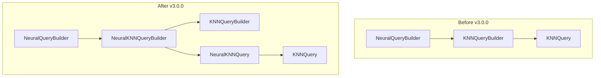

---
tags:
  - domain/search
  - component/server
  - k-nn
  - neural-search
  - search
---
# Neural Search Refactoring

## Summary

This release item introduces a refactoring of the Neural Search plugin that encapsulates KNNQueryBuilder creation within a new `NeuralKNNQueryBuilder` wrapper class. This architectural change centralizes KNN query handling to isolate k-NN plugin API changes and enables future extensions like semantic highlighting that require access to the original query text.

## Details

### What's New in v3.0.0

The refactoring introduces two new classes that wrap the k-NN plugin's query infrastructure:

1. **NeuralKNNQueryBuilder**: A wrapper around `KNNQueryBuilder` that isolates k-NN plugin API changes and preserves the original query text
2. **NeuralKNNQuery**: A Lucene query wrapper that delegates to the underlying KNN query while maintaining neural search context

### Technical Changes

#### Architecture Changes



#### New Components

| Component | Description |
|-----------|-------------|
| `NeuralKNNQueryBuilder` | Wraps `KNNQueryBuilder` to isolate k-NN API changes and preserve original query text for features like semantic highlighting |
| `NeuralKNNQuery` | Lucene query wrapper that delegates core operations to the underlying KNN query while maintaining neural search extensions |

#### Key Implementation Details

The `NeuralKNNQueryBuilder` provides:
- Builder pattern for constructing KNN queries with neural search context
- Preservation of original query text through the query lifecycle
- Isolation of k-NN plugin API changes to a single location
- Support for all KNN query parameters (k, filter, maxDistance, minScore, expandNested, methodParameters, rescoreContext)

The `NeuralKNNQuery` provides:
- Delegation of Lucene query operations (createWeight, visit, rewrite) to the underlying KNN query
- Storage of original query text for downstream features like highlighting
- Proper equals/hashCode implementation for query caching

### Usage Example

The refactoring is transparent to users. Neural queries continue to work as before:

```json
{
  "query": {
    "neural": {
      "passage_embedding": {
        "query_text": "semantic search example",
        "k": 10,
        "model_id": "your-model-id"
      }
    }
  }
}
```

Internally, the `NeuralQueryBuilder` now rewrites to `NeuralKNNQueryBuilder` instead of directly to `KNNQueryBuilder`:

```java
// Before: returned KNNQueryBuilder directly
// After: returns NeuralKNNQueryBuilder which wraps KNNQueryBuilder
return NeuralKNNQueryBuilder.builder()
    .fieldName(fieldName())
    .vector(vectorSupplier.get())
    .k(k())
    .filter(filter())
    .maxDistance(maxDistance())
    .minScore(minScore())
    .expandNested(expandNested())
    .methodParameters(methodParameters())
    .rescoreContext(rescoreContext())
    .build();
```

### Migration Notes

This is an internal refactoring with no user-facing API changes. Existing neural search queries continue to work without modification.

## Limitations

- This refactoring is a foundation for future features (semantic highlighting) and does not add new user-facing functionality in this release
- The original query text preservation is currently internal and not exposed through public APIs

## References

### Documentation
- [Neural Query Documentation](https://docs.opensearch.org/3.0/query-dsl/specialized/neural/): Official neural query docs

### Pull Requests
| PR | Description |
|----|-------------|
| [#1183](https://github.com/opensearch-project/neural-search/pull/1183) | Encapsulate KNNQueryBuilder creation within NeuralKNNQueryBuilder |

### Issues (Design / RFC)
- [Issue #1182](https://github.com/opensearch-project/neural-search/issues/1182): Semantic Highlighter Project Tasks Tracker
- [Issue #1175](https://github.com/opensearch-project/neural-search/issues/1175): RFC - OpenSearch Semantic Sentence Highlighting

## Related Feature Report

- [Semantic Highlighting](../../../../features/neural-search/neural-search-semantic-highlighting.md)
