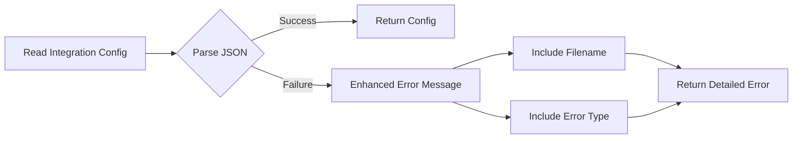

# Observability Integrations

## Summary

This release improves error handling and test quality for the Integrations feature in OpenSearch Dashboards Observability. The changes make test failures more actionable by providing detailed error context, and improve error messages when setting up or reading integration configurations.

## Details

### What's New in v3.0.0

Two bug fixes improve the developer experience when working with integrations:

1. **Improved Test Results** (PR #2376): Test assertions now provide meaningful error context instead of generic "Expected true but got false" messages
2. **Better Error Handling** (PR #2387): Error messages when reading integration configuration files now include specific details about what went wrong

### Technical Changes

#### Error Handling Flow



#### New Components

| Component | Description |
|-----------|-------------|
| `custom_expects.ts` | Custom test assertion helpers with context support |
| `expectOkResult()` | Validates successful results with optional context |
| `expectErrorResult()` | Validates error results with optional context |
| `formatParams()` | Formats file parameters for error messages |

#### Code Changes

**PR #2376 - Test Improvements:**
- Added `custom_expects.ts` with `expectOkResult()` and `expectErrorResult()` helpers
- Updated ESLint config to allow custom expect functions starting with `expect`
- Refactored test files to use new assertion helpers with context objects
- Tests now show integration name and specific error details on failure

**PR #2387 - Error Handling:**
- Added try-catch around JSON parsing in `savedObjectBundle` processing
- Enhanced error messages to include filename and error type
- Separated asset retrieval error from empty assets validation in `deepCheck()`

### Usage Example

Before (unhelpful error):
```
Expected true but got false
```

After (actionable error):
```javascript
{
  ok: false,
  context: { integration: 'nginx' },
  error: Error("While parsing integration data for `config.json` (type=assets):\nThe data field is not valid JSON.")
}
```

### Migration Notes

No migration required. These are internal improvements that don't affect the public API.

## Limitations

- Error context is only available in test environments
- Enhanced error messages are limited to integration configuration parsing

## Related PRs

| PR | Description |
|----|-------------|
| [#2387](https://github.com/opensearch-project/dashboards-observability/pull/2387) | Improve error handling when setting up and reading a new integration |
| [#2376](https://github.com/opensearch-project/dashboards-observability/pull/2376) | Improve the test results for Integrations internals |

## References

- [Integrations in OpenSearch Dashboards](https://docs.opensearch.org/3.0/dashboards/integrations/index/): Official documentation
- [Test Failures Should Be Actionable](https://testing.googleblog.com/2024/05/test-failures-should-be-actionable.html): Google Testing Blog article referenced in PR #2376

## Related Feature Report

- [Full feature documentation](../../../features/observability/observability-integrations.md)
