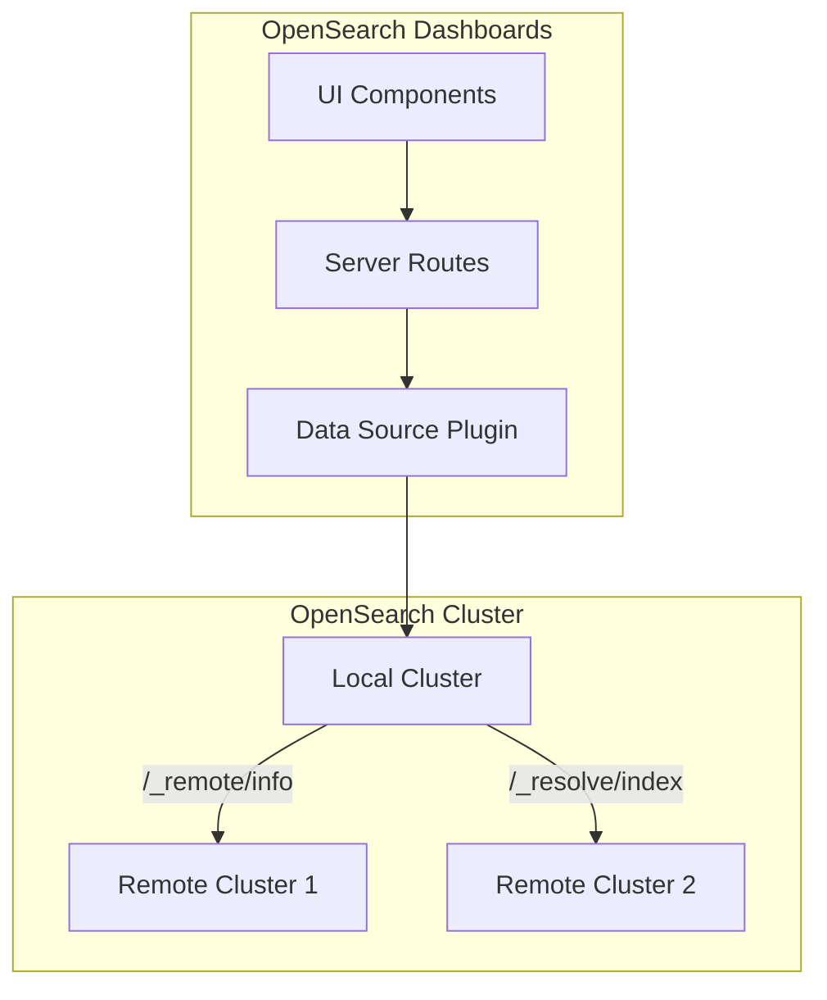

---
tags:
  - domain/core
  - component/dashboards
  - dashboards
  - indexing
  - search
---
# Cross-Cluster Search Support in OpenSearch Dashboards

## Summary

OpenSearch Dashboards v3.0.0 introduces native UI support for Cross-Cluster Search (CCS), enabling users to discover, view, and query data across multiple OpenSearch clusters directly from the Dashboards interface. Previously, while CCS was available via APIs since OpenSearch 1.0, there was no way to visualize or interact with remote cluster connections through the UI.

## Details

### What's New in v3.0.0

This release adds comprehensive Cross-Cluster Search support across multiple Dashboards pages:

1. **Data Sources Page**: Displays remote cluster connections as expandable rows under parent data sources
2. **Workspaces Page**: Shows cross-cluster connections when associating data sources with workspaces
3. **Index Pattern Creation**: Lists remote indices alongside local indices with visual indicators
4. **Discover Page**: Enables querying of remote cluster indices through the dataset selector

### Technical Changes

#### Architecture Changes

#### New Components

| Component | Description |
|-----------|-------------|
| `DataSourceEngineType.OpenSearchCrossCluster` | New engine type for cross-cluster connections |
| Remote Cluster Routes | Server-side API endpoints for listing remote clusters and indices |
| Cross-Cluster Connection UI | Expandable table rows showing remote connections |
| Dataset Explorer Enhancements | Support for remote indices in dataset selection |

#### New Configuration

| Setting | Description | Default |
|---------|-------------|---------|
| N/A | Feature is enabled by default when remote clusters are configured | - |

#### API Changes

New server-side routes added to `query_enhancements` plugin:

| Endpoint | Method | Description |
|----------|--------|-------------|
| `/api/enhancements/remote_cluster/list` | GET | Lists remote cluster connections for a data source |
| `/api/enhancements/remote_cluster/indexes` | GET | Lists indices available in a remote cluster |

### Usage Example

**Viewing Cross-Cluster Connections in Data Sources:**

1. Navigate to Data Sources management page
2. Data sources with remote connections show an expand arrow
3. Click to expand and view connected remote clusters

**Creating Index Patterns with Remote Indices:**

1. Go to Index Patterns → Create index pattern
2. Select a data source with remote connections
3. Remote indices appear with `cluster_alias:index_name` format
4. Select remote indices to include in the pattern

**Querying Remote Data in Discover:**

1. Open Discover page
2. In dataset selector, data sources with remote connections show an info icon
3. Remote indices are listed under the parent data source
4. Select a remote index to query data from the remote cluster

### Migration Notes

- No migration required - feature is automatically available when remote clusters are configured
- Existing cross-cluster search configurations via `/_remote/info` API are automatically detected

## Limitations

- **SQL queries**: Not supported for cross-cluster indexes/index patterns
- **PPL queries**: Limited support - only works for remote indexes that have their mapping stored in the local cluster
- **Authentication**: Remote cluster authentication must be configured at the OpenSearch level

## References

### Documentation
- [Cross-cluster search documentation](https://docs.opensearch.org/3.0/search-plugins/cross-cluster-search/): Official OpenSearch CCS documentation

### Pull Requests
| PR | Description |
|----|-------------|
| [#9566](https://github.com/opensearch-project/OpenSearch-Dashboards/pull/9566) | Show cross cluster connections in Data Sources and Workspaces page |
| [#9660](https://github.com/opensearch-project/OpenSearch-Dashboards/pull/9660) | Show cross cluster connections in Index Pattern and Discover Page |

### Issues (Design / RFC)
- [Issue #9578](https://github.com/opensearch-project/OpenSearch-Dashboards/issues/9578): Enhancement request for Cross-Cluster Search support

## Related Feature Report

- Full feature documentation
