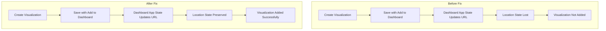

# Dashboard & Visualization Fixes

## Summary

This release includes two bug fixes that address issues when adding visualizations to dashboards in OpenSearch Dashboards. The fixes resolve problems with the "Add to Dashboards after saving" feature and URL encoding issues that could cause visualizations to fail to load.

## Details

### What's New in v3.0.0

Two critical bug fixes improve the reliability of adding visualizations to dashboards:

1. **Location State Preservation**: Fixes the "Add to Dashboards after saving" feature when `storeInSessionStorage` is enabled
2. **Search ID Encoding**: Properly encodes visualization IDs in URLs to prevent decoding issues

### Technical Changes

#### Fix 1: Preserve Location State at Dashboard App Startup (PR #9072)

When creating a new visualization from a dashboard and saving it with "Add to Dashboards after saving" enabled, the visualization would fail to be added. This occurred because the dashboard application state update at startup caused the `scopedHistory` location state to be lost.



**Changed Files:**
- `src/plugins/dashboard/public/application/utils/create_dashboard_app_state.tsx`
- `src/plugins/dashboard/public/application/utils/use/use_dashboard_app_state.tsx`
- `src/plugins/dashboard/public/application/utils/mocks.ts`

**Key Code Change:**
The `updateStateUrl` function now preserves the `scopedHistory` location state after flushing URL state changes:

```typescript
const previousState = scopedHistory.location.state;
const changed = osdUrlStateStorage.flush({ replace });
if (changed) {
  scopedHistory.replace({
    ...scopedHistory.location,
    state: previousState,
  });
}
```

#### Fix 2: Encode Search ID in URL (PR #8530)

When adding a new visualization, the visualization ID could be decoded after being added to the URL, causing a "not found" error.

**Changed File:**
- `src/plugins/visualizations/public/wizard/new_vis_modal.tsx`

**Key Code Change:**
```typescript
searchId = encodeURIComponent(searchId || '');
```

### Usage Example

To reproduce the fixed behavior:

1. Enable `storeInSessionStorage` in OpenSearch Dashboards settings
2. Navigate to an existing dashboard and click **Edit**
3. Click **Create New** and select a visualization type
4. Configure the visualization and click **Save**
5. Ensure **Add to Dashboards after saving** is enabled
6. Click **Save and Return**
7. The visualization is now correctly added to the dashboard

## Limitations

- These fixes are specific to the dashboard visualization workflow
- The location state preservation fix is particularly relevant when `storeInSessionStorage` is enabled

## References

### Documentation
- [PR #8164](https://github.com/opensearch-project/OpenSearch-Dashboards/pull/8164): Original PR that introduced the location state handling

### Pull Requests
| PR | Description |
|----|-------------|
| [#9072](https://github.com/opensearch-project/OpenSearch-Dashboards/pull/9072) | Preserve location state at dashboard app startup to fix adding a new visualization |
| [#8530](https://github.com/opensearch-project/OpenSearch-Dashboards/pull/8530) | Encode searchId as it tends to be decoded after adds into url |

### Issues (Design / RFC)
- [Issue #7204](https://github.com/opensearch-project/OpenSearch-Dashboards/issues/7204): Original bug report for "Add to Dashboards after saving" not working

## Related Feature Report

- [Full feature documentation](../../../features/opensearch-dashboards/dashboard-and-visualization-fixes.md)
