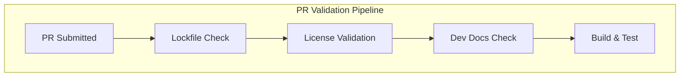

# Dashboards CI/CD & Documentation

## Summary

OpenSearch Dashboards v3.0.0 includes significant improvements to CI/CD pipelines and developer documentation. These changes enhance build reliability through lockfile validation and dependency license checks, add comprehensive documentation for Discover 2.0, and improve the developer experience with Docker-based development environments and automated documentation generation.

## Details

### What's New in v3.0.0

This release consolidates multiple CI/CD and documentation improvements:

1. **CI Pipeline Hardening**: Enhanced PR validation with lockfile sync checks and dependency license validation
2. **Discover 2.0 Documentation**: New developer guides for understanding and getting started with Discover 2.0
3. **Docker Development Environment**: Alternative Docker setup documentation for Cypress testing
4. **Developer Documentation Automation**: Git pre-commit hooks to ensure developer docs stay updated
5. **OpenAPI Documentation Fixes**: Corrected HTTP methods for bulk saved object APIs
6. **Triaging Process Documentation**: Added documentation for issue triaging workflow
7. **Maintainer Updates**: Added Joey Liu (@Maosaic) as a maintainer

### Technical Changes

#### CI/CD Improvements



| Check | Description |
|-------|-------------|
| Lockfile Sync | Validates yarn.lock is in sync with package.json |
| License Validation | Ensures dependencies comply with licensing requirements |
| Dev Docs | Verifies developer documentation is up-to-date |
| Actions Bump | Updated GitHub Actions to latest versions |

#### Developer Documentation

| Document | Description |
|----------|-------------|
| Understanding Discover 2.0 | Architecture and onboarding guide for new data types and languages |
| Getting Started with Discover 2.0 | Quick start guide for Discover 2.0 features |
| Docker Development Setup | Alternative Docker environment for Cypress testing |
| Triaging Process | Issue triaging workflow documentation |

#### Pre-commit Hook

The new pre-commit hook automatically runs `yarn docs:generateDevDocs` and validates that changes are staged:

```bash
# Hook validates:
# 1. Developer docs are generated
# 2. Generated changes are staged
# 3. Fails if unstaged changes exist
```

### Usage Example

To set up the development environment with Docker for Cypress testing:

```bash
# Follow the alternative Docker development environment documentation
# This allows creating datasources and filling data for Cypress tests
```

### Migration Notes

- Existing PRs may fail CI if lockfile is out of sync - run `yarn` to update
- Developer documentation changes now require staging the generated sidebar updates

## Limitations

- Pre-commit hook requires Node.js environment
- Docker development setup is specific to Cypress testing scenarios

## Related PRs

| PR | Description |
|----|-------------|
| [#9064](https://github.com/opensearch-project/OpenSearch-Dashboards/pull/9064) | Improve CI checks: lockfile sync, license validation, actions bump |
| [#8885](https://github.com/opensearch-project/OpenSearch-Dashboards/pull/8885) | Fix OpenAPI documentation for bulk saved object APIs |
| [#9291](https://github.com/opensearch-project/OpenSearch-Dashboards/pull/9291) | Add triaging process documentation |
| [#9325](https://github.com/opensearch-project/OpenSearch-Dashboards/pull/9325) | Add 2.19 Release Notes |
| [#9362](https://github.com/opensearch-project/OpenSearch-Dashboards/pull/9362) | Add Docker development environment documentation for Cypress |
| [#9463](https://github.com/opensearch-project/OpenSearch-Dashboards/pull/9463) | Initial version of Understanding Discover 2.0 |
| [#9467](https://github.com/opensearch-project/OpenSearch-Dashboards/pull/9467) | Add Joey Liu as maintainer |
| [#9525](https://github.com/opensearch-project/OpenSearch-Dashboards/pull/9525) | Getting started with Discover 2.0 |
| [#6585](https://github.com/opensearch-project/OpenSearch-Dashboards/pull/6585) | Add git pre-commit hook for developer docs |

## References

- [OpenSearch Dashboards Repository](https://github.com/opensearch-project/OpenSearch-Dashboards)

## Related Feature Report

- [Full feature documentation](../../../../features/opensearch-dashboards/dashboards-ci-cd-documentation.md)
