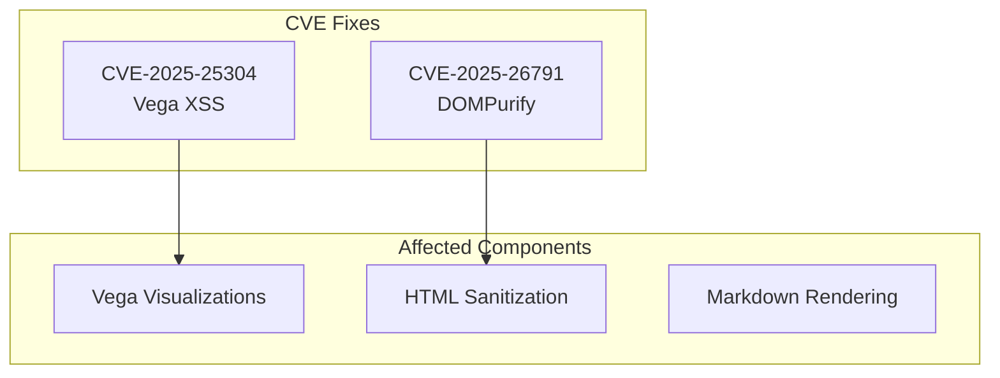

---
tags:
  - dashboards
  - performance
  - security
---

# Dashboards Dependency Updates

## Summary

OpenSearch Dashboards v3.0.0 includes critical security updates for three key dependencies: markdown-it, dompurify, and vega. These updates address multiple CVEs and improve the overall security posture of the Dashboards application.

## Details

### What's New in v3.0.0

Three security-focused dependency updates were merged to address known vulnerabilities:

| Dependency | Previous Version | New Version | CVE Addressed |
|------------|------------------|-------------|---------------|
| markdown-it | 12.3.2 | 13.0.2 | Security improvements |
| dompurify | 3.1.6 | 3.2.4 | CVE-2025-26791 |
| vega | 5.23.0 | 5.32.0 | CVE-2025-25304 (GHSA-mp7w-mhcv-673j) |

### Technical Changes

#### Vega Update (5.23.0 → 5.32.0)

The vega update required significant code changes beyond a simple version bump:

1. **Changed Vega Import Path**: Updated import in `src/plugins/vis_type_vega/public/lib/vega.js` to use standard browser-compatible import:
   ```javascript
   import * as vega from 'vega';
   // Instead of 'vega/build/vega-node' or 'vega/build-es5/vega'
   ```

2. **Updated Webpack Configuration**: Modified `packages/osd-optimizer/src/worker/webpack.config.ts`:
   - Removed noParse rules for Vega to allow proper webpack processing
   - Updated exclude pattern for vega-scenegraph and related packages for Babel processing

3. **Fixed Circular Dependency**: Resolved circular dependency in `src/plugins/vis_type_vega/public/vega_request_handler.ts`:
   ```javascript
   const VegaParserModule = await import('./data_model/vega_parser');
   const vp = new VegaParserModule.VegaParser(...);
   ```

#### DOMPurify Update (3.1.6 → 3.2.4)

Straightforward version bump addressing CVE-2025-26791 for HTML sanitization security.

#### Markdown-it Update (12.3.2 → 13.0.2)

Version bump for the markdown parsing library used in documentation rendering.

### Security Impact



### Migration Notes

These updates are transparent to end users. No configuration changes required.

For plugin developers using Vega:
- If importing Vega directly, use `import * as vega from 'vega'` instead of build-specific paths
- Dynamic imports may be needed to avoid circular dependencies

## Limitations

- Vega update required webpack configuration changes that may affect custom builds
- Some Vega visualizations may need testing to ensure compatibility with the new version

## References

### Documentation
- [GHSA-mp7w-mhcv-673j](https://github.com/vega/vega/security/advisories/GHSA-mp7w-mhcv-673j): Vega XSS vulnerability advisory
- [CVE-2025-26791](https://nvd.nist.gov/vuln/detail/CVE-2025-26791): DOMPurify vulnerability

### Pull Requests
| PR | Description |
|----|-------------|
| [#9412](https://github.com/opensearch-project/OpenSearch-Dashboards/pull/9412) | Bump markdown-it from 12.3.2 to 13.0.2 |
| [#9447](https://github.com/opensearch-project/OpenSearch-Dashboards/pull/9447) | Bump dompurify from 3.1.6 to 3.2.4 |
| [#9623](https://github.com/opensearch-project/OpenSearch-Dashboards/pull/9623) | Bump vega from 5.23.0 to 5.32.0 |

### Issues (Design / RFC)
- [Issue #9400](https://github.com/opensearch-project/OpenSearch-Dashboards/issues/9400): CVE-2025-25304 in vega-selections

## Related Feature Report

- [Full feature documentation](../../../features/opensearch-dashboards/dependency-updates.md)
