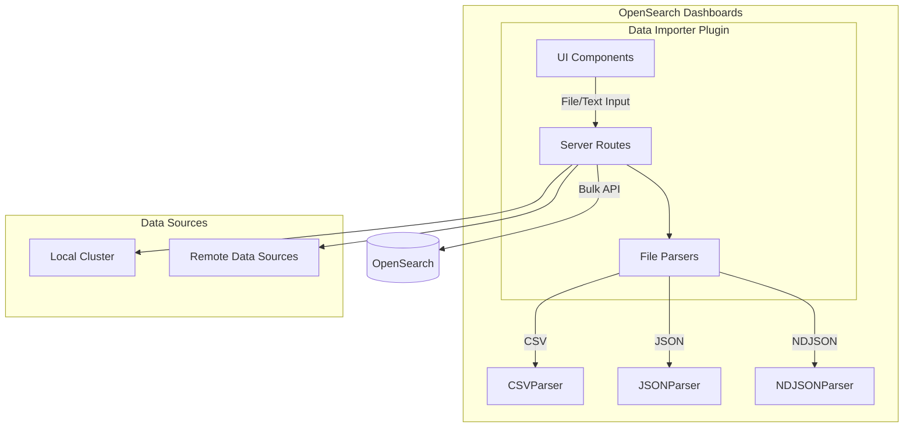

---
tags:
  - domain/core
  - component/dashboards
  - dashboards
  - indexing
---
# Data Importer Plugin

## Summary

OpenSearch Dashboards v3.0.0 introduces the **Data Importer Plugin**, a new core plugin that enables users to import static data files directly into OpenSearch indexes through the Dashboards UI. This feature eliminates the need for external scripts or direct API calls when ingesting small to medium-sized datasets, making it easier for users to quickly try out Dashboards with their own data.

## Details

### What's New in v3.0.0

The Data Importer Plugin is a completely new feature in v3.0.0 that provides:

- **File Upload Support**: Import data from CSV, JSON, and NDJSON files
- **Text Input Support**: Paste or type data directly in the UI
- **Multiple Data Source (MDS) Compatibility**: Select target data sources when MDS is enabled
- **Index Management**: Create new indexes or select existing ones for data ingestion
- **Data Preview**: Preview parsed data before importing
- **Automatic Mapping Detection**: Predicts index mappings based on data content

### Technical Changes

#### Architecture



#### New Components

| Component | Description |
|-----------|-------------|
| `DataImporterPlugin` | Main plugin class handling setup and registration |
| `DataImporterPluginApp` | React application component for the UI |
| `ImportTypeSelector` | Component for choosing between file upload and text input |
| `ImportFileContentBody` | File picker component for uploading data files |
| `ImportTextContentBody` | Code editor component for text input |
| `PreviewComponent` | Table component for previewing parsed data |
| `DelimiterSelect` | Selector for CSV delimiter options |

#### New Configuration

| Setting | Description | Default |
|---------|-------------|---------|
| `data_importer.enabled` | Enable/disable the plugin | `false` |
| `data_importer.enabledFileTypes` | Supported file types | `['csv', 'json', 'ndjson']` |
| `data_importer.maxFileSizeBytes` | Maximum file size in bytes | `100000000` (100MB) |
| `data_importer.maxTextCount` | Maximum character count for text input | `10000` |
| `data_importer.filePreviewDocumentsCount` | Number of documents to show in preview | `10` |

#### API Routes

| Route | Method | Description |
|-------|--------|-------------|
| `/api/data_importer/_import_file` | POST | Import data from uploaded file |
| `/api/data_importer/_import_text` | POST | Import data from text input |
| `/api/data_importer/_preview` | POST | Preview parsed file data |
| `/api/data_importer/_cat_indices` | GET | List available indexes |

### Usage Example

1. Enable the plugin in `opensearch_dashboards.yml`:
```yaml
data_importer.enabled: true
```

2. Navigate to Data Importer in Dashboards (Settings > Data Administration > Data Importer)

3. Select import type (Upload or Text)

4. Choose or create a target index

5. Upload a file or paste data:
```json
{"name": "John", "age": 30}
{"name": "Jane", "age": 25}
```

6. Click "Preview" to verify data parsing

7. Click "Import" to ingest data into OpenSearch

### Supported File Formats

| Format | Extension | Description |
|--------|-----------|-------------|
| CSV | `.csv` | Comma-separated values with configurable delimiters |
| JSON | `.json` | Single JSON document (treated as 1 document) |
| NDJSON | `.ndjson` | Newline-delimited JSON (one document per line) |

### Migration Notes

This is a new feature with no migration required. To enable:
1. Set `data_importer.enabled: true` in configuration
2. Restart OpenSearch Dashboards

## Limitations

- Maximum file size is configurable but defaults to 100MB
- Text input limited to 10,000 characters by default
- Single file import only (no batch file upload)
- No support for editing data before import in v3.0.0
- Plugin must be explicitly enabled in configuration

## References

### Documentation
- [OpenSearch Dashboards Repository](https://github.com/opensearch-project/OpenSearch-Dashboards)

### Pull Requests
| PR | Description |
|----|-------------|
| [#9602](https://github.com/opensearch-project/OpenSearch-Dashboards/pull/9602) | Add a new Data Importer Plugin to OSD Core |
| [#9408](https://github.com/opensearch-project/OpenSearch-Dashboards/pull/9408) | Data importer P0 release (feature branch) |
| [#10478](https://github.com/opensearch-project/OpenSearch-Dashboards/pull/10478) | Move Data Importer to Data Administration under settings |
| [#10961](https://github.com/opensearch-project/OpenSearch-Dashboards/pull/10961) | Data importer UI fixes |

### Issues (Design / RFC)
- [Issue #9199](https://github.com/opensearch-project/OpenSearch-Dashboards/issues/9199): RFC - Integrate a Data Importer Plugin into Dashboards

## Related Feature Report

- Full feature documentation
