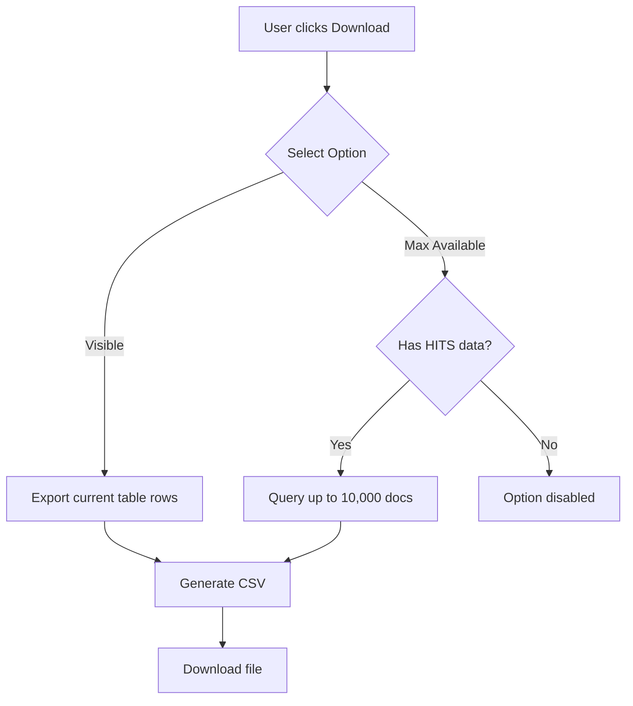

---
tags:
  - domain/core
  - component/dashboards
  - dashboards
  - search
  - sql
---
# Discover Plugin Enhancements

## Summary

OpenSearch Dashboards v3.0.0 introduces significant enhancements to the Discover plugin, including CSV export functionality, improved UI layout with relocated results counter, customizable summary panel titles, and extensibility improvements through the Data plugin's `__enhance` API. Additionally, multiple bug fixes improve saved search handling, workspace integration, and URL synchronization.

## Details

### What's New in v3.0.0

#### CSV Export from Discover

Users can now export search results directly from the Discover page to CSV format with two options:
- **Visible**: Downloads currently displayed rows (up to sample size)
- **Max Available**: Downloads up to 10,000 documents matching the query (DQL/Lucene only)



#### Results Action Bar

The results display has been reorganized:
- HITs counter moved closer to the table
- New `ResultsActionBar` component houses results count and export button
- Format: `Results (X/Y)` where X = displayed rows, Y = total hits
- For SQL queries without hits: `Results (X)`

#### Summary Panel Customization

New configuration option allows customizing the AI summary panel title:

```yaml
# opensearch_dashboards.yml
queryEnhancements.queryAssist.summary.branding.label: 'AI Assistant'
```

#### Data Plugin Extensibility

The Data plugin's `__enhance` API is now experimental and includes:
- `resultsActionBar`: Area for custom buttons in the results action bar
- Renamed `getSearchBarButton` to `getQueryControlButtons`
- Documentation for extension usage

### Technical Changes

#### New Components

| Component | Description |
|-----------|-------------|
| `ResultsActionBar` | Container for results count and action buttons |
| `DownloadCSV` | CSV export functionality with visible/max options |
| `useSyncQueryStateWithUrl` | Hook for proper URL sync cleanup |

#### New Configuration

| Setting | Description | Default |
|---------|-------------|---------|
| `queryEnhancements.queryAssist.summary.branding.label` | Custom title for summary panel | (none) |

#### API Changes

| Change | Description |
|--------|-------------|
| `formatHit.formatField()` | Now accepts `type` parameter for text/html output |
| `__enhance` | Marked as experimental, includes `resultsActionBar` |
| `getSearchBarButton` | Renamed to `getQueryControlButtons` |

### Bug Fixes

| Issue | Fix |
|-------|-----|
| URL sync memory leak | Properly clean up URL subscription when navigating away |
| Array mutation in flattenHit | Create new array instead of modifying original |
| Saved search columns not loading | Move column filtering to `DiscoverTable` |
| Saved search from snapshot URL | Preserve URL state when loading saved search |
| Query not loading in editor | Compare incoming props with state, not previous props |
| Workspace access | Prevent access to Discover outside workspace context |

### Usage Example

```typescript
// CSV Export - triggered from ResultsActionBar
// Visible option
downloadCSV(rows, columns, 'visible');

// Max Available option (up to 10,000)
const maxRows = Math.min(hits, 10000);
const data = await fetchAllDocuments(query, maxRows);
downloadCSV(data, columns, 'max-available');
```

### Migration Notes

- The `getSearchBarButton` method has been renamed to `getQueryControlButtons`
- The `__enhance` API is now experimental - usage may change in future versions
- `formatHit.formatField()` now requires explicit `type` parameter for non-HTML output

## Limitations

- CSV export "Max Available" option limited to 10,000 documents
- CSV export "Max Available" only available for DQL/Lucene queries (not SQL)
- Summary panel customization requires server restart

## References

### Pull Requests
| PR | Description |
|----|-------------|
| [#9530](https://github.com/opensearch-project/OpenSearch-Dashboards/pull/9530) | Add CSV export from Discover page |
| [#9498](https://github.com/opensearch-project/OpenSearch-Dashboards/pull/9498) | Move HITs counter and show results count |
| [#9494](https://github.com/opensearch-project/OpenSearch-Dashboards/pull/9494) | Update position of query summary and editor |
| [#9481](https://github.com/opensearch-project/OpenSearch-Dashboards/pull/9481) | Allow customizing summary panel title |
| [#9469](https://github.com/opensearch-project/OpenSearch-Dashboards/pull/9469) | Update formatHit to accept type parameter |
| [#9655](https://github.com/opensearch-project/OpenSearch-Dashboards/pull/9655) | Enable experimental __enhance with resultsActionBar |
| [#9316](https://github.com/opensearch-project/OpenSearch-Dashboards/pull/9316) | Clean up sync URL subscription in topNav |
| [#9347](https://github.com/opensearch-project/OpenSearch-Dashboards/pull/9347) | Fix flattenHit modifying original array |
| [#9523](https://github.com/opensearch-project/OpenSearch-Dashboards/pull/9523) | Correctly show selected columns from saved search |
| [#9529](https://github.com/opensearch-project/OpenSearch-Dashboards/pull/9529) | Correctly load saved search from snapshot URL |
| [#9541](https://github.com/opensearch-project/OpenSearch-Dashboards/pull/9541) | Correctly load saved search query in query editor |
| [#9465](https://github.com/opensearch-project/OpenSearch-Dashboards/pull/9465) | Prevent visiting Discover outside workspace |

### Issues (Design / RFC)
- [Issue #9309](https://github.com/opensearch-project/OpenSearch-Dashboards/issues/9309): URL sync subscription leak
- [Issue #9318](https://github.com/opensearch-project/OpenSearch-Dashboards/issues/9318): flattenHit array mutation bug

## Related Feature Report

- [Full feature documentation](../../../features/opensearch-dashboards/opensearch-dashboards-discover.md)
