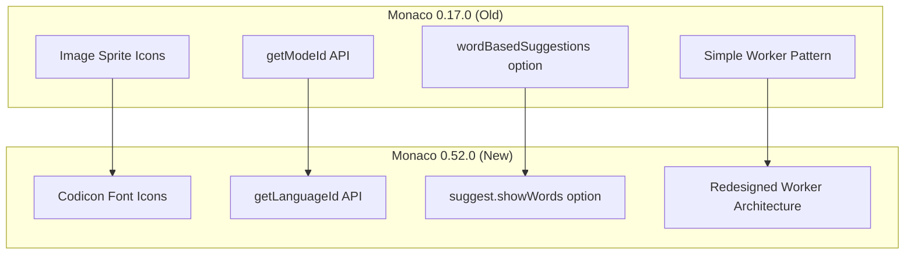

# Monaco Editor Upgrade

## Summary

OpenSearch Dashboards v3.0.0 includes a major upgrade of the Monaco Editor from version 0.17.0 to 0.52.0. This is a **breaking change** that modernizes the code editor component used throughout the Dashboards UI, including the Query Editor, Dev Tools Console, and various configuration editors. The upgrade brings improved performance, better accessibility, and modern JavaScript features support.

## Details

### What's New in v3.0.0

The Monaco Editor upgrade was implemented in two phases:
1. **Phase 1 (PR #9497)**: Upgrade from 0.17.0 to 0.30.1
2. **Phase 2 (PR #9618)**: Upgrade from 0.30.1 to 0.52.0

### Technical Changes

#### Architecture Changes



#### Key API Changes

| Old API (0.17.0) | New API (0.52.0) | Description |
|------------------|------------------|-------------|
| `model.getModeId()` | `model.getLanguageId()` | Language identification |
| `wordBasedSuggestions: false` | `suggest: { showWords: false }` | Disable word suggestions |
| `getWorker(module, languageId)` | `getWorker(workerId, label)` | Worker initialization |
| CSS pseudo-element status bar | Built-in `showStatusBar: true` | Suggestion widget status |

#### New Dependencies

| Package | Version | Purpose |
|---------|---------|---------|
| `monaco-editor` | ^0.52.0 | Core editor |
| `react-monaco-editor` | ^0.58.0 | React wrapper |
| `file-loader` | ^6.2.0 | Font file loading |
| `style-loader` | ^1.1.3 | CSS injection |
| `@babel/plugin-transform-numeric-separator` | ^7.25.9 | Modern JS syntax |

#### Webpack Configuration Changes

New babel plugins required to handle modern JavaScript syntax in Monaco 0.52.0:
- `@babel/plugin-transform-class-static-block`
- `@babel/plugin-transform-nullish-coalescing-operator`
- `@babel/plugin-transform-optional-chaining`
- `@babel/plugin-transform-numeric-separator`

#### Worker Implementation Changes

The worker architecture was significantly redesigned. Workers now use simplified implementations:

```typescript
// New simplified worker pattern
self.onmessage = () => {
  // Basic initialization
  // Worker is initialized and ready
};
```

#### Import Path Changes

Many import paths now include `/browser/` in their structure:

```typescript
// Old
import 'monaco-editor/esm/vs/editor/contrib/suggest/suggestController.js';

// New
import 'monaco-editor/esm/vs/editor/contrib/suggest/browser/suggestController';
```

### Migration Notes

#### For Plugin Developers

1. **Update completion providers**: Add `context` and `token` parameters to `provideCompletionItems`
2. **Update signature help providers**: Return a Promise with `{ value: {...}, dispose: () => {} }` structure
3. **Replace deprecated options**: Change `wordBasedSuggestions: false` to `suggest: { showWords: false }`
4. **Update language detection**: Replace `getModeId()` with `getLanguageId()`

#### For Test Authors

1. Add Monaco mock to Jest configuration
2. Add `window.matchMedia` mock for Monaco editor tests
3. Update `transformIgnorePatterns` to include `react-monaco-editor`

### Usage Example

```typescript
// Updated editor options for Monaco 0.52.0
const editorOptions = {
  minimap: { enabled: false },
  scrollBeyondLastLine: false,
  suggest: {
    snippetsPreventQuickSuggestions: false,
    filterGraceful: false,
    showStatusBar: true,  // Built-in status bar
    showWords: false,     // Replaces wordBasedSuggestions
  },
  acceptSuggestionOnEnter: 'off',
};

// Updated completion provider signature
const suggestionProvider = {
  triggerCharacters: [' '],
  provideCompletionItems: async (model, position, context, token) => {
    if (token.isCancellationRequested) {
      return { suggestions: [], incomplete: false };
    }
    // ... provide suggestions
  },
};
```

## Limitations

- Custom CSS-based status bar styling no longer works; must use Monaco's built-in status bar
- Some older plugins may need updates to work with the new Monaco API
- Worker files are simplified and may have reduced functionality compared to Monaco's full workers

## Related PRs

| PR | Description |
|----|-------------|
| [#9497](https://github.com/opensearch-project/OpenSearch-Dashboards/pull/9497) | Bump monaco-editor from 0.17.0 to 0.30.1 |
| [#9618](https://github.com/opensearch-project/OpenSearch-Dashboards/pull/9618) | Bump monaco-editor from 0.30.1 to 0.52.0 |

## References

- [Issue #9573](https://github.com/opensearch-project/OpenSearch-Dashboards/issues/9573): Bump monaco-editor from 0.30.1 to 0.52.0 (implementation notes)
- [Monaco Editor Changelog](https://github.com/microsoft/monaco-editor/blob/main/CHANGELOG.md): Official changelog

## Related Feature Report

- [Full feature documentation](../../../features/opensearch-dashboards/monaco-editor.md)
