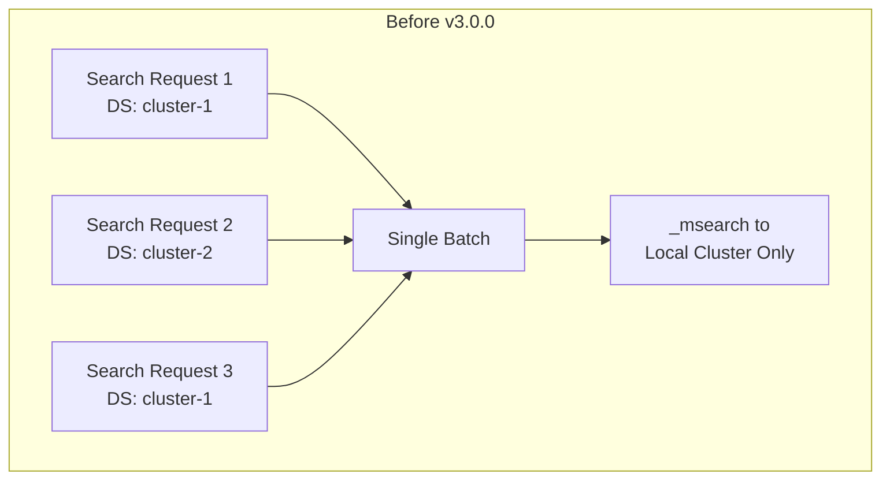
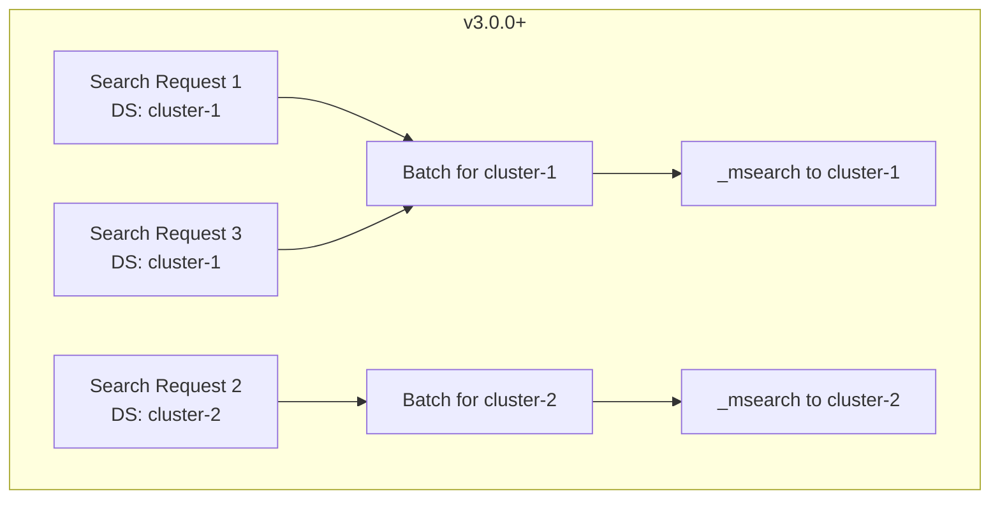

# Multi-Data Source (MDS)

## Summary

OpenSearch Dashboards v3.0.0 includes improvements to the Multi-Data Source (MDS) feature, adding support for batch concurrent search (`_msearch`) with multiple data sources and fixing UI/UX issues in the data source management interface.

## Details

### What's New in v3.0.0

This release addresses a long-standing limitation where batch concurrent search (`_msearch`) could not work with multiple data sources. Additionally, it includes UI improvements for the dataset selector and data source creation form.

### Technical Changes

#### MDS Support for msearch

Previously, when `courier:batchSearches` was enabled, all search requests were batched into a single `_msearch` call. However, this didn't work with MDS because search requests from different data sources couldn't be combined into a single batch.





#### New Components

| Component | Description |
|-----------|-------------|
| `dataSourceId` parameter in msearch | Allows specifying target data source for batch searches |
| Grouped request batching | Search requests are now grouped by data source before batching |
| `data_source_id` query parameter | Server-side routing parameter for msearch API |

#### API Changes

The internal `_msearch` API now accepts a `data_source_id` query parameter:

```
POST /internal/_msearch?data_source_id=<dataSourceId>
```

When provided, the msearch request is routed to the specified data source instead of the local cluster.

### Usage Example

Enable batch concurrent search with MDS:

```yaml
# opensearch_dashboards.yml
data_source.enabled: true
uiSettings:
  overrides:
    'courier:batchSearches': true
```

When viewing a dashboard with visualizations from multiple data sources, search requests are automatically grouped by data source and sent as separate `_msearch` batches.

### Bug Fixes

1. **Dataset Selector Column Header**: Changed from "Clusters" to "Data sources" for consistency, as the selector handles both clusters and collections.

2. **Data Source URL Trimming**: Leading and trailing spaces in data source URLs are now automatically trimmed when creating or testing connections, preventing connection errors.

## Limitations

- Timeline visualization types remain unsupported with MDS
- Reporting plugin is still de-registered when MDS is enabled
- Each `_msearch` batch can only target a single data source

## References

### Documentation
- [Documentation](https://docs.opensearch.org/3.0/dashboards/management/multi-data-sources/): Configuring and using multiple data sources

### Pull Requests
| PR | Description |
|----|-------------|
| [#9361](https://github.com/opensearch-project/OpenSearch-Dashboards/pull/9361) | Add MDS to msearch |
| [#9343](https://github.com/opensearch-project/OpenSearch-Dashboards/pull/9343) | Change from cluster to data sources for dataset selector column |
| [#9637](https://github.com/opensearch-project/OpenSearch-Dashboards/pull/9637) | Trim the URL for creating data source |

### Issues (Design / RFC)
- [Issue #2174](https://github.com/opensearch-project/OpenSearch-Dashboards/issues/2174): Original feature request for MDS batch concurrent search

## Related Feature Report

- [Full feature documentation](../../../features/multi-plugin/multi-data-source-support.md)
