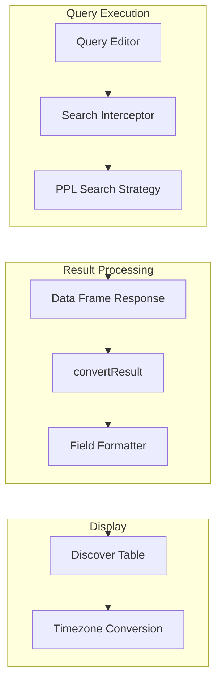

# PPL Query Support

## Summary

This release includes several bugfixes for PPL (Piped Processing Language) query support in OpenSearch Dashboards. The fixes address grammar parsing issues in auto-suggest, timezone handling for time columns, millisecond precision in date fields, error message display in query editors, and time range handling for non-search queries.

## Details

### What's New in v3.0.0

Five bugfixes improve the PPL query experience in Discover and query editors:

1. **Grammar Parsing Fix** - Auto-suggest now correctly handles PPL grammar changes
2. **Timezone Handling** - Time columns respect user's timezone and date format settings
3. **Millisecond Precision** - Date fields now include milliseconds (`YYYY-MM-DDTHH:mm:ss.SSSZ`)
4. **Error Message Display** - Error messages correctly display in both DQL and PPL query editors
5. **Time Range Handling** - Time range is only appended when using the `source` command

### Technical Changes

#### Date Formatting Architecture



#### New Components

| Component | Description |
|-----------|-------------|
| `formatter` option in `ISearchOptions` | Allows language-specific field formatting during result conversion |
| `processField` / `processNestedField` | Handles date formatting for flat and nested object fields |
| `isPPLSearchQuery` | Utility to detect if a PPL query uses the `source` command |
| `safeJSONParse` | Safely parses JSON error messages without throwing |
| `displayErrorMessage` | Extracts error details from various error response formats |

#### New Configuration

| Setting | Description | Default |
|---------|-------------|---------|
| `UI_SETTINGS.DATE_FORMAT` | Date format setting key | - |
| `UI_SETTINGS.DATE_FORMAT_TIMEZONE` | Timezone setting key | - |

#### API Changes

The `convertResult` function signature changed to accept an options object:

```typescript
// Before
convertResult(response: IDataFrameResponse): SearchResponse<any>

// After
convertResult({
  response,
  fields,
  options,
}: {
  response: IDataFrameResponse;
  fields?: SearchSourceFields;
  options?: ISearchOptions;
}): SearchResponse<any>
```

The `ISearchOptions` interface now includes a `formatter` property:

```typescript
interface ISearchOptions {
  withLongNumeralsSupport?: boolean;
  formatter?: (value: any, type: OSD_FIELD_TYPES) => any;
}
```

### Usage Example

PPL date fields are automatically formatted with the correct timezone:

```typescript
// PPL language config registers a formatter
fields: {
  formatter: (value: string, type: OSD_FIELD_TYPES) => {
    switch (type) {
      case OSD_FIELD_TYPES.DATE:
        return moment.utc(value).format('YYYY-MM-DDTHH:mm:ss.SSSZ');
      default:
        return value;
    }
  },
}
```

Time range is only appended for queries using the `source` command:

```ppl
# Time range appended
source = logs-* | where status >= 400

# Time range NOT appended (non-search queries)
describe logs-*
```

### Migration Notes

No migration required. These are bugfixes that improve existing PPL query functionality.

## Limitations

- PPL date formatting relies on UTC conversion; complex timezone scenarios may require additional handling
- Error message parsing handles multiple formats but may not cover all edge cases

## References

### Documentation
- [PPL Documentation](https://docs.opensearch.org/3.0/search-plugins/sql/ppl/index/): Official PPL language reference
- [SQL and PPL](https://docs.opensearch.org/3.0/search-plugins/sql/index/): SQL/PPL plugin overview

### Pull Requests
| PR | Description |
|----|-------------|
| [#9120](https://github.com/opensearch-project/OpenSearch-Dashboards/pull/9120) | Fix PPL grammar parsing issues in auto-suggest |
| [#9379](https://github.com/opensearch-project/OpenSearch-Dashboards/pull/9379) | Make PPL time column respect timezone and date format |
| [#9436](https://github.com/opensearch-project/OpenSearch-Dashboards/pull/9436) | Make PPL handle milliseconds in date fields |
| [#9586](https://github.com/opensearch-project/OpenSearch-Dashboards/pull/9586) | Correctly show error message in DQL and PPL query editor |
| [#9603](https://github.com/opensearch-project/OpenSearch-Dashboards/pull/9603) | Skip appending time range when not querying with source |

## Related Feature Report

- [Query Enhancements](../../../../features/opensearch-dashboards/query-enhancements.md)
