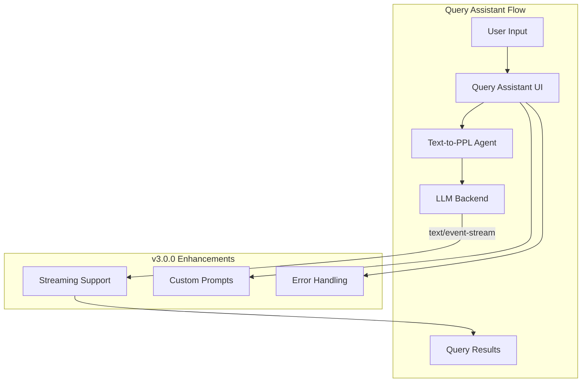

---
tags:
  - dashboards
  - ml
  - search
  - sql
---

# Query Assistant

## Summary

Query Assistant in OpenSearch Dashboards v3.0.0 receives several enhancements and bug fixes that improve the natural language to PPL query generation experience. Key improvements include streaming response support for real-time feedback, better error handling for unsupported datasets, prompt customization in request payloads, and fixes for UI state management issues.

## Details

### What's New in v3.0.0

This release includes 3 new features and 3 bug fixes for the Query Assistant functionality in OpenSearch Dashboards.

### Technical Changes

#### New Features

| Feature | Description | PR |
|---------|-------------|-----|
| Streaming Support | Returns pure fetch response when content-type is `text/event-stream`, enabling real-time streaming responses from LLM | [#9647](https://github.com/opensearch-project/OpenSearch-Dashboards/pull/9647) |
| Unsupported Dataset Handling | Displays error placeholder and disables input when selected dataset is not supported for query generation | [#9232](https://github.com/opensearch-project/OpenSearch-Dashboards/pull/9232) |
| Prompt Customization | Appends custom prompt for query assistant in request payload for enhanced query generation | [#9532](https://github.com/opensearch-project/OpenSearch-Dashboards/pull/9532) |

#### Bug Fixes

| Fix | Description | PR |
|-----|-------------|-----|
| Assistant Entry Visibility | Hides the assistant entry when data2summary agent is not configured | [#9277](https://github.com/opensearch-project/OpenSearch-Dashboards/pull/9277) |
| Placeholder Cleanup | Removes the placeholder of last asked question after query submission | [#9552](https://github.com/opensearch-project/OpenSearch-Dashboards/pull/9552) |
| PPL Refresh | Fixes issue where query assistant doesn't refresh generated PPL when regenerating | [#9601](https://github.com/opensearch-project/OpenSearch-Dashboards/pull/9601) |

#### Architecture Changes



### Usage Example

The streaming support enables real-time response display:

```typescript
// When content-type is text/event-stream, 
// the response is returned as a pure fetch response
// enabling streaming consumption
const response = await http.fetch('/api/assistant/query', {
  method: 'POST',
  body: JSON.stringify({
    question: 'Show me errors in the last hour',
    prompt: customPrompt // New in v3.0.0
  })
});

// For streaming responses
if (response.headers.get('content-type')?.includes('text/event-stream')) {
  // Handle streaming response
  const reader = response.body.getReader();
  // Process stream chunks...
}
```

### Migration Notes

No migration required. These changes are backward compatible.

## Limitations

- Streaming support requires the backend to return `text/event-stream` content type
- Query generation is limited to supported dataset types (index patterns)
- The data2summary agent must be configured for the assistant entry to appear

## References

### Documentation
- [OpenSearch Assistant for OpenSearch Dashboards](https://docs.opensearch.org/3.0/dashboards/dashboards-assistant/index/): Official documentation
- [OpenSearch Assistant Toolkit](https://docs.opensearch.org/3.0/ml-commons-plugin/opensearch-assistant/): ML Commons integration

### Blog Posts
- [OpenSearch adds a new generative AI assistant toolkit](https://opensearch.org/blog/opensearch-adds-new-generative-ai-assistant-toolkit/): Introduction blog post

### Pull Requests
| PR | Description |
|----|-------------|
| [#9647](https://github.com/opensearch-project/OpenSearch-Dashboards/pull/9647) | Support streaming when content type is event stream |
| [#9232](https://github.com/opensearch-project/OpenSearch-Dashboards/pull/9232) | Display query assistant when dataset is not supported |
| [#9532](https://github.com/opensearch-project/OpenSearch-Dashboards/pull/9532) | Append prompt for query assistant in request payload |
| [#9277](https://github.com/opensearch-project/OpenSearch-Dashboards/pull/9277) | Hide the assistant entry when there isn't data2summary agent |
| [#9552](https://github.com/opensearch-project/OpenSearch-Dashboards/pull/9552) | Query-assist removed the placeholder of last ask question |
| [#9601](https://github.com/opensearch-project/OpenSearch-Dashboards/pull/9601) | Query assistant doesn't refresh generated ppl |

## Related Feature Report

- [Full feature documentation](../../../features/opensearch-dashboards/query-assistant.md)
