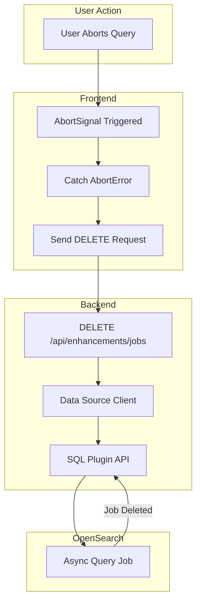

---
tags:
  - domain/core
  - component/dashboards
  - dashboards
  - search
  - sql
---
# S3 / Direct Query Connections

## Summary

OpenSearch Dashboards v3.0.0 includes several improvements to S3 and Direct Query Connections, focusing on query cancellation, data type mappings, and memory leak prevention. These changes improve the reliability and stability of querying external S3 data sources through OpenSearch Dashboards.

## Details

### What's New in v3.0.0

1. **Backend Job Cancellation**: When users abort S3 queries in Discover, the backend jobs are now properly canceled/deleted via the SQL plugin API
2. **Extended Numeric Type Mappings**: Added support for `tinyint`, `smallint`, and `bigint` data types in S3 datasets
3. **Memory Leak Fix**: Fixed potential memory leak in `getDirectQueryConnections` with Node.js 20 compatibility

### Technical Changes

#### Query Cancellation Flow



#### New Components

| Component | Description |
|-----------|-------------|
| `DELETE /api/enhancements/jobs` | New API endpoint for canceling async query jobs |
| `enhancements.deleteJob` | Backend client method to delete jobs via SQL plugin |
| S3 Field Type Mappings | Extended numeric type support for S3 datasets |

#### New Configuration

| Setting | Description | Default |
|---------|-------------|---------|
| `data_source.clientPool.size` | Client pool size for data source connections | `10` (was `5`) |
| Request timeout for `ppl.getDataConnections` | Timeout for direct query connection requests | `5000ms` |

#### API Changes

New DELETE endpoint for job cancellation:

```
DELETE /api/enhancements/jobs?id={dataSourceId}&queryId={queryId}
```

### Usage Example

When a user starts an S3 query and then clicks the query button again or navigates away, the previous query is automatically canceled:

```typescript
// Frontend automatically cancels previous query
// When AbortError is caught, DELETE request is sent
await http.fetch({
  method: 'DELETE',
  path: '/api/enhancements/jobs',
  query: {
    id: dataSource.id,
    queryId: previousQueryId,
  },
});
```

### Migration Notes

- The default client pool size has increased from 5 to 10, which may affect memory usage in environments with many concurrent data source connections
- The 5-second timeout on `ppl.getDataConnections` prevents hanging requests but may cause timeouts in slow network environments

## Limitations

- If more than 10 data sources are loaded on a single page, server crashes may still occur due to a deprecated `parseUrl` function in the elasticsearch legacy library (tracked in Issue #2220)
- Query cancellation requires the SQL plugin to be installed and configured

## References

### Documentation
- [Connecting Amazon S3 to OpenSearch](https://docs.opensearch.org/3.0/dashboards/management/S3-data-source/): Official documentation

### Pull Requests
| PR | Description |
|----|-------------|
| [#9355](https://github.com/opensearch-project/OpenSearch-Dashboards/pull/9355) | Deletes S3 Jobs in Backend when Original Query is Canceled |
| [#9430](https://github.com/opensearch-project/OpenSearch-Dashboards/pull/9430) | Add mappings for tinyint, smallint, and bigint in S3 dataset type |
| [#9575](https://github.com/opensearch-project/OpenSearch-Dashboards/pull/9575) | Fix potential memory leak in getDirectQueryConnections |

### Issues (Design / RFC)
- [Issue #9459](https://github.com/opensearch-project/OpenSearch-Dashboards/issues/9459): Node.js v20 Plugin Verification Meta Issue
- [Issue #2220](https://github.com/opensearch-project/OpenSearch-Dashboards/issues/2220): Elasticsearch legacy client deprecation

## Related Feature Report

- Full feature documentation
