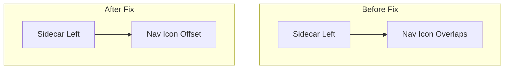

---
tags:
  - domain/core
  - component/dashboards
  - dashboards
---
# UI/UX Improvements

## Summary

OpenSearch Dashboards v3.0.0 includes two UI/UX bug fixes that improve navigation compatibility with the sidecar panel and fix data frame conversion errors when handling null or undefined values.

## Details

### What's New in v3.0.0

#### Navigation Icon Sidecar Compatibility

Fixed an issue where the navigation toggle icon was not properly positioned when the sidecar panel (e.g., chatbot) was docked to the left side of the screen.

**Problem**: The navigation toggle button used a fixed position with `left: 0`, which caused it to overlap with the sidecar panel when docked to the left.

**Solution**: Added dynamic left positioning based on sidecar configuration. When the sidecar is docked to the left, the navigation icon adjusts its position to account for the sidecar width.



#### Data Frame Null/Undefined Conversion Fix

Fixed a TypeError that occurred when processing data frames containing null or undefined values in nested object fields.

**Problem**: The `processNestedFieldEntry` function called `Object.entries()` on values without checking for null/undefined, causing "Cannot convert undefined or null to object" errors.

**Solution**: Added a null check before calling `Object.entries()`, returning the value directly when it's falsy.

```typescript
// Before (caused error)
Object.entries(value).forEach(...)

// After (fixed)
if (!value) {
  return value;
}
Object.entries(value).forEach(...)
```

### Technical Changes

#### New Components

| Component | Description |
|-----------|-------------|
| `getSidecarLeftNavStyle` | Helper function to calculate left offset for nav elements when sidecar is docked left |

#### Changed Files

| File | Change |
|------|--------|
| `src/core/public/overlays/sidecar/helper.ts` | Added `getSidecarLeftNavStyle` function |
| `src/core/public/chrome/ui/header/header.tsx` | Applied sidecar left nav style to toggle button |
| `src/core/public/chrome/ui/header/collapsible_nav_group_enabled.scss` | Changed `.searchBarIcon` from `fixed` to `relative` position |
| `src/plugins/data/common/data_frames/utils.ts` | Added null check in `processNestedFieldEntry` |

### Usage Example

The sidecar left nav style helper:

```typescript
import { getSidecarLeftNavStyle } from '../../../overlays';

// Returns { left: paddingSize } when sidecar is docked left
// Returns {} otherwise
const style = getSidecarLeftNavStyle(sidecarConfig);
```

## Limitations

- Navigation icon positioning only applies when sidecar is docked to the left
- The null check fix applies to all nested object fields in data frames

## References

### Documentation
- [OpenSearch Dashboards Repository](https://github.com/opensearch-project/OpenSearch-Dashboards)

### Pull Requests
| PR | Description |
|----|-------------|
| [#9514](https://github.com/opensearch-project/OpenSearch-Dashboards/pull/9514) | Make nav icon style compatible with sidecar |
| [#9516](https://github.com/opensearch-project/OpenSearch-Dashboards/pull/9516) | Fix data frame null or undefined object conversion error |

## Related Feature Report

- [Full feature documentation](../../../../features/opensearch-dashboards/dashboards-ui-ux-fixes.md)
