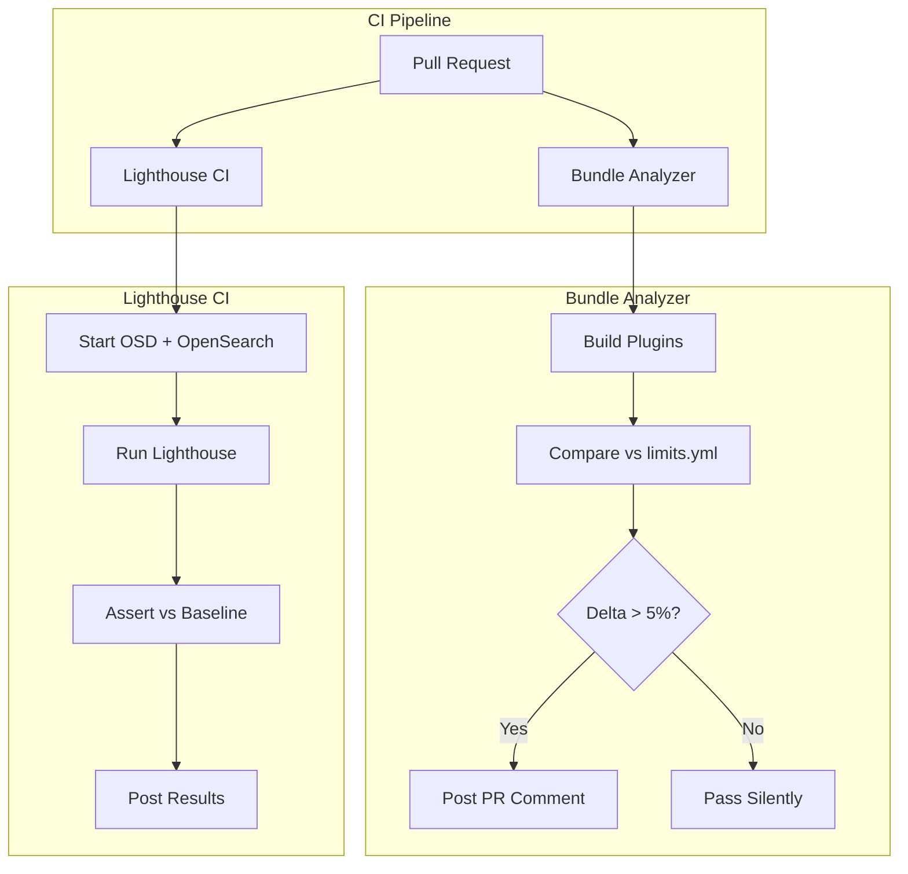

# Webpack & Build Performance

## Summary

OpenSearch Dashboards v3.0.0 introduces automated performance monitoring for build artifacts and page load metrics. Two new CI workflows help developers track bundle size variations and page performance regressions, enabling proactive optimization and preventing performance degradation.

## Details

### What's New in v3.0.0

This release adds two complementary performance monitoring capabilities:

1. **Webpack Bundle Analyzer** - Monitors plugin bundle sizes and alerts when changes exceed 5% threshold
2. **Lighthouse CI** - Measures page load performance metrics (First Contentful Paint, Speed Index) against baselines

### Technical Changes

#### Architecture



#### New Components

| Component | Description |
|-----------|-------------|
| `performance_testing.yml` | GitHub Actions workflow for bundle size monitoring |
| `lighthouse_testing.yml` | GitHub Actions workflow for Lighthouse CI |
| `.lighthouserc.js` | Lighthouse CI configuration with page URLs and thresholds |
| `baselines/lighthouse_baseline.json` | Performance baseline values for key pages |
| `packages/osd-optimizer/src/limits.ts` | Enhanced to track bundle size variations |

#### New Configuration

| Setting | Description | Default |
|---------|-------------|---------|
| `DELTA_LIMIT` | Bundle size variation threshold | 0.05 (5%) |
| `first-contentful-paint` | FCP threshold per page | 1800-2800ms |
| `speed-index` | Speed Index threshold per page | 15000-30000ms |

#### Lighthouse Baseline Configuration

```json
{
  "/app/home": {
    "first-contentful-paint": 2800,
    "speed-index": 20000
  },
  "/app/data-explorer/discover": {
    "first-contentful-paint": 2200,
    "speed-index": 30000
  },
  "/app/dashboards": {
    "first-contentful-paint": 2200,
    "speed-index": 30000
  },
  "/app/visualize": {
    "first-contentful-paint": 2200,
    "speed-index": 28000
  }
}
```

### Usage Example

#### Running Lighthouse Locally

```bash
# Install Lighthouse CI
yarn add --dev @lhci/cli

# Run Lighthouse CI
yarn lhci autorun
```

#### Bundle Size Monitoring

The bundle analyzer runs automatically on PRs. When a plugin's bundle size increases by more than 5%, a comment is posted:

```
📊 **Bundle Size crossed 5% for below plugins**

pageLoadAssetSizeVariation:
  myPlugin: 12
```

### How It Works

**Bundle Analyzer Workflow:**
1. Builds all platform plugins
2. Runs `--update-limits` to compare against `limits.yml`
3. Generates `limits_delta.yml` for plugins exceeding 5% threshold
4. Posts results as PR comment

**Lighthouse Workflow:**
1. Starts OpenSearch and OpenSearch Dashboards
2. Loads sample e-commerce data
3. Runs Lighthouse against configured URLs
4. Compares metrics against baseline
5. Posts detailed report with links to hosted Lighthouse reports

## Limitations

- Lighthouse CI runs only on PRs to `main` branch
- Bundle analyzer ignores documentation, test files, and workflow changes
- Performance thresholds are warnings only (don't fail CI)
- Lighthouse results can vary based on CI runner load

## Related PRs

| PR | Description |
|----|-------------|
| [#9320](https://github.com/opensearch-project/OpenSearch-Dashboards/pull/9320) | Webpack bundle analyser limit check |
| [#9304](https://github.com/opensearch-project/OpenSearch-Dashboards/pull/9304) | Lighthouse Page Performance Metrics CI workflow |

## References

- [PR #9320](https://github.com/opensearch-project/OpenSearch-Dashboards/pull/9320): Bundle analyzer implementation
- [PR #9304](https://github.com/opensearch-project/OpenSearch-Dashboards/pull/9304): Lighthouse CI implementation
- [Lighthouse CI Documentation](https://github.com/GoogleChrome/lighthouse-ci)

## Related Feature Report

- [Full feature documentation](../../../features/opensearch-dashboards/webpack-and-build-performance.md)
