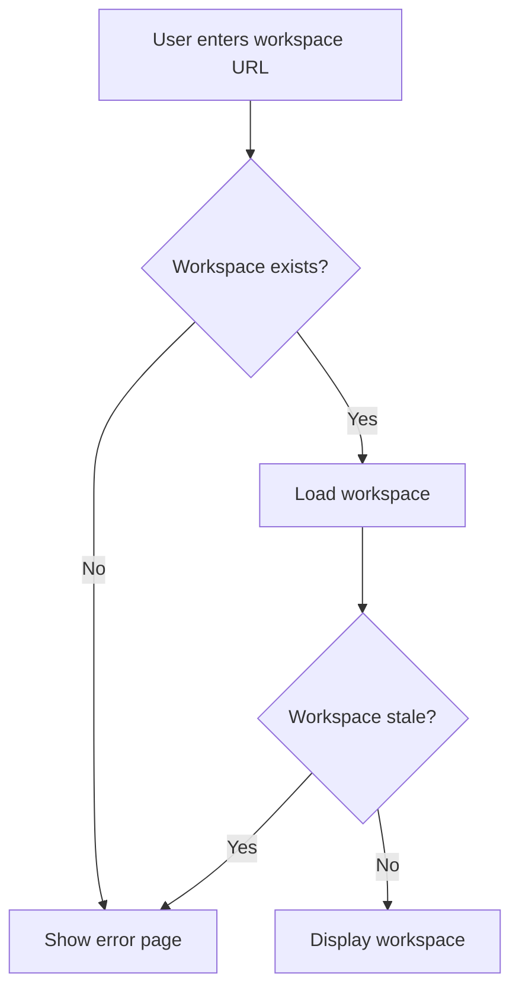

# Workspace Improvements

## Summary

OpenSearch Dashboards v3.0.0 includes several bug fixes for the Workspace feature that improve stability and user experience. These fixes address issues with saved object isolation, error handling for deleted items in recent lists, and stale workspace state handling.

## Details

### What's New in v3.0.0

Three key bug fixes improve workspace reliability:

1. **Saved Objects Isolation Fix**: The `_find` API now correctly returns only saved objects within the current workspace context
2. **Recent Items Error Filtering**: Deleted or inaccessible items are filtered out from the recent items list
3. **Stale Workspace Error Handling**: Users are redirected to an error page instead of getting stuck in a loading state when accessing a stale workspace

### Technical Changes

#### Saved Objects Find API Fix (PR #9420)

Previously, when querying saved objects within a workspace context without explicit `workspace` query parameters, the API would return all saved objects across all workspaces. This was a security and usability issue.

**Root Cause**: The endpoint passed `workspace: undefined` when no workspace parameter was provided, bypassing workspace filtering.

**Fix**: Modified `src/plugins/saved_objects_management/server/routes/find.ts` to only include the `workspaces` property when explicitly provided:

```typescript
// Before
workspaces: req.query.workspaces ? Array<string>().concat(req.query.workspaces) : undefined,

// After
...(req.query.workspaces
  ? {
      workspaces: Array<string>().concat(req.query.workspaces),
    }
  : {}),
```

#### Recent Items Error Filtering (PR #9346)

The recent items component now filters out saved objects that have errors (e.g., deleted objects) before displaying them.

**Changed File**: `src/core/public/chrome/ui/header/recent_items.tsx`

```typescript
const formatDetailedSavedObjects = res
  .filter((obj) => !obj.error) // filter out saved objects with errors
  .map((obj) => {
    // ... formatting logic
  });
```

#### Stale Workspace Error Handling (PR #9478)

A new `WorkspaceValidationService` handles workspace state validation and redirects users to an error page when the workspace is stale.



**New Components**:

| Component | Description |
|-----------|-------------|
| `WorkspaceValidationService` | Validates workspace state during initialization |
| `WorkspaceError` enum | Defines workspace error types (e.g., `WORKSPACE_IS_STALE`) |
| `workspaceError$` | Observable stream for workspace errors |

**Error Flow**:
1. User navigates to workspace URL
2. `WorkspaceValidationService` checks workspace validity
3. If workspace is stale or not found, `workspaceError$` emits error
4. Plugin redirects to `WORKSPACE_FATAL_ERROR_APP_ID` with error message

### Migration Notes

No migration required. These are bug fixes that improve existing behavior.

## Limitations

- The stale workspace error page requires manual navigation back to the home page
- Recent items filtering only removes items with errors; it does not automatically clean up the recent items storage

## References

### Documentation
- [Workspace Documentation](https://docs.opensearch.org/3.0/dashboards/workspace/workspace/): Official workspace feature documentation

### Pull Requests
| PR | Description |
|----|-------------|
| [#9420](https://github.com/opensearch-project/OpenSearch-Dashboards/pull/9420) | Fix saved objects find returning all workspaces |
| [#9346](https://github.com/opensearch-project/OpenSearch-Dashboards/pull/9346) | Filter out recent items with errors |
| [#9478](https://github.com/opensearch-project/OpenSearch-Dashboards/pull/9478) | Add error handling page for stale workspace state |

## Related Feature Report

- [Full feature documentation](../../../features/opensearch-dashboards/workspace.md)
