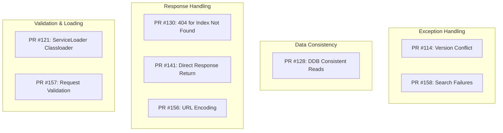

---
tags:
  - domain/core
  - component/server
  - indexing
  - search
---
# Remote Metadata Store Bugfixes

## Summary

OpenSearch 3.0.0 includes 8 bug fixes for the Remote Metadata SDK that improve reliability, consistency, and error handling across Local Cluster and DynamoDB storage backends. These fixes address issues with version conflict detection, classloader handling, data consistency, error responses, and request validation.

## Details

### What's New in v3.0.0

This release focuses on stability and correctness improvements for the Remote Metadata SDK:

1. **Version Conflict Detection**: Fixed exception unwrapping for proper version conflict handling
2. **ServiceLoader Classloader**: Corrected classloader usage for SPI service discovery
3. **DynamoDB Consistency**: Enabled strongly consistent reads for getItem operations
4. **Error Handling**: Improved 404 responses and search failure handling
5. **Response Passthrough**: Direct response return to avoid serialization issues
6. **URL Encoding**: Proper handling of URL-encoded ID and index values
7. **Request Validation**: Added validation for put/update request fields

### Technical Changes

#### Bug Fix Categories



#### Fix Details

| PR | Issue | Root Cause | Fix |
|----|-------|------------|-----|
| #114 | Version conflicts not detected | `RemoteTransportException` wrapping | Unwrap cause before checking `VersionConflictEngineException` |
| #121 | ServiceLoader fails to find implementations | Wrong classloader context | Use `SdkClientDelegate.class.getClassLoader()` |
| #128 | Stale reads from DynamoDB | Eventually consistent by default | Add `.consistentRead(true)` to getItem requests |
| #130 | Missing 404 for index not found | Local cluster search not returning proper status | Return 404 status code for `IndexNotFoundException` |
| #141 | Aggregation queries fail | Response serialization/deserialization issues | Directly return responses without re-serialization |
| #156 | JSON parsing errors with special characters | URL-encoded strings not decoded | Properly handle URL-encoded ID and index values |
| #157 | Invalid requests cause 500 errors | Missing request validation | Validate index, id, and data object fields |
| #158 | Search failures return wrong status | `CompletionException` not unwrapped, status type mismatch | Properly unwrap exceptions and handle `RestStatus` |

### Usage Example

These fixes are transparent to users. The SDK now correctly handles edge cases:

```java
// Version conflict detection now works correctly
UpdateDataObjectRequest request = UpdateDataObjectRequest.builder()
    .index("my-index")
    .id("doc-id")
    .ifSeqNo(expectedSeqNo)
    .ifPrimaryTerm(expectedPrimaryTerm)
    .dataObject(updatedData)
    .build();

sdkClient.updateDataObjectAsync(request)
    .whenComplete((response, throwable) -> {
        if (throwable != null) {
            // Now correctly identifies VersionConflictEngineException
            // even when wrapped in RemoteTransportException
        }
    });
```

```java
// DynamoDB reads are now strongly consistent
GetDataObjectRequest request = GetDataObjectRequest.builder()
    .index("my-index")
    .id("doc-id")
    .build();

// Returns the latest value immediately after writes
sdkClient.getDataObjectAsync(request);
```

### Migration Notes

No migration required. These are backward-compatible bug fixes that improve existing behavior.

## Limitations

- DynamoDB strongly consistent reads may have slightly higher latency than eventually consistent reads
- Search operations on DynamoDB still require zero-ETL replication to OpenSearch

## References

### Pull Requests
| PR | Description |
|----|-------------|
| [#114](https://github.com/opensearch-project/opensearch-remote-metadata-sdk/pull/114) | Fix version conflict check for update |
| [#121](https://github.com/opensearch-project/opensearch-remote-metadata-sdk/pull/121) | Use SdkClientDelegate's classloader for ServiceLoader |
| [#128](https://github.com/opensearch-project/opensearch-remote-metadata-sdk/pull/128) | Ensure consistent reads on DynamoDB getItem calls |
| [#130](https://github.com/opensearch-project/opensearch-remote-metadata-sdk/pull/130) | Return 404 for Index not found on Local Cluster search |
| [#141](https://github.com/opensearch-project/opensearch-remote-metadata-sdk/pull/141) | Directly return responses from Local Cluster client |
| [#156](https://github.com/opensearch-project/opensearch-remote-metadata-sdk/pull/156) | Make generated responses robust to URL encoded id and index values |
| [#157](https://github.com/opensearch-project/opensearch-remote-metadata-sdk/pull/157) | Validate request fields in DDB Put and Update implementations |
| [#158](https://github.com/opensearch-project/opensearch-remote-metadata-sdk/pull/158) | Properly handle remote client search failures with status codes |

### Issues (Design / RFC)
- [Issue #127](https://github.com/opensearch-project/opensearch-remote-metadata-sdk/issues/127): DDB getItem() API is only eventually consistent
- [Issue #132](https://github.com/opensearch-project/opensearch-remote-metadata-sdk/issues/132): Unable to call aggregation in ml-commons API
- [Issue #154](https://github.com/opensearch-project/opensearch-remote-metadata-sdk/issues/154): DDBClient does not validate request fields
- [Issue #1082](https://github.com/opensearch-project/flow-framework/issues/1082): Provision workflow failed due to version conflicts

## Related Feature Report

- Full feature documentation
