---
tags:
  - performance
  - search
---

# Aggregations

## Summary

OpenSearch 3.0.0 introduces performance optimizations for aggregation operations, including a new `execution_hint` parameter for cardinality aggregation, latency and memory improvements for multi-term aggregations, and sorting optimizations for numeric term aggregations. These changes reduce query latency by 7-10 seconds for multi-term queries and eliminate unnecessary sorting overhead.

## Details

### What's New in v3.0.0

Three key aggregation improvements are included in this release:

1. **Cardinality Aggregation `execution_hint`**: New parameter to control how cardinality aggregation executes
2. **Multi-Term Aggregation Performance**: Reduced latency and memory allocations
3. **Numeric Term Aggregation Sorting**: Eliminated unnecessary heap sort operations

### Technical Changes

#### Architecture Changes

```mermaid
graph TB
    subgraph "Cardinality Aggregation"
        CA[Cardinality Request] --> EH{execution_hint?}
        EH -->|ordinals| OC[OrdinalsCollector]
        EH -->|direct| DC[DirectCollector]
        EH -->|none| Auto[Auto-select based on heuristics]
        Auto --> OC
        Auto --> DC
    end
    
    subgraph "Multi-Term Aggregation"
        MTA[Multi-Term Request] --> CV[Collect Values]
        CV --> CK[Generate Composite Keys]
        CK --> BO[Add to BucketOrds]
        BO --> Result[Aggregation Result]
    end
    
    subgraph "Numeric Term Aggregation"
        NTA[Numeric Term Request] --> PQ[Priority Queue]
        PQ --> KO{Key Order?}
        KO -->|Yes| Sort[Heap Sort Pop]
        KO -->|No| Iter[Iterator - No Sort]
        Sort --> NResult[Result]
        Iter --> NResult
    end
```



#### New Components

| Component | Description |
|-----------|-------------|
| `ExecutionMode` | Enum with `DIRECT` and `ORDINALS` values for cardinality execution |
| `execution_hint` parameter | New aggregation parameter accepting `"direct"` or `"ordinals"` |

#### New Configuration

| Setting | Description | Default |
|---------|-------------|---------|
| `execution_hint` | Controls cardinality aggregation execution mode | Auto-select |

### Usage Example

#### Cardinality with execution_hint

```json
GET /logs/_search
{
  "size": 0,
  "aggs": {
    "unique_users": {
      "cardinality": {
        "field": "user_id.keyword",
        "execution_hint": "ordinals"
      }
    }
  }
}
```

Valid values:
- `ordinals`: Forces use of OrdinalsCollector (faster but uses more memory)
- `direct`: Forces use of DirectCollector (slower but more memory-efficient)

#### Multi-Term Aggregation (automatic optimization)

```json
GET /events/_search
{
  "size": 0,
  "aggs": {
    "by_fields": {
      "multi_terms": {
        "terms": [
          { "field": "agent_name" },
          { "field": "host_name" }
        ]
      }
    }
  }
}
```

### Migration Notes

- The `execution_hint` parameter is optional; existing queries continue to work with automatic selection
- Multi-term and numeric term optimizations are automatic and require no configuration changes
- For high-cardinality fields experiencing latency regression from OS 2.x, try `"execution_hint": "ordinals"`

## Limitations

- `execution_hint: "ordinals"` on non-ordinal fields (like numeric fields) has no effect
- `execution_hint: "direct"` on ordinal fields has no effect
- Ordinals use byte arrays sized by field cardinality; very high cardinality fields risk OOM errors
- Multi-term aggregation still consumes more memory than single terms aggregation

## References

### Documentation
- [Cardinality Aggregation Documentation](https://docs.opensearch.org/3.0/aggregations/metric/cardinality/): Official documentation with execution_hint details
- [Multi-terms Aggregation Documentation](https://docs.opensearch.org/3.0/aggregations/bucket/multi-terms/): Multi-terms aggregation usage

### Pull Requests
| PR | Description |
|----|-------------|
| [#17312](https://github.com/opensearch-project/OpenSearch/pull/17312) | Introduce `execution_hint` for Cardinality aggregation |
| [#14993](https://github.com/opensearch-project/OpenSearch/pull/14993) | Latency and memory allocation improvements to Multi Term Aggregation queries |
| [#17252](https://github.com/opensearch-project/OpenSearch/pull/17252) | Improve performance of NumericTermAggregation by avoiding unnecessary sorting |

### Issues (Design / RFC)
- [Issue #16837](https://github.com/opensearch-project/OpenSearch/issues/16837): Feature request for high cardinality field aggregation improvements

## Related Feature Report

- [Full feature documentation](../../../features/opensearch/aggregation-optimizations.md)
