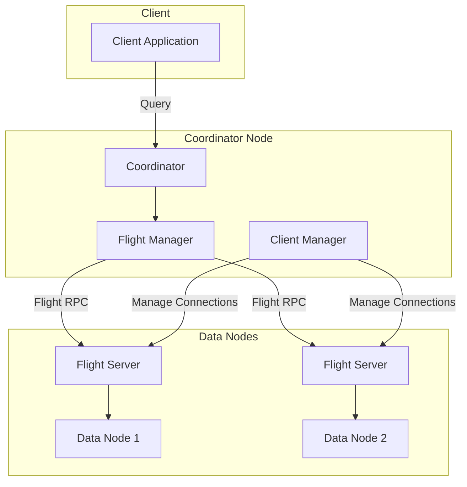

# Arrow Flight RPC

## Summary

OpenSearch 3.0.0 introduces the Arrow Flight RPC plugin, enabling high-performance data transfer using Apache Arrow Flight protocol. This experimental feature provides efficient streaming communication between data nodes and coordinator nodes, eliminating serialization/deserialization overhead through zero-copy data transfer.

## Details

### What's New in v3.0.0

The Arrow Flight RPC plugin introduces a new transport layer for OpenSearch that leverages Apache Arrow's columnar memory format and Flight RPC framework for efficient data streaming.

### Technical Changes

#### Architecture Changes



#### New Components

| Component | Description |
|-----------|-------------|
| `FlightStreamPlugin` | Main plugin class that bootstraps Arrow Flight server and client |
| `FlightServer` | Arrow Flight server implementation for handling streaming requests |
| `ClientManager` | Manages pool of Flight clients for internode communication |
| `StreamManager` | Interface for registering and managing data streams |
| `StreamProducer` | Interface for producing Arrow data batches |
| `StreamReader` | Interface for consuming Arrow data streams |
| `ServerConfig` | Configuration for Netty server and allocator settings |
| `SslContextProvider` | TLS/SSL context provider for secure Flight communication |

#### New Configuration

| Setting | Description | Default |
|---------|-------------|---------|
| `opensearch.experimental.feature.transport.stream.enabled` | Enable Arrow Flight streaming | `false` |
| `arrow.flight.publish_host` | Host address for Flight server publishing | Node IP |
| `arrow.flight.bind_host` | Host address for Flight server binding | Node IP |
| `transport.stream.type.default` | Transport stream type (`FLIGHT` or `FLIGHT-SECURE`) | - |
| `flight.ssl.enable` | Enable SSL for Flight connections | `false` |

#### JVM Options Required

```
-Dio.netty.allocator.numDirectArenas=1
-Dio.netty.noUnsafe=false
-Dio.netty.tryUnsafe=true
-Dio.netty.tryReflectionSetAccessible=true
--add-opens=java.base/java.nio=org.apache.arrow.memory.core,ALL-UNNAMED
```

### Usage Example

#### Installation

```bash
bin/opensearch-plugin install transport-reactor-netty4
bin/opensearch-plugin install arrow-flight-rpc
```

#### Configuration (opensearch.yml)

```yaml
# Enable experimental streaming feature
opensearch.experimental.feature.transport.stream.enabled: true

# HTTP transport type (choose based on security settings)
http.type: reactor-netty4        # security disabled
# http.type: reactor-netty4-secure # security enabled

# Multi-node cluster settings
arrow.flight.publish_host: <node-ip>
arrow.flight.bind_host: <node-ip>

# Security-enabled cluster settings
transport.stream.type.default: FLIGHT-SECURE
flight.ssl.enable: true
transport.ssl.enforce_hostname_verification: false
```

#### Enable ML Commons Streaming

```json
PUT /_cluster/settings
{
    "persistent": {
        "plugins.ml_commons.stream_enabled": true
    }
}
```

### Migration Notes

This is a new experimental feature. To adopt:

1. Install required plugins (`transport-reactor-netty4` and `arrow-flight-rpc`)
2. Add JVM options for Arrow memory management
3. Configure `opensearch.yml` with Flight settings
4. Enable streaming via cluster settings API

## Limitations

- **Experimental Status**: Feature is behind a feature flag and not recommended for production use
- **Plugin Dependencies**: Requires `transport-reactor-netty4` plugin
- **JVM Configuration**: Requires specific JVM options for Netty and Arrow memory
- **Security Plugin Changes**: Requires security plugin updates for SSL context building ([security#5011](https://github.com/opensearch-project/security/issues/5011))
- **Certificate Hot Reload**: Not yet supported ([#16965](https://github.com/opensearch-project/OpenSearch/issues/16965))
- **Default Tuning**: Server, client, and allocator configs need tuning after benchmarks ([#16966](https://github.com/opensearch-project/OpenSearch/issues/16966))

## Related PRs

| PR | Description |
|----|-------------|
| [#16962](https://github.com/opensearch-project/OpenSearch/pull/16962) | Arrow Flight RPC plugin with Flight server bootstrap logic and client for internode communication |

## References

- [Issue #16963](https://github.com/opensearch-project/OpenSearch/issues/16963): Arrow Flight server and client bootstrap logic feature request
- [Issue #16679](https://github.com/opensearch-project/OpenSearch/issues/16679): META - Streams using Apache Arrow and Flight
- [Blog: OpenSearch and Apache Arrow](https://opensearch.org/blog/opensearch-and-apache-arrow-a-tour-of-the-archery-range/): Overview of Arrow Flight integration
- [Apache Arrow](https://arrow.apache.org/): Apache Arrow project homepage
- [Arrow Flight](https://arrow.apache.org/docs/format/Flight.html): Arrow Flight RPC documentation

## Related Feature Report

- [Full feature documentation](../../../../features/opensearch/arrow-flight-rpc.md)
