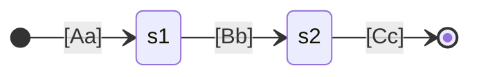

---
tags:
  - domain/core
  - component/server
  - performance
  - search
---
# Automata & Regex Optimization

## Summary

OpenSearch v3.0.0 removes the `MinimizationOperations` class and stops minimizing automata used for case-insensitive matches. This change fixes a memory exhaustion bug where case-insensitive term queries on large strings could easily run out of memory due to exponential state explosion during automaton minimization.

## Details

### What's New in v3.0.0

The `MinimizationOperations.minimize()` calls have been removed from case-insensitive query processing. Instead, the code now uses `Operations.determinize()` where needed, or relies on the fact that the constructed automata are already deterministic.

### Technical Changes

#### Background: The Memory Problem

Case-insensitive queries in OpenSearch work by converting the query string into a finite automaton. For example, a case-insensitive term query for `abc` behaves like a regexp query for `[Aa][Bb][Cc]`:



The previous implementation called `MinimizationOperations.minimize()` with `Integer.MAX_VALUE` as the work limit, which could cause exponential memory consumption for long strings (100+ characters).

#### Changes Made

| Component | Before | After |
|-----------|--------|-------|
| `AutomatonQueries.caseInsensitivePrefix()` | `MinimizationOperations.minimize(a, Integer.MAX_VALUE)` | `assert a.isDeterministic()` |
| `AutomatonQueries.toCaseInsensitiveString()` | `MinimizationOperations.minimize(a, maxDeterminizedStates)` | `Operations.concatenate(list)` |
| `AutomatonQueries.toCaseInsensitiveChar()` | `MinimizationOperations.minimize(result, maxDeterminizedStates)` | Direct union without minimization |
| `ReindexValidator.buildRemoteAllowlist()` | `MinimizationOperations.minimize()` | `Operations.determinize()` |
| `SystemIndices.buildCharacterRunAutomaton()` | `MinimizationOperations.minimize()` | `Operations.determinize()` |

#### Removed Components

| Component | Description |
|-----------|-------------|
| `MinimizationOperations.java` | 374-line class implementing Hopcroft's minimization algorithm |
| `package-info.java` | Package documentation for `org.opensearch.lucene.util.automaton` |

#### API Changes

The `maxDeterminizedStates` parameter has been removed from several methods in `AutomatonQueries`:

| Method | Old Signature | New Signature |
|--------|---------------|---------------|
| `toCaseInsensitiveChar` | `toCaseInsensitiveChar(int codepoint, int maxDeterminizedStates)` | `toCaseInsensitiveChar(int codepoint)` |
| `toCaseInsensitiveString` | `toCaseInsensitiveString(String s, int maxDeterminizedStates)` | `toCaseInsensitiveString(String s)` |
| `toCaseInsensitiveWildcardAutomaton` | `toCaseInsensitiveWildcardAutomaton(Term wildcardquery, int maxDeterminizedStates)` | `toCaseInsensitiveWildcardAutomaton(Term wildcardquery)` |

### Usage Example

Case-insensitive queries continue to work the same way from a user perspective:

```json
GET /my-index/_search
{
  "query": {
    "term": {
      "field": {
        "value": "SearchTerm",
        "case_insensitive": true
      }
    }
  }
}
```

The difference is internal - the query now executes more safely without risk of memory exhaustion.

### Migration Notes

- **No user action required**: This is an internal optimization with no API changes
- **Plugin developers**: If your plugin directly calls `AutomatonQueries.toCaseInsensitiveString()` or similar methods with the `maxDeterminizedStates` parameter, update to use the new signatures without that parameter

## Limitations

- The optimization applies only to case-insensitive queries; regexp queries still use the `max_determinized_states` parameter for controlling complexity

## References

### Documentation
- [Regexp Query Documentation](https://docs.opensearch.org/3.0/query-dsl/term/regexp/): Official docs on regexp queries and `case_insensitive` parameter

### Pull Requests
| PR | Description |
|----|-------------|
| [#17268](https://github.com/opensearch-project/OpenSearch/pull/17268) | Remove MinimizationOperations |

### Issues (Design / RFC)
- [Issue #16975](https://github.com/opensearch-project/OpenSearch/issues/16975): Bug report - Can (easily) run out of memory with case-insensitive term queries

## Related Feature Report

- [Full feature documentation](../../../features/opensearch/opensearch-automata-regex-optimization.md)
