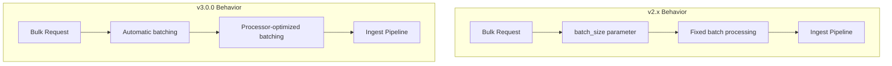

---
tags:
  - domain/core
  - component/server
  - indexing
  - performance
---
# Bulk API Changes

## Summary

OpenSearch 3.0.0 introduces breaking changes to the Bulk API. The deprecated `batch_size` parameter has been removed, and batch ingestion is now automatic. This change simplifies the API and improves performance by allowing ingest processors to determine optimal batch sizes internally.

## Details

### What's New in v3.0.0

#### Removal of `batch_size` Parameter

The `batch_size` parameter on the `_bulk` API has been completely removed. This parameter was deprecated in v2.14.0 and is no longer supported in v3.0.0.

**Before (v2.x):**
```bash
POST _bulk?batch_size=100
{ "index": { "_index": "test", "_id": "1" } }
{ "field": "value" }
```

**After (v3.0.0):**
```bash
POST _bulk
{ "index": { "_index": "test", "_id": "1" } }
{ "field": "value" }
```

#### Automatic Batch Processing

Batch processing for ingest pipelines is now automatic. The entire content of a bulk request is passed to each ingest processor, allowing processors to determine optimal batch sizes internally. This provides:

- **Simplified API**: No need to determine and specify `batch_size` parameter
- **Better Performance**: Ingest processors can optimize batch processing based on their specific requirements
- **Backward Compatibility**: The default implementation of `batchExecute` operates on one document at a time, so existing processors work without modification

### Technical Changes

#### Architecture Changes



#### Code Changes

| File | Change |
|------|--------|
| `BulkRequest.java` | Removed `batchSize` field and methods |
| `RestBulkAction.java` | Removed `batch_size` parameter handling |
| `IngestService.java` | Simplified batch processing logic |
| `TransportBulkAction.java` | Removed batch size parameter passing |

#### Serialization Compatibility

For backward compatibility during rolling upgrades:
- Nodes running v2.14.0+ can communicate with v3.0.0 nodes
- The `batch_size` field is read but ignored when receiving from v2.x nodes
- A placeholder value (`Integer.MAX_VALUE`) is written when sending to v2.x nodes

### Migration Notes

1. **Remove `batch_size` parameter**: If your application specifies `batch_size` in bulk requests, remove it
2. **No code changes needed for processors**: Existing ingest processors continue to work without modification
3. **Performance may improve**: Batch processing is now optimized per-processor rather than using a fixed size

### Usage Example

```bash
# Standard bulk request (same as before, but without batch_size)
POST _bulk
{ "index": { "_index": "movies", "_id": "1" } }
{ "title": "The Matrix", "year": 1999 }
{ "index": { "_index": "movies", "_id": "2" } }
{ "title": "Inception", "year": 2010 }
{ "delete": { "_index": "movies", "_id": "3" } }
```

## Limitations

- Applications that relied on `batch_size` for controlling memory usage must find alternative approaches
- Custom ingest processors should implement `batchExecute` method for optimal performance

## References

### Documentation
- [Bulk API Documentation](https://docs.opensearch.org/3.0/api-reference/document-apis/bulk/): Official documentation

### Blog Posts
- [OpenSearch 3.0 Breaking Changes](https://opensearch.org/blog/opensearch-3-0-what-to-expect/): Blog post about v3.0.0 changes

### Pull Requests
| PR | Description |
|----|-------------|
| [#17801](https://github.com/opensearch-project/OpenSearch/pull/17801) | Remove deprecated `batch_size` parameter from `_bulk` |

### Issues (Design / RFC)
- [Issue #14283](https://github.com/opensearch-project/OpenSearch/issues/14283): Feature request to make batch ingestion automatic

## Related Feature Report

- [Full feature documentation](../../../features/opensearch/opensearch-bulk-api.md)
