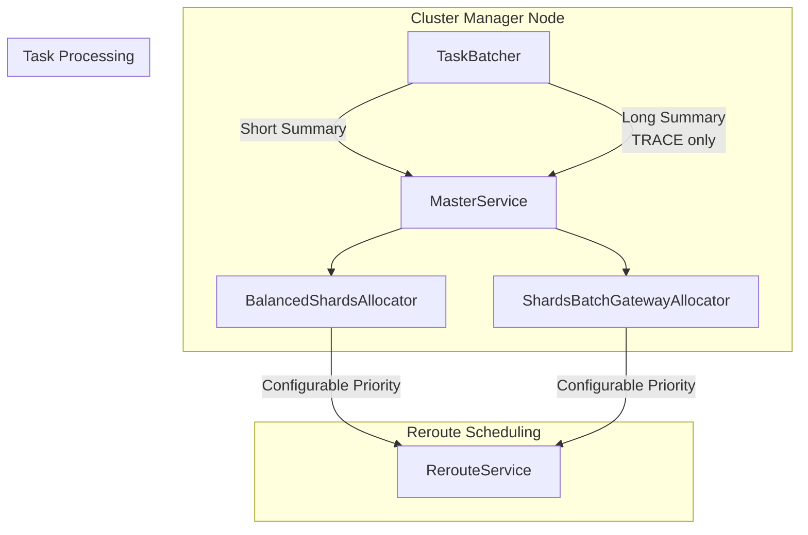

---
tags:
  - domain/core
  - component/server
  - indexing
  - observability
  - performance
---
# Cluster Management

## Summary

OpenSearch 3.0.0 introduces cluster management improvements that optimize performance during cluster recovery and shard allocation. These changes reduce logging overhead in the MasterService and improve task scheduling priority for reroute operations, resulting in faster cluster recovery times for large-scale deployments.

## Details

### What's New in v3.0.0

Two key improvements enhance cluster management performance:

1. **Optimized MasterService Logging**: Reduces excessive DEBUG logging that was causing significant delays during cluster recovery with large numbers of shards
2. **Configurable Reroute Priority**: Changes the default priority for scheduling reroute tasks during timeout from HIGH to NORMAL, with a new setting to adjust priority for problematic clusters

### Technical Changes

#### Architecture Changes



#### New Components

| Component | Description |
|-----------|-------------|
| `taskSummaryGenerator` | Function that generates short or long task summaries on demand |
| `buildShortSummary()` | Creates lightweight summary with batching key and task count |
| `FOLLOW_UP_REROUTE_PRIORITY_SETTING` | Dynamic setting to control reroute task priority |

#### New Configuration

| Setting | Description | Default |
|---------|-------------|---------|
| `cluster.routing.allocation.balanced_shards_allocator.schedule_reroute.priority` | Priority for followup reroute when allocator times out | `NORMAL` |
| `cluster.routing.allocation.shards_batch_gateway_allocator.schedule_reroute.priority` | Priority for followup reroute when batch allocator times out | `NORMAL` |

Valid values: `NORMAL`, `HIGH`, `URGENT`

### Usage Example

To raise reroute priority for clusters experiencing task starvation:

```yaml
# opensearch.yml or via Cluster Settings API
cluster.routing.allocation.balanced_shards_allocator.schedule_reroute.priority: high
cluster.routing.allocation.shards_batch_gateway_allocator.schedule_reroute.priority: high
```

Or dynamically:

```json
PUT _cluster/settings
{
  "persistent": {
    "cluster.routing.allocation.balanced_shards_allocator.schedule_reroute.priority": "high",
    "cluster.routing.allocation.shards_batch_gateway_allocator.schedule_reroute.priority": "high"
  }
}
```

### Performance Impact

- **MasterService Logging Optimization**: Saves approximately 10 minutes during recovery phase for clusters with 200K+ shards by deferring expensive task summary computation to TRACE level only
- **Reroute Priority Change**: Prevents HIGH priority reroute tasks from starving NORMAL priority cluster tasks, improving overall cluster stability

### Migration Notes

- The default reroute priority changed from `HIGH` to `NORMAL`. For clusters that were relying on the previous HIGH priority behavior, explicitly set the priority to `high` using the new settings.
- DEBUG logging now shows short summaries (batching key + count). Enable TRACE logging to see detailed task summaries.

## Limitations

- The new priority settings only affect reroute tasks triggered by allocator timeouts
- Short summary format may provide less detail for debugging; use TRACE level for full task details

## References

### Documentation
- [Cluster Allocation Explain API](https://docs.opensearch.org/3.0/api-reference/cluster-api/cluster-allocation/): Official documentation

### Pull Requests
| PR | Description |
|----|-------------|
| [#14795](https://github.com/opensearch-project/OpenSearch/pull/14795) | Reduce logging in DEBUG for MasterService:run |
| [#16445](https://github.com/opensearch-project/OpenSearch/pull/16445) | Change priority for scheduling reroute during timeout |

### Issues (Design / RFC)
- [Issue #12249](https://github.com/opensearch-project/OpenSearch/issues/12249): Reduce TaskBatcher excessive logging in DEBUG mode

## Related Feature Report

- [Full feature documentation](../../../features/opensearch/opensearch-cluster-management.md)
