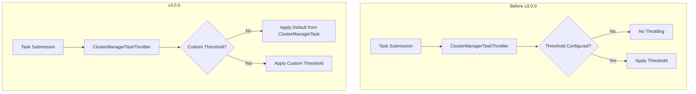

# Cluster Manager Throttling

## Summary

OpenSearch v3.0.0 enables default throttling for all tasks submitted to the cluster manager. Previously, throttling was disabled by default and required manual configuration. This change provides out-of-the-box protection against cluster manager overload by applying predefined throttling thresholds based on task type.

## Details

### What's New in v3.0.0

- **Default throttling enabled**: All cluster manager tasks now have throttling enabled by default with predefined thresholds
- **Task-type-based thresholds**: Different task types have different default thresholds based on their typical usage patterns
- **New `ClusterManagerTask` enum**: Replaces the old `ClusterManagerTaskKeys` class with a type-safe enum that includes both task keys and their default thresholds
- **Automatic threshold application**: When a task is registered for throttling, its default threshold is automatically applied if not explicitly configured

### Technical Changes

#### Architecture Changes



#### New Components

| Component | Description |
|-----------|-------------|
| `ClusterManagerTask` | New enum that defines all cluster manager task types with their keys and default thresholds |
| `registerClusterManagerTask(ClusterManagerTask, boolean)` | Updated method signature that accepts the enum instead of a string key |

#### Default Throttling Thresholds

| Task Type | Default Threshold |
|-----------|-------------------|
| `create-index` | 50 |
| `update-settings` | 50 |
| `cluster-update-settings` | 50 |
| `delete-index` | 50 |
| `delete-dangling-index` | 50 |
| `create-data-stream` | 50 |
| `remove-data-stream` | 50 |
| `create-index-template` | 50 |
| `remove-index-template` | 50 |
| `create-component-template` | 50 |
| `remove-component-template` | 50 |
| `create-index-template-v2` | 50 |
| `remove-index-template-v2` | 50 |
| `put-pipeline` | 50 |
| `delete-pipeline` | 50 |
| `put-search-pipeline` | 50 |
| `delete-search-pipeline` | 50 |
| `create-persistent-task` | 50 |
| `finish-persistent-task` | 50 |
| `remove-persistent-task` | 50 |
| `update-task-state` | 50 |
| `create-query-group` | 50 |
| `delete-query-group` | 50 |
| `update-query-group` | 50 |
| `put-script` | 50 |
| `delete-script` | 50 |
| `put-repository` | 50 |
| `delete-repository` | 50 |
| `create-snapshot` | 50 |
| `delete-snapshot` | 50 |
| `restore-snapshot` | 50 |
| `cluster-reroute-api` | 50 |
| `auto-create` | 200 |
| `rollover-index` | 200 |
| `index-aliases` | 200 |
| `put-mapping` | 10000 |
| `update-snapshot-state` | 5000 |

### Usage Example

Throttling is now enabled by default. To customize a threshold:

```json
PUT _cluster/settings
{
  "persistent": {
    "cluster_manager.throttling.thresholds": {
      "put-mapping": {
        "value": 5000
      }
    }
  }
}
```

To disable throttling for a specific task type, set the threshold to `-1`:

```json
PUT _cluster/settings
{
  "persistent": {
    "cluster_manager.throttling.thresholds": {
      "create-index": {
        "value": -1
      }
    }
  }
}
```

### Migration Notes

- **Breaking change for custom configurations**: If you previously relied on throttling being disabled by default, you may need to explicitly disable it for specific task types
- **Existing custom thresholds preserved**: Any custom thresholds configured via cluster settings will continue to override the defaults
- **No action required for most users**: The default thresholds are designed to provide reasonable protection without impacting normal operations

## Limitations

- Throttling thresholds are cluster-wide and cannot be configured per-node
- The default thresholds are based on general usage patterns and may need tuning for specific workloads
- When throttled, tasks are rejected and must be retried by the client with exponential backoff

## Related PRs

| PR | Description |
|----|-------------|
| [#17711](https://github.com/opensearch-project/OpenSearch/pull/17711) | Enabled default throttling for all tasks submitted to cluster manager |

## References

- [Issue #17685](https://github.com/opensearch-project/OpenSearch/issues/17685): Feature request for default throttling
- [Documentation](https://docs.opensearch.org/3.0/tuning-your-cluster/cluster-manager-task-throttling/): Cluster manager task throttling

## Related Feature Report

- [Full feature documentation](../../../features/opensearch/cluster-manager-throttling.md)
