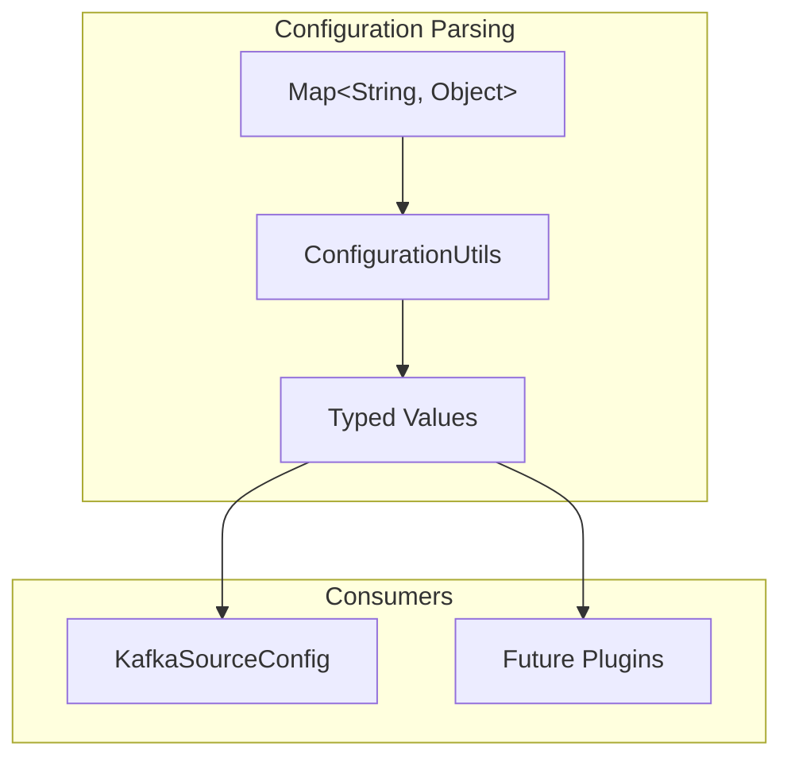

---
tags:
  - search
---

# Configuration Utilities

## Summary

OpenSearch 3.0.0 introduces `ConfigurationUtils`, a new utility class in the core library that provides standardized methods for parsing configuration maps. This utility simplifies configuration handling across OpenSearch components by offering type-safe property extraction with built-in validation and error handling.

## Details

### What's New in v3.0.0

A new `ConfigurationUtils` class has been added to `org.opensearch.core.util` package, inspired by the existing `ConfigurationUtil` in the ingest package. This utility provides a consistent API for reading configuration properties from `Map<String, Object>` structures with proper type checking and error messages.

### Technical Changes

#### Architecture Changes



#### New Components

| Component | Description |
|-----------|-------------|
| `ConfigurationUtils` | Core utility class for type-safe configuration parsing |
| `ConfigurationUtilsTests` | Comprehensive test suite for the utility |

#### API Methods

| Method | Description |
|--------|-------------|
| `readStringProperty(config, name)` | Read required string property |
| `readStringProperty(config, name, default)` | Read string with default value |
| `readOptionalStringProperty(config, name)` | Read optional string (returns null if missing) |
| `readStringOrIntProperty(config, name, default)` | Read string or int as string |
| `readOptionalStringOrIntProperty(config, name)` | Read optional string or int |
| `readBooleanProperty(config, name, default)` | Read boolean with default |
| `readIntProperty(config, name, default)` | Read integer property |
| `readDoubleProperty(config, name)` | Read required double property |
| `newConfigurationException(name, reason)` | Create standardized parse exception |

### Usage Example

```java
import org.opensearch.core.util.ConfigurationUtils;

public class MyConfig {
    private final String topic;
    private final String servers;
    private final int timeout;
    private final boolean enabled;

    public MyConfig(Map<String, Object> params) {
        // Required string property - throws if missing
        this.topic = ConfigurationUtils.readStringProperty(params, "topic");
        
        // Required string with default
        this.servers = ConfigurationUtils.readStringProperty(params, "servers", "localhost:9092");
        
        // Integer with default
        this.timeout = ConfigurationUtils.readIntProperty(params, "timeout", 30000);
        
        // Boolean with default
        this.enabled = ConfigurationUtils.readBooleanProperty(params, "enabled", true);
    }
}
```

### Error Handling

The utility provides clear, consistent error messages:

```java
// Missing required property
ConfigurationUtils.readStringProperty(config, "missing");
// Throws: OpenSearchParseException: [missing] required property is missing

// Wrong type
config.put("arr", Arrays.asList("1", "2"));
ConfigurationUtils.readStringProperty(config, "arr");
// Throws: OpenSearchParseException: [arr] property isn't a string, but of type [java.util.Arrays$ArrayList]
```

### Migration Notes

Plugin developers can migrate from manual configuration parsing to use `ConfigurationUtils`:

**Before:**
```java
this.topic = (String) Objects.requireNonNull(params.get("topic"));
this.servers = (String) Objects.requireNonNull(params.get("bootstrap_servers"));
```

**After:**
```java
this.topic = ConfigurationUtils.readStringProperty(params, "topic");
this.servers = ConfigurationUtils.readStringProperty(params, "bootstrap_servers");
```

## Limitations

- The utility reads from configuration maps but does not remove properties (unlike some ingest processor utilities)
- No support for complex nested object parsing - designed for flat configuration maps
- List/array property parsing is not included in this initial implementation

## References

### Documentation
- [Ingest Processors Documentation](https://docs.opensearch.org/3.0/ingest-pipelines/processors/index-processors/): Related ingest processor configuration patterns
- [PR #17223](https://github.com/opensearch-project/OpenSearch/pull/17223): Implementation PR

### Pull Requests
| PR | Description |
|----|-------------|
| [#17223](https://github.com/opensearch-project/OpenSearch/pull/17223) | Added ConfigurationUtils to core for the ease of configuration parsing |

## Related Feature Report

- [Full feature documentation](../../../features/opensearch/configuration-utilities.md)
