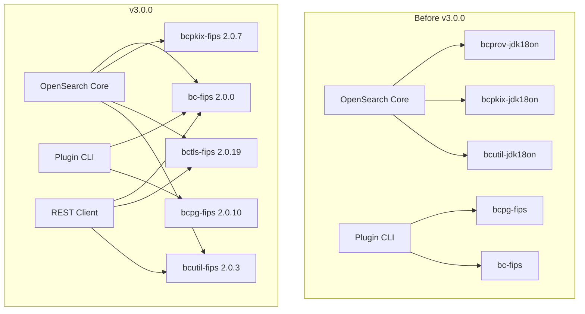

---
tags:
  - security
---

# Cryptography & Security Libraries

## Summary

OpenSearch 3.0.0 migrates from standard Bouncy Castle (BC) libraries to their FIPS-compliant counterparts (BC-FIPS). This change provides a smoother transition path toward FIPS 140-2/140-3 compliance while improving security standards for PEM file parsing, key derivation, and cryptographic operations. The migration also refactors PemUtils to use BC libraries for parsing private keys, increases key length requirements, and removes deprecated cryptographic code.

## Details

### What's New in v3.0.0

1. **BC to BC-FIPS Migration**: All Bouncy Castle libraries replaced with FIPS-certified versions
2. **PemUtils Refactoring**: Complete rewrite using BC libraries for PEM file parsing
3. **Enhanced Key Support**: Support for PKCS#1, PKCS#8 (encrypted and unencrypted), EC, DSA key formats
4. **Security Provider Configuration**: New `java.security` configuration file for BC-FIPS providers
5. **Increased Key Length**: Higher key size requirements for Google Cloud Storage integration
6. **Kerberos Security**: Improved algorithms for KeyTabs and Kerberos authentication

### Technical Changes

#### Architecture Changes



#### New Components

| Component | Description |
|-----------|-------------|
| `bc-fips` | Core FIPS-certified cryptographic provider (v2.0.0) |
| `bcpkix-fips` | PKIX/CMS/EAC/PKCS/OCSP/TSP/OPENSSL support (v2.0.7) |
| `bctls-fips` | TLS API and JSSE provider (v2.0.19) |
| `bcutil-fips` | Utility classes for BC-FIPS (v2.0.3) |
| `bcpg-fips` | OpenPGP support for plugin verification (v2.0.10) |

#### New Configuration

| Setting | Description | Default |
|---------|-------------|---------|
| `security.provider.1` | Primary security provider | `BouncyCastleFipsProvider` |
| `security.provider.2` | JSSE provider | `BouncyCastleJsseProvider` |
| `ssl.KeyManagerFactory.algorithm` | Key manager algorithm | `PKIX` |
| `ssl.TrustManagerFactory.algorithm` | Trust manager algorithm | `PKIX` |

The new `java.security` configuration file (`distribution/src/config/java.security`):

```properties
# Security properties for non-approved mode
security.provider.1=org.bouncycastle.jcajce.provider.BouncyCastleFipsProvider
security.provider.2=org.bouncycastle.jsse.provider.BouncyCastleJsseProvider
security.provider.3=SUN
security.provider.4=SunJGSS

ssl.KeyManagerFactory.algorithm=PKIX
ssl.TrustManagerFactory.algorithm=PKIX
```

#### PemUtils Refactoring

The `PemUtils` class was completely rewritten to use Bouncy Castle's PEM parsing capabilities:

```java
// New implementation using BC PEMParser
public static PrivateKey readPrivateKey(Path keyPath, Supplier<char[]> passwordSupplier) 
    throws IOException, PKCSException {
    PrivateKeyInfo pki = loadPrivateKeyFromFile(keyPath, passwordSupplier);
    JcaPEMKeyConverter converter = new JcaPEMKeyConverter();
    return converter.getPrivateKey(pki);
}
```

**Supported Key Formats:**
- PKCS#8 encrypted and unencrypted
- PKCS#1 RSA keys
- EC keys (with and without parameters)
- DSA keys (with and without parameters)
- PEM-encrypted keys using PBKDF2

### Usage Example

No changes required for most users. The migration is transparent for standard TLS/SSL configurations.

For plugin developers using cryptographic operations:

```java
// Use BCFIPS provider explicitly
SecureRandom secureRandom = SecureRandom.getInstance("DEFAULT", "BCFIPS");
KeyManagerFactory kmf = KeyManagerFactory.getInstance("PKIX", "BCJSSE");
TrustManagerFactory tmf = TrustManagerFactory.getInstance("PKIX", "BCJSSE");
```

### Migration Notes

1. **Automatic Migration**: For most deployments, no action required
2. **Custom Security Providers**: If using custom security providers, verify compatibility with BC-FIPS
3. **FIPS Mode**: BC-FIPS libraries run in "general mode" by default; FIPS-140-3 approved-only mode requires additional configuration
4. **Plugin Compatibility**: Plugins with hard BC dependencies may need updates

## Limitations

- BC-FIPS libraries run in general mode, not FIPS-140-3 approved-only mode
- Some legacy PBE (Password-Based Encryption) algorithms not available in FIPS mode
- Plugins with direct Bouncy Castle dependencies may require updates
- PBKDF-OPENSSL not supported in FIPS mode (use PBKDF2 instead)

## References

### Documentation
- [PR #14912](https://github.com/opensearch-project/OpenSearch/pull/14912): Original FIPS support PR (split into #17393 and #17507)

### Blog Posts
- [Blog: Finding a replacement for JSM in OpenSearch 3.0](https://opensearch.org/blog/finding-a-replacement-for-jsm-in-opensearch-3-0/): Related security architecture changes

### Pull Requests
| PR | Description |
|----|-------------|
| [#17393](https://github.com/opensearch-project/OpenSearch/pull/17393) | Use BC libraries to parse PEM files, increase key length, allow general use of known cryptographic binary extensions |
| [#17507](https://github.com/opensearch-project/OpenSearch/pull/17507) | Migrate BC libs to their FIPS counterparts |

### Issues (Design / RFC)
- [Issue #3420](https://github.com/opensearch-project/security/issues/3420): RFC - Proposal for supporting FIPS 140-2 enforced mode

## Related Feature Report

- [Full feature documentation](../../../features/opensearch/cryptography-security-libraries.md)
