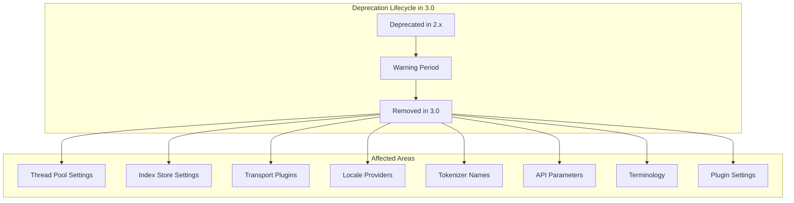

---
tags:
  - domain/core
  - component/server
  - dashboards
  - indexing
  - search
---
# Deprecated Code Cleanup

## Summary

OpenSearch 3.0.0 includes a comprehensive cleanup of deprecated code, removing legacy settings, APIs, plugins, and terminology that were deprecated in earlier versions. This major version release removes functionality that has been marked for removal since 2.x, affecting users who may still be using deprecated features. The cleanup spans multiple repositories including OpenSearch core, OpenSearch Dashboards, and various plugins.

## Details

### What's New in v3.0.0

This release removes deprecated code across multiple categories:

#### Core OpenSearch Changes

1. **JDK 21 Requirement**: Minimum supported Java runtime is now JDK 21
2. **Lucene 10.1.0 Upgrade**: Major search library upgrade with breaking API changes
3. **Thread Pool Settings**: Deprecated `thread_pool.test.max_queue_size` and `thread_pool.test.min_queue_size` settings removed
4. **Index Store Settings**: `index.store.hybrid.mmap.extensions` setting removed in favor of improved hybridfs file handling
5. **Transport Plugin**: `transport-nio` plugin removed; Netty remains the standard network framework
6. **Locale Provider**: COMPAT locale provider removed for JDK 21+ compatibility
7. **Tokenizer Naming**: CamelCase `PathHierarchy` tokenizer name deprecated in favor of snake_case `path_hierarchy`
8. **Module Renaming**: Classes ending with `Plugin` under `modules` directory renamed to `Module`
9. **JodaCompatibleZonedDateTime**: Deprecated methods removed from scripts
10. **Non-inclusive Terminology**: "blacklist/whitelist" replaced with "allow list/deny list" in Java APIs
11. **Bulk API**: `batch_size` parameter removed from `_bulk` endpoint
12. **System Index Access**: REST API access to system indexes removed (deprecated since 1.x)
13. **Document ID Limits**: 512-byte document ID limit now enforced consistently across all APIs including Bulk API

#### OpenSearch Dashboards Changes

1. **CssDistFilename**: Removed from build configuration
2. **withLongNumerals**: Removed from `HttpFetchOptions`
3. **@elastic/filesaver**: Dependency removed
4. **monaco-editor**: Bumped from 0.17.0 to 0.52.0
5. **newExperience**: Deprecated table option removed from Discover

#### Plugin-Specific Changes

**k-NN Plugin:**
- `knn.plugin.enabled` setting removed
- `index.knn.algo_param.ef_construction` index setting removed
- `index.knn.algo_param.m` index setting removed
- `index.knn.space_type` index setting removed
- NMSLIB engine deprecated (use Faiss or Lucene instead)

**SQL Plugin:**
- OpenSearch query DSL response format removed
- `DELETE` statement support removed
- `plugins.sql.delete.enabled` setting removed
- Legacy Spark Connector module deprecated
- OpenDistro endpoints and legacy settings with `opendistro` prefix removed
- `plugins.sql.pagination.api` removed; Scroll API deprecated in favor of Point in Time

**Security Plugin:**
- Blake2b hash implementation fixed (salt parameter now used correctly)
- OpenSSL provider removed
- Whitelist settings removed in favor of allowlist

**ML Commons:**
- `CatIndexTool` removed in favor of `ListIndexTool`
- Batch ingestion RESTful API deprecated

**Observability:**
- Legacy notebooks feature removed (only `.kibana` index notebooks supported)

**Performance Analyzer:**
- `performance-analyzer-rca` agent removed (use Telemetry plugin instead)

### Technical Changes

#### Architecture Changes



#### Removed Settings

| Setting | Replacement | PR |
|---------|-------------|-----|
| `thread_pool.test.max_queue_size` | None (removed) | [#2595](https://github.com/opensearch-project/OpenSearch/issues/2595) |
| `thread_pool.test.min_queue_size` | None (removed) | [#2595](https://github.com/opensearch-project/OpenSearch/issues/2595) |
| `index.store.hybrid.mmap.extensions` | Auto-detection | [#9392](https://github.com/opensearch-project/OpenSearch/pull/9392) |
| `knn.plugin.enabled` | None (always enabled) | [#2564](https://github.com/opensearch-project/k-NN/pull/2564) |
| `index.knn.algo_param.ef_construction` | Use method parameters | [#2564](https://github.com/opensearch-project/k-NN/pull/2564) |
| `index.knn.algo_param.m` | Use method parameters | [#2564](https://github.com/opensearch-project/k-NN/pull/2564) |
| `index.knn.space_type` | Use method parameters | [#2564](https://github.com/opensearch-project/k-NN/pull/2564) |

#### Removed Components

| Component | Reason | PR |
|-----------|--------|-----|
| `transport-nio` plugin | Netty is standard | [#16887](https://github.com/opensearch-project/OpenSearch/issues/16887) |
| COMPAT locale provider | JDK 21 deprecation | [#13988](https://github.com/opensearch-project/OpenSearch/pull/13988) |
| `performance-analyzer-rca` | Use Telemetry plugin | [#591](https://github.com/opensearch-project/performance-analyzer/issues/591) |
| `CatIndexTool` | Use `ListIndexTool` | [#3243](https://github.com/opensearch-project/ml-commons/pull/3243) |
| Legacy notebooks | Use `.kibana` index | [#2406](https://github.com/opensearch-project/dashboards-observability/pull/2406) |

#### Removed API Parameters

| API | Parameter | Replacement |
|-----|-----------|-------------|
| `_bulk` | `batch_size` | None | 
| System indexes | REST API access | Internal access only |

#### New Limits Introduced

| Limit | Value | Description |
|-------|-------|-------------|
| JSON nesting depth | 1,000 levels | Maximum depth for JSON objects/arrays |
| JSON property name length | 50,000 units | Maximum length for property names |
| Nested query depth | 20 (default) | `index.query.max_nested_depth` setting |
| Document ID length | 512 bytes | Now enforced on Bulk API |

### Usage Example

#### Before (Deprecated)
```yaml
# opensearch.yml - These settings no longer work
thread_pool:
  test:
    max_queue_size: 1000
    min_queue_size: 100

index:
  store:
    hybrid:
      mmap:
        extensions: ["nvd", "dvd", "tim"]
```

#### After (v3.0.0)
```yaml
# opensearch.yml - Remove deprecated settings
# Thread pool settings removed entirely
# mmap.extensions auto-detected by hybridfs
```

#### Tokenizer Migration
```json
// Before (deprecated)
{
  "tokenizer": {
    "type": "PathHierarchy"
  }
}

// After (recommended)
{
  "tokenizer": {
    "type": "path_hierarchy"
  }
}
```

### Migration Notes

1. **JDK Upgrade Required**: Ensure JDK 21 or later is installed before upgrading
2. **Review Configuration**: Check `opensearch.yml` for deprecated settings and remove them
3. **Update Scripts**: Replace deprecated `JodaCompatibleZonedDateTime` methods in Painless scripts
4. **Update Analyzers**: Use snake_case tokenizer names (`path_hierarchy` instead of `PathHierarchy`)
5. **Test Plugins**: Verify custom plugins don't depend on removed classes or settings
6. **Update Clients**: Ensure client applications use current API parameters
7. **k-NN Migration**: Move k-NN settings from index settings to method parameters
8. **SQL Migration**: Update queries to use Point in Time instead of Scroll API
9. **Notebooks Migration**: Migrate legacy notebooks to `.kibana` index format before upgrading

## Limitations

- No backward compatibility for removed settings
- Scripts using deprecated datetime methods will fail
- Plugins depending on `transport-nio` must migrate to Netty
- NMSLIB engine deprecated; new indexes should use Faiss or Lucene
- Legacy notebooks not accessible after upgrade

## References

### Documentation
- [Breaking Changes Documentation](https://docs.opensearch.org/3.0/breaking-changes/)

### Blog Posts
- [OpenSearch 3.0 Blog Post](https://opensearch.org/blog/opensearch-3-0-what-to-expect/)

### Pull Requests
| PR | Description |
|----|-------------|
| [#2595](https://github.com/opensearch-project/OpenSearch/issues/2595) | Cleanup deprecated thread pool settings |
| [#1683](https://github.com/opensearch-project/OpenSearch/issues/1683) | Replace blacklist/whitelist terminology |
| [#3346](https://github.com/opensearch-project/OpenSearch/pull/3346) | Remove deprecated JodaCompatibleZonedDateTime methods |
| [#9392](https://github.com/opensearch-project/OpenSearch/pull/9392) | Remove mmap.extensions setting |
| [#13988](https://github.com/opensearch-project/OpenSearch/pull/13988) | Remove COMPAT locale provider |
| [#16887](https://github.com/opensearch-project/OpenSearch/issues/16887) | Remove transport-nio plugin |
| [#10894](https://github.com/opensearch-project/OpenSearch/pull/10894) | Deprecate CamelCase PathHierarchy tokenizer |
| [#14283](https://github.com/opensearch-project/OpenSearch/issues/14283) | Remove deprecated batch_size parameter |
| [#4042](https://github.com/opensearch-project/OpenSearch/pull/4042) | Rename Plugin classes to Module |
| [#2564](https://github.com/opensearch-project/k-NN/pull/2564) | k-NN breaking changes for 3.0 |
| [#5089](https://github.com/opensearch-project/security/pull/5089) | Fix Blake2b hash implementation |
| [#5224](https://github.com/opensearch-project/security/pull/5224) | Remove whitelist settings |

### Issues (Design / RFC)
- [Meta Issue #5243](https://github.com/opensearch-project/opensearch-build/issues/5243): Full list of breaking changes
- [Issue #2773](https://github.com/opensearch-project/OpenSearch/issues/2773): List of deprecated code removal in 3.0
- [Issue #5214](https://github.com/opensearch-project/OpenSearch/issues/5214): Remove deprecated terms from Java API

## Related Feature Report

- [Full feature documentation](../../../../features/opensearch/deprecated-opensearch-code-cleanup.md)
