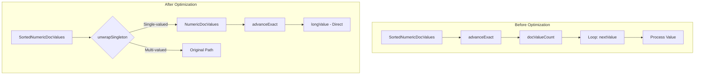

---
tags:
  - domain/core
  - component/server
  - performance
---
# DocValues Optimization

## Summary

OpenSearch v3.0.0 introduces singleton DocValues unwrapping optimization for date histogram and composite aggregations. This optimization provides a specialized fast path for single-valued fields by using `DocValues.unwrapSingleton()` to bypass unnecessary iteration logic, resulting in ~3-10% performance improvement in aggregation service time.

## Details

### What's New in v3.0.0

Two key aggregators now detect single-valued fields and use direct value access instead of iterative processing:

1. **DateHistogramAggregator**: Optimized for single-valued date fields
2. **GlobalOrdinalValuesSource**: Optimized for single-valued keyword fields in composite aggregations

### Technical Changes

#### Architecture Changes



#### Optimization Pattern

The optimization uses Lucene's `DocValues.unwrapSingleton()` method to detect single-valued fields:

```java
// Detection
final NumericDocValues singleton = DocValues.unwrapSingleton(values);

if (singleton != null) {
    // Fast path: direct value access
    return new LeafBucketCollectorBase(sub, values) {
        @Override
        public void collect(int doc, long owningBucketOrd) throws IOException {
            if (singleton.advanceExact(doc)) {
                long value = singleton.longValue();  // Direct access
                collectValue(sub, doc, owningBucketOrd, value);
            }
        }
    };
}

// Original path for multi-valued fields
return new LeafBucketCollectorBase(sub, values) {
    // ... iteration logic
};
```

#### New Components

| Component | Description |
|-----------|-------------|
| `DateHistogramAggregator` | Enhanced with singleton detection for date fields |
| `GlobalOrdinalValuesSource` | Enhanced with singleton detection for keyword fields |

### Performance Impact

#### Date Histogram Aggregation

| Metric | Before | After | Improvement |
|--------|--------|-------|-------------|
| 90th percentile service time (avg) | 851 ms | 824 ms | ~3.2% |

Benchmark: `date_histogram_minute_agg` on big5 workload

#### Composite Aggregation

| Metric | Before | After | Improvement |
|--------|--------|-------|-------------|
| 90th percentile service time (avg) | 418 ms | 378 ms | ~9.5% |

Benchmark: `composite_terms-keyword` on big5 workload

### Usage Example

No configuration changes required. The optimization is automatically applied when:

1. The aggregated field is single-valued
2. The field uses DocValues storage

```json
// Date histogram - automatically optimized for single-valued date fields
GET /logs/_search
{
  "size": 0,
  "aggs": {
    "events_per_minute": {
      "date_histogram": {
        "field": "@timestamp",
        "calendar_interval": "minute"
      }
    }
  }
}

// Composite aggregation - automatically optimized for single-valued keyword fields
GET /events/_search
{
  "size": 0,
  "aggs": {
    "by_category": {
      "composite": {
        "size": 100,
        "sources": [
          { "category": { "terms": { "field": "category.keyword" } } }
        ]
      }
    }
  }
}
```

### Migration Notes

This is a transparent performance optimization. No migration steps required.

## Limitations

- Only applies to single-valued fields (multi-valued fields use the original path)
- Requires DocValues to be enabled on the field
- Performance gains vary based on data distribution and query patterns

## References

### Documentation
- [Date Histogram Documentation](https://docs.opensearch.org/3.0/aggregations/bucket/date-histogram/)
- [Bucket Aggregations Documentation](https://docs.opensearch.org/3.0/aggregations/bucket/index/)

### Pull Requests
| PR | Description |
|----|-------------|
| [#17643](https://github.com/opensearch-project/OpenSearch/pull/17643) | Unwrap singleton DocValues in date histogram aggregation |
| [#17740](https://github.com/opensearch-project/OpenSearch/pull/17740) | Unwrap singleton DocValues in global ordinal value source of composite aggregation |

## Related Feature Report

- Full feature documentation
