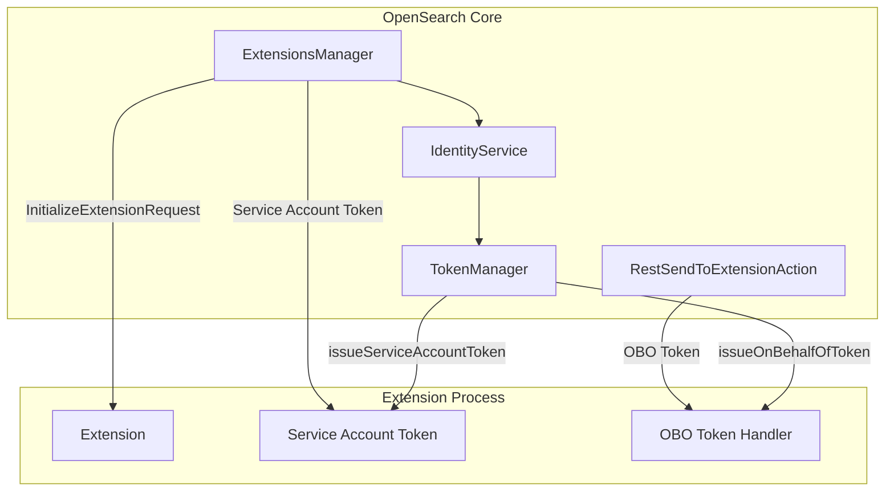

# Extensions Framework

## Summary

OpenSearch 3.0.0 enhances the Extensions Framework with improved security token handling for extensions. Two key features were added: "On Behalf Of" (OBO) token passing for user authentication delegation, and Service Account token issuance for extension identity management. These changes enable extensions to securely interact with OpenSearch on behalf of users and access their own system indices.

## Details

### What's New in v3.0.0

The Extensions Framework received significant security enhancements to support authentication and authorization for extensions running as separate processes:

1. **On Behalf Of Token Passing** - Extensions can now receive authentication tokens that represent the original user making a request, enabling proper authorization when extensions interact with OpenSearch.

2. **Service Account Tokens** - Extensions receive a dedicated service account token during initialization, allowing them to authenticate as themselves when accessing their reserved system indices.

### Technical Changes

#### Architecture Changes



#### New Components

| Component | Description |
|-----------|-------------|
| `OnBehalfOfClaims` | Claims class for OBO tokens containing audience, subject, expiration, and timing information |
| `issueOnBehalfOfToken()` | TokenManager method to generate OBO tokens for user delegation |
| `issueServiceAccountToken()` | TokenManager method to generate service account tokens for extensions |
| `InitializeExtensionRequest.serviceAccountHeader` | New field to pass service account token during extension initialization |

#### New Configuration

| Setting | Description | Default |
|---------|-------------|---------|
| N/A | Token generation is automatic during extension initialization | - |

#### API Changes

**TokenManager Interface**

New methods added to `TokenManager`:

```java
// Issue an On Behalf Of token for user delegation
public AuthToken issueOnBehalfOfToken(Subject subject, OnBehalfOfClaims claims);

// Issue a service account token for extension identity
public AuthToken issueServiceAccountToken(String audience);

// Authenticate a provided token
public Subject authenticateToken(AuthToken authToken);
```

**AuthToken Interface**

New method added:

```java
// Get the token value for use in HTTP Authorization header
String asAuthHeaderValue();
```

### Usage Example

Extensions automatically receive their service account token during initialization:

```java
// In extension initialization handler
public void handleInitializeExtensionRequest(InitializeExtensionRequest request) {
    // Service account token is provided in the request
    String serviceAccountToken = request.getServiceAccountHeader();
    
    // Use this token to authenticate requests to OpenSearch
    // for accessing extension's reserved system indices
}
```

For REST requests forwarded to extensions, OBO tokens are generated automatically:

```java
// OpenSearch core generates OBO token for each request
TokenManager tokenManager = identityService.getTokenManager();
Subject subject = identityService.getSubject();
OnBehalfOfClaims claims = new OnBehalfOfClaims(
    extensionId,           // audience
    subject.getPrincipal().getName()  // subject
);
String oboToken = tokenManager.issueOnBehalfOfToken(subject, claims).asAuthHeaderValue();
```

### Migration Notes

- Extensions must be updated to handle the new `serviceAccountHeader` field in `InitializeExtensionRequest`
- The `ExtensionsManager` constructor now requires an `IdentityService` parameter
- Token encoding changed from standard Base64 to URL-safe Base64 for compatibility

## Limitations

- Extensions framework remains experimental in v3.0.0
- Service account token rotation is not yet implemented
- Security plugin implementation of the token interfaces is pending

## References

### Documentation
- [Extensions Documentation](https://docs.opensearch.org/3.0/developer-documentation/extensions/): Official OpenSearch extensions documentation

### Blog Posts
- [Introducing Extensions Blog](https://opensearch.org/blog/introducing-extensions-for-opensearch/): Blog post introducing extensions architecture

### Pull Requests
| PR | Description |
|----|-------------|
| [#8679](https://github.com/opensearch-project/OpenSearch/pull/8679) | Implement on behalf of token passing for extensions |
| [#9618](https://github.com/opensearch-project/OpenSearch/pull/9618) | Provide service accounts tokens to extensions |

### Issues (Design / RFC)
- [Issue #2764](https://github.com/opensearch-project/security/issues/2764): Determine how auth tokens are forwarded to Extensions
- [Issue #3176](https://github.com/opensearch-project/security/issues/3176): Issue and ferry a Service Account Token to an Extension on bootstrap

## Related Feature Report

- [Full feature documentation](../../../features/opensearch/extensions-framework.md)
