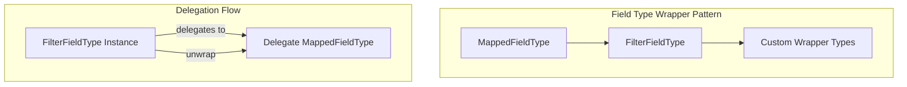

# Field Types

## Summary

OpenSearch 3.0.0 introduces `FilterFieldType`, a new abstract wrapper class that enables developers to wrap existing `MappedFieldType` instances while delegating all behavior by default. This pattern simplifies creating custom field types that extend or modify existing type behavior without reimplementing all methods.

## Details

### What's New in v3.0.0

- New `FilterFieldType` abstract class for wrapping `MappedFieldType`
- New `unwrap()` method on `MappedFieldType` to access the underlying type
- Public API annotation (`@PublicApi(since = "3.0.0")`) for stable plugin development

### Technical Changes

#### Architecture Changes



#### New Components

| Component | Description |
|-----------|-------------|
| `FilterFieldType` | Abstract wrapper class that delegates all `MappedFieldType` methods to an underlying delegate |
| `MappedFieldType.unwrap()` | Returns the concrete (unfiltered) field type; returns `this` for non-wrapper types |

#### New Configuration

No configuration required. The `FilterFieldType` class and `unwrap()` method are automatically available.

### Usage Example

```java
// Creating a custom wrapped field type
public class CustomFieldType extends FilterFieldType {
    
    public CustomFieldType(MappedFieldType delegate) {
        super(delegate);
    }
    
    @Override
    public String typeName() {
        return "custom";
    }
    
    @Override
    public Query termQuery(Object value, QueryShardContext context) {
        // Custom behavior before delegating
        return super.termQuery(value, context);
    }
}

// Correct instanceof check with unwrap()
MappedFieldType fieldType = context.fieldMapper(fieldName);
if (fieldType.unwrap() instanceof DateFieldMapper.DateFieldType) {
    // Process date field
}
```

### Migration Notes

Plugin developers creating custom field types that wrap existing types should:

1. Extend `FilterFieldType` instead of `MappedFieldType` directly
2. Override only the methods that need custom behavior
3. Use `unwrap()` before `instanceof` checks to handle wrapped types correctly

## Limitations

- The `typeName()` method is intentionally not delegated and must be overridden by subclasses
- Plugin developers must remember to call `unwrap()` before `instanceof` checks
- Adds a small overhead for type resolution in wrapped types

## References

### Documentation
- [Mappings and field types](https://docs.opensearch.org/3.0/field-types/): OpenSearch field types documentation
- [neural-search PR #1225](https://github.com/opensearch-project/neural-search/pull/1225): Example usage with SemanticFieldType

### Pull Requests
| PR | Description |
|----|-------------|
| [#17627](https://github.com/opensearch-project/OpenSearch/pull/17627) | Add FilterFieldType for developers who want to wrap MappedFieldType |

### Issues (Design / RFC)
- [Issue #17624](https://github.com/opensearch-project/OpenSearch/issues/17624): Feature request for easier field type wrapping

## Related Feature Report

- [Full feature documentation](../../../features/opensearch/filter-field-type.md)
