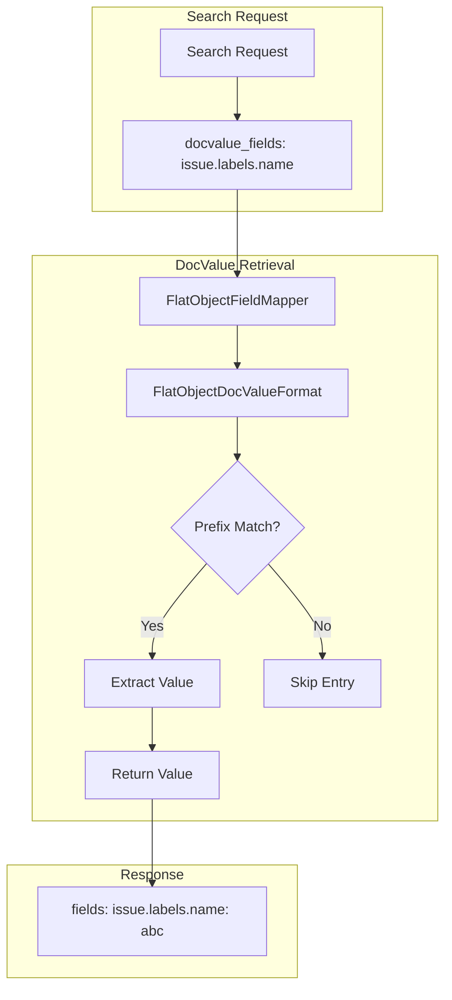

---
tags:
  - domain/core
  - component/server
  - search
---
# Flat Object Field Type: DocValues Retrieval

## Summary

OpenSearch 3.0.0 adds the ability to retrieve values from DocValues in `flat_object` fields. Previously, while `flat_object` fields stored DocValues, there was no way to retrieve specific subfield values using the `docvalue_fields` parameter in search requests. This enhancement enables efficient field value retrieval without loading the entire `_source` document.

## Details

### What's New in v3.0.0

This release adds DocValues retrieval support for `flat_object` subfields, allowing users to fetch specific nested values using dot notation in `docvalue_fields` queries. This is particularly useful when documents have many fields but only a few values need to be retrieved, as DocValues access is more efficient than stored fields for this use case.

### Technical Changes

#### Architecture Changes



#### New Components

| Component | Description |
|-----------|-------------|
| `FlatObjectDocValueFormat` | Inner class that formats DocValues for flat_object fields, filtering by path prefix |
| `DOC_VALUE_NO_MATCH` | Sentinel object used to skip non-matching DocValue entries |

#### Key Implementation Details

The implementation introduces a custom `DocValueFormat` for flat_object fields:

1. **Path-based filtering**: When retrieving DocValues, the format filters entries by checking if the stored value starts with the expected path prefix (e.g., `field.field.name=`)
2. **Value extraction**: Matching entries have their prefix stripped to return only the actual value
3. **Non-matching entries**: Entries that don't match the requested path return a sentinel `DOC_VALUE_NO_MATCH` object, which is filtered out by `DocValueFetcher`

#### Modified Files

| File | Change |
|------|--------|
| `FlatObjectFieldMapper.java` | Added `FlatObjectDocValueFormat` class and `docValueFormat()` method |
| `DocValueFetcher.java` | Added filtering for `DOC_VALUE_NO_MATCH` sentinel values |

### Usage Example

```json
// Create index with flat_object field
PUT /test-index/
{
  "mappings": {
    "properties": {
      "issue": {
        "type": "flat_object"
      }
    }
  }
}

// Index document
PUT /test-index/_doc/1
{
  "issue": {
    "number": "123456",
    "labels": {
      "name": "bug",
      "version": "2.1"
    }
  }
}

// Retrieve specific subfield value from DocValues
GET /test-index/_search
{
  "_source": false,
  "stored_fields": "_none_",
  "docvalue_fields": ["issue.labels.name"]
}

// Response
{
  "hits": {
    "hits": [
      {
        "_index": "test-index",
        "_id": "1",
        "fields": {
          "issue.labels.name": ["bug"]
        }
      }
    ]
  }
}
```

### Migration Notes

- DocValues retrieval requires specifying the full dot-path to the subfield (e.g., `issue.labels.name`)
- Root-level flat_object fields do not support DocValues retrieval; only subfields with dot notation are supported
- This feature is backward compatible; existing flat_object fields automatically support DocValues retrieval

## Limitations

- DocValues retrieval is not supported for the root flat_object field itself (e.g., `issue`), only for subfields with dot notation
- Custom formats and time zones are not supported for flat_object DocValues
- Aggregations on flat_object subfields remain unsupported

## References

### Documentation
- [Flat object documentation](https://docs.opensearch.org/3.0/field-types/supported-field-types/flat-object/): Official documentation
- [DocValues vs Stored Fields](https://sease.io/2020/03/docvalues-vs-stored-fields-apache-solr-features-and-performance-smackdown.html): Performance comparison

### Pull Requests
| PR | Description |
|----|-------------|
| [#16802](https://github.com/opensearch-project/OpenSearch/pull/16802) | Added ability to retrieve value from DocValues in a flat_object field |

### Issues (Design / RFC)
- [Issue #16742](https://github.com/opensearch-project/OpenSearch/issues/16742): Feature request for DocValues retrieval in flat_object fields

## Related Feature Report

- Full feature documentation
