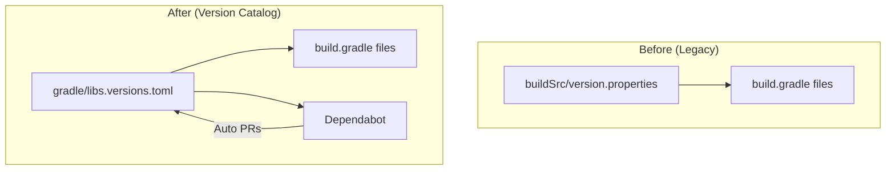

---
tags:
  - domain/core
  - component/server
  - search
---
# Gradle Build System

## Summary

This release item continues the migration of OpenSearch modules to use the Gradle version catalog (`gradle/libs.versions.toml`) instead of the legacy `buildSrc/version.properties` file. Specifically, PR #17233 converts the `transport-reactor-netty4` plugin to use the version catalog, adding Netty and Reactor dependencies to the centralized catalog.

## Details

### What's New in v3.0.0

The `transport-reactor-netty4` plugin has been migrated to use the Gradle version catalog, which:

- Adds Netty library bundles to the version catalog
- Adds Reactor Netty dependencies to the catalog
- Simplifies the plugin's `build.gradle` by using catalog references
- Enables Dependabot to monitor and create automated dependency update PRs for these libraries

### Technical Changes

#### Architecture Changes



#### New Components

| Component | Description |
|-----------|-------------|
| `libs.bundles.netty` | Bundle containing all Netty dependencies |
| `libs.bundles.reactornetty` | Bundle containing Reactor Netty core and HTTP |
| `libs.log4jslf4jimpl` | Log4j SLF4J implementation reference |
| `libs.reactor.test` | Reactor test library reference |

#### New Configuration

The following entries were added to `gradle/libs.versions.toml`:

| Setting | Description | Version |
|---------|-------------|---------|
| `netty-buffer` | Netty buffer library | `${netty}` |
| `netty-codec` | Netty codec library | `${netty}` |
| `netty-codec-dns` | Netty DNS codec | `${netty}` |
| `netty-codec-http` | Netty HTTP codec | `${netty}` |
| `netty-codec-http2` | Netty HTTP/2 codec | `${netty}` |
| `netty-common` | Netty common utilities | `${netty}` |
| `netty-handler` | Netty handler | `${netty}` |
| `netty-resolver-dns` | Netty DNS resolver | `${netty}` |
| `netty-resolver` | Netty resolver | `${netty}` |
| `netty-transport` | Netty transport | `${netty}` |
| `netty-transport-native-unix-common` | Netty Unix transport | `${netty}` |
| `reactor-netty-core` | Reactor Netty core | `${reactor_netty}` |
| `reactor-netty-http` | Reactor Netty HTTP | `${reactor_netty}` |
| `reactor-test` | Reactor test utilities | `${reactor}` |
| `log4jslf4jimpl` | Log4j SLF4J implementation | `${log4j}` |

### Usage Example

Before (legacy approach):
```groovy
dependencies {
  api "io.netty:netty-buffer:${versions.netty}"
  api "io.netty:netty-codec:${versions.netty}"
  api "io.netty:netty-codec-http:${versions.netty}"
  // ... many more individual declarations
  api "io.projectreactor.netty:reactor-netty-http:${versions.reactor_netty}"
  api "io.projectreactor.netty:reactor-netty-core:${versions.reactor_netty}"
}
```

After (version catalog):
```groovy
dependencies {
  api libs.bundles.netty
  api libs.bundles.reactornetty
  testImplementation libs.log4jslf4jimpl
  javaRestTestImplementation libs.reactor.test
}
```

### Migration Notes

For plugin developers migrating to the version catalog:

1. Add library entries to `gradle/libs.versions.toml` under `[libraries]`
2. Create bundles under `[bundles]` for related dependencies
3. Replace version string references with `libs.<library-name>` or `libs.bundles.<bundle-name>`
4. Remove corresponding entries from `buildSrc/version.properties` if no longer needed

## Limitations

- The migration is incremental; not all modules have been converted yet
- Some dependencies may still use the legacy `versions.properties` approach
- Dependabot can only monitor dependencies listed in the version catalog

## References

### Documentation
- [Gradle Version Catalogs](https://docs.gradle.org/current/userguide/platforms.html): Official Gradle documentation
- [Dependabot Gradle Support](https://docs.github.com/en/code-security/dependabot/dependabot-version-updates/configuration-options-for-the-dependabot.yml-file#gradle): GitHub Dependabot configuration

### Pull Requests
| PR | Description |
|----|-------------|
| [#17233](https://github.com/opensearch-project/OpenSearch/pull/17233) | Convert transport-reactor-netty4 to use gradle version catalog |
| [#16284](https://github.com/opensearch-project/OpenSearch/pull/16284) | Initial implementation of Gradle version catalog |

### Issues (Design / RFC)
- [Issue #3782](https://github.com/opensearch-project/OpenSearch/issues/3782): Original feature request for Dependabot support

## Related Feature Report

- Full feature documentation
