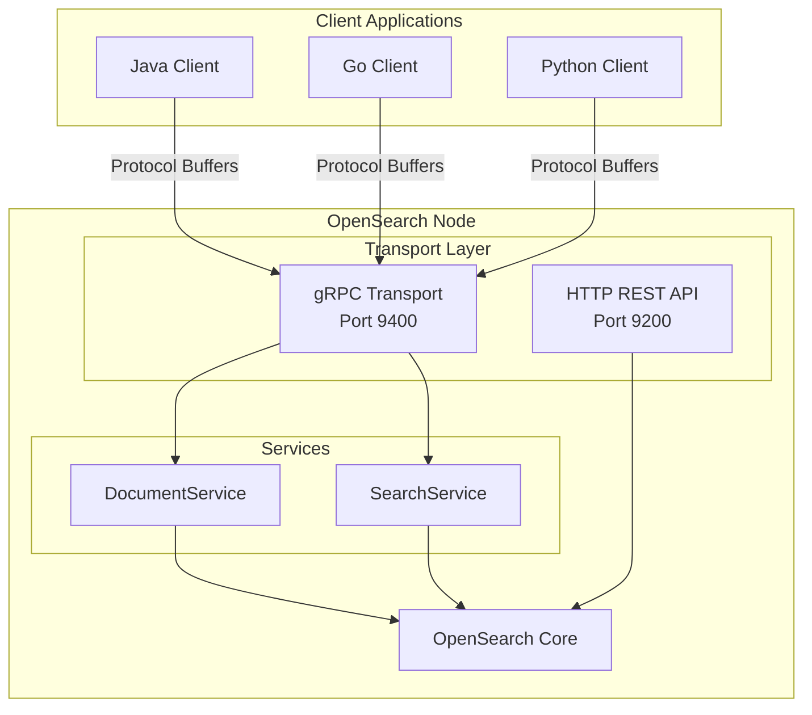

# gRPC Transport & Services

## Summary

OpenSearch 3.0.0 introduces experimental gRPC transport support as an alternative to the traditional HTTP REST API. The transport-grpc plugin enables high-performance, binary-encoded communication using protocol buffers, providing efficient client integrations for Java, Go, Python, and other languages with native gRPC stubs. This release includes TLS security support and initial implementations of DocumentService (Bulk) and SearchService (Search) endpoints.

## Details

### What's New in v3.0.0

- **gRPC Transport Plugin**: New `transport-grpc` plugin providing gRPC server transport on port 9400 (default)
- **TLS Support**: SecureNetty4GrpcServerTransport enables encrypted gRPC connections
- **DocumentService**: Bulk API endpoint for batch document operations (index, create, update, delete)
- **SearchService**: Search API endpoint supporting match_all, term, terms, and match_none queries

### Technical Changes

#### Architecture Changes



#### New Components

| Component | Description |
|-----------|-------------|
| `Netty4GrpcServerTransport` | Base gRPC server transport using Netty4 |
| `SecureNetty4GrpcServerTransport` | TLS-enabled gRPC transport |
| `DocumentService` | gRPC service for document operations (Bulk) |
| `SearchService` | gRPC service for search operations |
| `opensearch-protobufs` | Protocol buffer definitions for OpenSearch APIs |

#### New Configuration

| Setting | Description | Default |
|---------|-------------|---------|
| `grpc.port` | Port for gRPC server | `9400` |
| `grpc.publish_port` | Published port for gRPC | Same as `grpc.port` |
| `grpc.bind_host` | Host to bind gRPC server | Network host |
| `grpc.publish_host` | Host to publish for gRPC | Network host |

#### API Changes

**DocumentService - Bulk Endpoint**

The gRPC Bulk API mirrors the REST Bulk API with protocol buffer encoding:

- Operations: `index`, `create`, `update`, `delete`
- Documents provided as Base64-encoded bytes
- Supports routing, pipeline, refresh options

**SearchService - Search Endpoint**

The gRPC Search API supports basic query types:

- `match_all`: Returns all documents
- `term`: Exact term matching
- `terms`: Multiple term matching with terms lookup support
- `match_none`: Returns no documents

### Usage Example

**Java gRPC Client - Bulk Request:**

```java
import org.opensearch.protobufs.*;
import io.grpc.ManagedChannel;
import io.grpc.ManagedChannelBuilder;

ManagedChannel channel = ManagedChannelBuilder
    .forAddress("localhost", 9400)
    .usePlaintext()
    .build();

DocumentServiceGrpc.DocumentServiceBlockingStub stub = 
    DocumentServiceGrpc.newBlockingStub(channel);

IndexOperation indexOp = IndexOperation.newBuilder()
    .setIndex("my-index")
    .setId("1")
    .build();

BulkRequestBody body = BulkRequestBody.newBuilder()
    .setIndex(indexOp)
    .setDoc(ByteString.copyFromUtf8("{\"field\": \"value\"}"))
    .build();

BulkRequest request = BulkRequest.newBuilder()
    .addRequestBody(body)
    .build();

BulkResponse response = stub.bulk(request);
```

**Java gRPC Client - Search Request:**

```java
SearchServiceGrpc.SearchServiceBlockingStub searchStub = 
    SearchServiceGrpc.newBlockingStub(channel);

SearchRequest searchRequest = SearchRequest.newBuilder()
    .addIndex("my-index")
    .setRequestBody(SearchRequestBody.newBuilder()
        .setQuery(QueryContainer.newBuilder()
            .setMatchAll(MatchAllQuery.newBuilder().build())
            .build())
        .setSize(10)
        .build())
    .build();

SearchResponse searchResponse = searchStub.search(searchRequest);
```

### Migration Notes

1. **Install the plugin**: The transport-grpc plugin must be installed separately
2. **Obtain protobufs**: Client applications need protocol buffer definitions from [opensearch-protobufs](https://github.com/opensearch-project/opensearch-protobufs)
3. **Port configuration**: gRPC uses port 9400 by default (separate from HTTP 9200)
4. **TLS setup**: For secure connections, configure TLS certificates for gRPC transport

## Limitations

- **Experimental feature**: Not recommended for production use
- **Limited query support**: Only `match_all`, `term`, `terms`, and `match_none` queries supported in v3.0.0
- **Limited service coverage**: Only Bulk and Search endpoints available initially
- **No aggregations**: Aggregation support not yet implemented in gRPC Search API

## Related PRs

| PR | Description |
|----|-------------|
| [#17796](https://github.com/opensearch-project/OpenSearch/pull/17796) | Enable TLS for Netty4GrpcServerTransport |
| [#17727](https://github.com/opensearch-project/OpenSearch/pull/17727) | Add DocumentService and Bulk gRPC endpoint v1 |
| [#17830](https://github.com/opensearch-project/OpenSearch/pull/17830) | SearchService and Search gRPC endpoint v1 |
| [#17888](https://github.com/opensearch-project/OpenSearch/pull/17888) | Add terms query support in Search gRPC endpoint |

## References

- [Issue #16787](https://github.com/opensearch-project/OpenSearch/issues/16787): gRPC Transport tracking issue
- [gRPC APIs Documentation](https://docs.opensearch.org/3.0/api-reference/grpc-apis/index/): Official docs
- [Bulk (gRPC) Documentation](https://docs.opensearch.org/3.0/api-reference/grpc-apis/bulk/): Bulk API reference
- [Search (gRPC) Documentation](https://docs.opensearch.org/3.0/api-reference/grpc-apis/search/): Search API reference
- [Additional Plugins - transport-grpc](https://docs.opensearch.org/3.0/install-and-configure/additional-plugins/index/): Plugin installation

## Related Feature Report

- [Full feature documentation](../../../../features/opensearch/grpc-transport--services.md)
