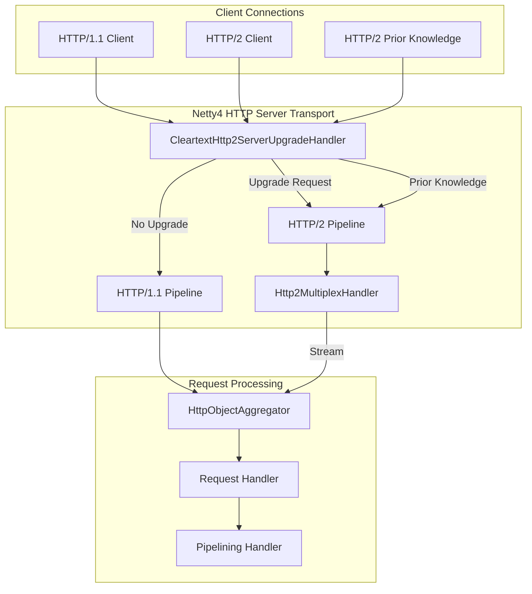

---
tags:
  - domain/core
  - component/server
  - performance
  - security
---
# HTTP/2 Support

## Summary

OpenSearch 3.0.0 introduces server-side HTTP/2 protocol support, enabling multiplexed request/response handling over a single connection. This eliminates head-of-line blocking issues present in HTTP/1.1 and improves performance for clients making concurrent requests.

## Details

### What's New in v3.0.0

HTTP/2 support is implemented in the Netty4 transport module, providing:

- **h2c (HTTP/2 over cleartext)**: Supports HTTP/2 without TLS
- **HTTP/1.1 to HTTP/2 upgrade**: Clients can upgrade from HTTP/1.1 to HTTP/2 via the standard upgrade mechanism
- **HTTP/2 prior knowledge**: Clients that know the server supports HTTP/2 can connect directly using HTTP/2

### Technical Changes

#### Architecture Changes



#### New Components

| Component | Description |
|-----------|-------------|
| `CleartextHttp2ServerUpgradeHandler` | Handles HTTP/1.1 to HTTP/2 upgrade and prior knowledge connections |
| `Http2MultiplexHandler` | Multiplexes HTTP/2 streams into separate channels |
| `Http2StreamFrameToHttpObjectCodec` | Converts HTTP/2 frames to HTTP objects for existing handlers |
| `Http2FrameCodecBuilder` | Builds the HTTP/2 frame codec for encoding/decoding |

#### New Dependencies

| Dependency | Version | Purpose |
|------------|---------|---------|
| `netty-codec-http2` | 4.1.79.Final | HTTP/2 protocol support in Netty |

### Usage Example

#### Standard HTTP/1.1 Request
```bash
curl http://localhost:9200 -v
# Uses HTTP/1.1 as before
```

#### HTTP/1.1 to HTTP/2 Upgrade
```bash
curl http://localhost:9200 -v --http2
# Sends upgrade request, server responds with 101 Switching Protocols
# Subsequent communication uses HTTP/2
```

#### HTTP/2 Prior Knowledge
```bash
curl http://localhost:9200 -v --http2-prior-knowledge
# Connects directly using HTTP/2 without upgrade negotiation
```

### Migration Notes

- HTTP/2 support is automatic and backward compatible
- Existing HTTP/1.1 clients continue to work without changes
- No configuration changes required to enable HTTP/2
- Clients can opt-in to HTTP/2 using standard upgrade mechanisms

## Limitations

- Only h2c (cleartext HTTP/2) is supported in this initial implementation
- HTTP/2 over TLS (h2) requires additional configuration with the security plugin
- Response ordering is not guaranteed with HTTP/2 (unlike HTTP/1.1 pipelining)

## References

### Documentation
- [Network settings documentation](https://docs.opensearch.org/3.0/install-and-configure/configuring-opensearch/network-settings/): OpenSearch network configuration

### Pull Requests
| PR | Description |
|----|-------------|
| [#3847](https://github.com/opensearch-project/OpenSearch/pull/3847) | Support for HTTP/2 (server-side) |

### Issues (Design / RFC)
- [Issue #3651](https://github.com/opensearch-project/OpenSearch/issues/3651): Original feature request

## Related Feature Report

- Full feature documentation
