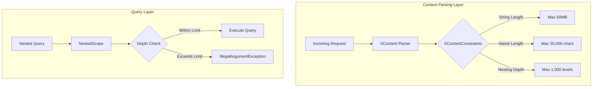

---
tags:
  - indexing
  - search
  - security
---

# Jackson & Query Limits

## Summary

OpenSearch 3.0.0 introduces breaking changes related to JSON processing limits and nested query depth restrictions. These changes address security and stability concerns by enforcing configurable maximums for JSON content parsing (via Jackson 2.16.x) and nested query depth at the index level.

## Details

### What's New in v3.0.0

Two significant changes affect how OpenSearch handles content parsing and query depth:

1. **Jackson Default Maximums**: New limits on JSON/CBOR/SMILE/YAML content parsing
2. **Nested Query Depth Limit**: New index setting to restrict nested query depth

### Technical Changes

#### Architecture Changes



#### New Components

| Component | Description |
|-----------|-------------|
| `XContentConstraints` | Interface defining configurable limits for content parsing |
| `NestedScope` depth tracking | Enhanced to enforce `index.query.max_nested_depth` |

#### New Configuration

| Setting | Description | Default |
|---------|-------------|---------|
| `opensearch.xcontent.string.length.max` | Maximum string length in JSON content | 50,000,000 (~50 MB) |
| `opensearch.xcontent.name.length.max` | Maximum field name length | 50,000 |
| `opensearch.xcontent.depth.max` | Maximum nesting depth for JSON objects/arrays | 1,000 |
| `index.query.max_nested_depth` | Maximum depth for nested queries (index-level, dynamic) | 20 |

### Usage Example

#### Customizing XContent Limits via System Properties

```bash
# Start OpenSearch with custom limits
./bin/opensearch \
  -Dopensearch.xcontent.string.length.max=100000000 \
  -Dopensearch.xcontent.name.length.max=100000 \
  -Dopensearch.xcontent.depth.max=2000
```

#### Configuring Nested Query Depth

```json
PUT /my-index/_settings
{
  "index.query.max_nested_depth": 30
}
```

#### Creating Index with Custom Nested Depth

```json
PUT /my-index
{
  "settings": {
    "index.query.max_nested_depth": 50
  }
}
```

### Migration Notes

1. **Review existing deeply nested JSON documents**: Documents with nesting depth exceeding 1,000 levels will fail to parse
2. **Check nested query complexity**: Queries with nested depth exceeding 20 (default) will throw `IllegalArgumentException`
3. **Adjust settings if needed**: Use system properties for XContent limits or index settings for query depth
4. **Test with production data**: Validate that existing documents and queries work within new limits

## Limitations

- XContent limits are JVM-wide (system properties), not configurable per-index
- Nested query depth limit is per-index but requires index settings update for existing indices
- No runtime API to query current XContent limits

## References

### Documentation
- [Breaking Changes Documentation](https://docs.opensearch.org/3.0/breaking-changes/): Official v3.0 breaking changes

### Pull Requests
| PR | Description |
|----|-------------|
| [#11811](https://github.com/opensearch-project/OpenSearch/pull/11811) | Ensure Jackson default maximums introduced in 2.16.0 do not conflict with OpenSearch settings |
| [#11670](https://github.com/opensearch-project/OpenSearch/pull/11670) | Introduce index.query.max_nested_depth |

### Issues (Design / RFC)
- [Issue #11278](https://github.com/opensearch-project/OpenSearch/issues/11278): Jackson default maximums feature request
- [Issue #3268](https://github.com/opensearch-project/OpenSearch/issues/3268): Nested query depth limit feature request

## Related Feature Report

- [Full feature documentation](../../../../features/opensearch/jackson--query-limits.md)
