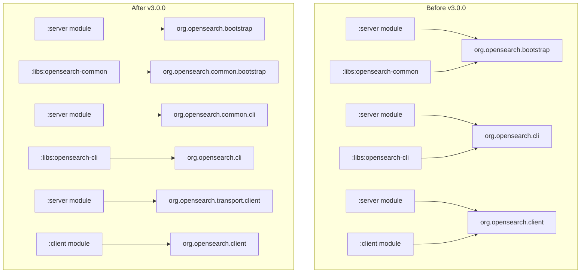

# Java Runtime & JPMS

## Summary

OpenSearch 3.0.0 introduces two major breaking changes to the Java runtime environment: JDK 21 becomes the minimum supported runtime, and the codebase has been refactored to eliminate split packages in preparation for Java Platform Module System (JPMS) support. These changes enable OpenSearch to leverage modern Java features and prepare for future modularization.

## Details

### What's New in v3.0.0

#### JDK 21 Minimum Requirement

OpenSearch 3.0.0 requires JDK 21 as the minimum supported Java runtime. This is a breaking change from previous versions that supported JDK 11+. The upgrade was driven by:

- Apache Lucene 10.x requiring JDK 21
- Access to modern Java features including virtual threads, pattern matching, and improved garbage collection
- JDK 21 being a Long-Term Support (LTS) release with support until 2031

#### JPMS Phase 0 - Split Package Elimination

The codebase has been refactored to eliminate top-level split packages, which is a prerequisite for JPMS support. Split packages occur when the same package exists in multiple JAR files, which is incompatible with the Java module system.

### Technical Changes

#### Architecture Changes



#### Package Refactoring Summary

| Original Package | New Package | Module |
|-----------------|-------------|--------|
| `org.opensearch.bootstrap` (libs) | `org.opensearch.common.bootstrap` | `:libs:opensearch-common` |
| `org.opensearch.cli` (server) | `org.opensearch.common.cli` | `:server` |
| `org.opensearch.client` (server) | `org.opensearch.transport.client` | `:server` |
| `org.opensearch.common.settings` (keystore-cli) | `org.opensearch.tools.cli.keystore` | `:distribution:tools:keystore-cli` |
| `org.opensearch.plugins` (plugin-cli) | `org.opensearch.tools.cli.plugin` | `:distribution:tools:plugin-cli` |
| `org.apache.lucene.*` (server) | `org.opensearch.lucene.*` | `:server` |

#### Key Class Relocations

| Class | Old Location | New Location |
|-------|--------------|--------------|
| `JarHell` | `org.opensearch.bootstrap` | `org.opensearch.common.bootstrap` |
| `JdkJarHellCheck` | `org.opensearch.bootstrap` | `org.opensearch.common.bootstrap` |
| `KeyStoreCli` | `org.opensearch.common.settings` | `org.opensearch.tools.cli.keystore` |
| `PluginCli` | `org.opensearch.plugins` | `org.opensearch.tools.cli.plugin` |
| `KeyStoreAwareCommand` | `org.opensearch.cli` | `org.opensearch.tools.cli.keystore` |

#### Removed Components

- `LoggingAwareCommand.java` from `:server` module (unused)
- `libs/plugin-classloader` module (refactored into `:server`)
- `OneMergeHelper.java` (merged into `OpenSearchConcurrentMergeScheduler`)

### Migration Notes

#### For Users

1. **Upgrade JDK**: Ensure your runtime environment uses JDK 21 or later
2. **Update JAVA_HOME**: Set `JAVA_HOME` or `OPENSEARCH_JAVA_HOME` to point to JDK 21+
3. **Bundled JDK**: OpenSearch distributions include a bundled JDK 21, which is used by default

#### For Plugin Developers

1. **Update imports**: If your plugin references any relocated classes, update the import statements:
   ```java
   // Before
   import org.opensearch.bootstrap.JarHell;
   import org.opensearch.cli.KeyStoreAwareCommand;
   
   // After
   import org.opensearch.common.bootstrap.JarHell;
   import org.opensearch.tools.cli.keystore.KeyStoreAwareCommand;
   ```

2. **Compile with JDK 21**: Update your build configuration to use JDK 21
3. **Test thoroughly**: Verify plugin compatibility with the new package structure

### JDK Memory Mapping Improvements

OpenSearch 3.0.0 can leverage JDK 21's `MemorySegment` API for memory-mapped files in Lucene, providing:
- Improved performance for large indexes
- Better memory management
- No need for `--enable-preview` flag (was required in JDK 19-20)

## Limitations

- **No JDK 8/11 support**: Applications requiring older JDK versions cannot use OpenSearch 3.0.0
- **Plugin compatibility**: Plugins compiled against older OpenSearch versions may need updates
- **JPMS not fully enabled**: Phase 0 only eliminates split packages; full module descriptors are planned for future releases

## References

### Documentation
- [Breaking Changes Documentation](https://docs.opensearch.org/3.0/breaking-changes/): Official breaking changes for v3.0.0

### Blog Posts
- [Using Different Java Runtimes with OpenSearch](https://opensearch.org/blog/opensearch-java-runtime/): Blog post on Java runtime options

### Pull Requests
| PR | Description |
|----|-------------|
| [#17153](https://github.com/opensearch-project/OpenSearch/pull/17153) | Refactor codebase to eliminate top level split packages for JPMS support |
| [#17117](https://github.com/opensearch-project/OpenSearch/pull/17117) | Refactor `:libs` module `bootstrap` package |
| [#17241](https://github.com/opensearch-project/OpenSearch/pull/17241) | Refactor `org.apache.lucene` codebase |
| [#17272](https://github.com/opensearch-project/OpenSearch/pull/17272) | Refactor `org.opensearch.client` from `:server` module |
| [#16366](https://github.com/opensearch-project/OpenSearch/pull/16366) | Update to Apache Lucene 10 for 3.0.0 (requires JDK 21) |
| [#16429](https://github.com/opensearch-project/OpenSearch/pull/16429) | Update JDK to 23.0.1 |
| [#17900](https://github.com/opensearch-project/OpenSearch/pull/17900) | Custom Gradle plugin to leverage Java agent (SecurityManager replacement) |
| [#5151](https://github.com/opensearch-project/OpenSearch/pull/5151) | Allow mmap to use JDK-19 preview APIs in Lucene 9.4+ |

### Issues (Design / RFC)
- [Issue #8110](https://github.com/opensearch-project/OpenSearch/issues/8110): META - Split and modularize the server monolith

## Related Feature Report

- [Full feature documentation](../../../features/opensearch/java-runtime-and-jpms.md)
