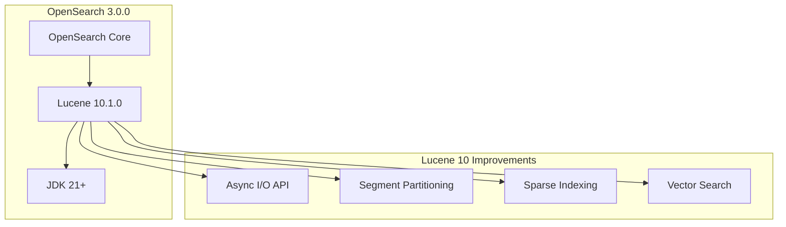

---
tags:
  - indexing
  - k-nn
  - performance
  - search
---

# Lucene 10 Upgrade

## Summary

OpenSearch 3.0.0 upgrades from Apache Lucene 9.x to Lucene 10.1.0, bringing significant performance improvements in I/O parallelism, search execution, and vector search capabilities. This major dependency upgrade is a key driver for the OpenSearch 3.0 release and requires JDK 21 as the minimum runtime version.

## Details

### What's New in v3.0.0

The upgrade to Apache Lucene 10 introduces several foundational improvements:

- **I/O Parallelism**: New API for asynchronous data fetching enables more efficient disk operations
- **Search Parallelism**: Logical partitions within segments replace segment grouping for parallel searches
- **Sparse Indexing**: Primary-key indexing organizes data into blocks with min/max values, allowing queries to skip non-relevant blocks
- **k-NN/Vector Search**: Improved parallelized execution and vector indexing optimizations

### Technical Changes

#### Architecture Changes



#### Key Version Changes

| Component | Previous | New |
|-----------|----------|-----|
| Apache Lucene | 9.12.1 | 10.1.0 |
| Minimum JDK | 11 | 21 |
| Build JDK | 17 | 21 |

#### API Changes

Lucene 10 introduces breaking API changes that affect OpenSearch internals:

- `TotalHits.value` changed to `TotalHits.value()` (field to method)
- `TotalHits.relation` changed to `TotalHits.relation()` (field to method)
- `TimeLimitingCollector` global timer methods removed
- `LUCENE_8_0_0` constant removed (use `Version.fromBits(8, 0, 0)`)

#### Removed Stemmers

The following Snowball stemmers were removed in Lucene 10:

| Stemmer | Status |
|---------|--------|
| `dutch_kp` / `kp` | Removed |
| `lovins` | Removed |
| `german2` | Merged into `german` |

#### Build System Changes

- Minimum compiler version: 21 (was 17)
- Minimum runtime version: 21 (was 11)
- CI matrix updated to test JDK 21 and 23 only
- Multi-release JAR support for Java 20+ removed (now baseline)
- Shadow plugin updated to `com.gradleup.shadow:shadow-gradle-plugin:8.3.5`

### Usage Example

No configuration changes required for end users. The Lucene upgrade is transparent at the API level, though plugin developers may need to update code that directly uses Lucene APIs.

```yaml
# opensearch.yml - no changes needed for Lucene 10
# Ensure JDK 21+ is installed
```

### Migration Notes

1. **JDK Requirement**: Upgrade to JDK 21 or later before upgrading to OpenSearch 3.0.0
2. **Index Compatibility**: Indices created with Lucene 9.x are compatible with Lucene 10
3. **Plugin Updates**: Plugins using Lucene APIs directly may require updates for API changes
4. **Stemmer Changes**: If using `dutch_kp`, `lovins`, or `german2` stemmers, migrate to alternatives

## Limitations

- Rolling upgrades from OpenSearch 2.x require careful planning due to JDK version requirements
- Some Snowball stemmers (`dutch_kp`, `lovins`) are no longer available
- Plugins compiled against Lucene 9.x APIs may need recompilation

## References

### Documentation
- [Lucene 10.0.0 Release Notes](https://cwiki.apache.org/confluence/display/LUCENE/Release+Notes+10.0.0): Official Lucene changelog
- [Lucene 10.1.0 Changes](https://lucene.apache.org/core/10_0_0/changes/Changes.html#v10.0.0): Detailed change log

### Blog Posts
- [OpenSearch 3.0 Blog](https://opensearch.org/blog/opensearch-3-0-what-to-expect/): Overview of 3.0 features and breaking changes

### Pull Requests
| PR | Description |
|----|-------------|
| [#16366](https://github.com/opensearch-project/OpenSearch/pull/16366) | Update to Apache Lucene 10 for 3.0.0 |

### Issues (Design / RFC)
- [Issue #11415](https://github.com/opensearch-project/OpenSearch/issues/11415): Feature request for Lucene 10 upgrade
- [Breaking Changes Guide](https://github.com/opensearch-project/opensearch-build/issues/5243): 2.x to 3.0 migration guide

## Related Feature Report

- [Full feature documentation](../../../features/opensearch/lucene-10-upgrade.md)
