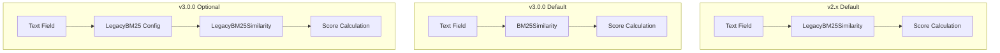

---
tags:
  - domain/core
  - component/server
  - indexing
---
# Lucene Similarity

## Summary

OpenSearch v3.0.0 changes the default similarity algorithm from `LegacyBM25Similarity` to Lucene's native `BM25Similarity`. This aligns OpenSearch with the upstream Lucene implementation and provides a cleaner, more standardized scoring approach. Users who need the previous behavior can explicitly configure `LegacyBM25` similarity.

## Details

### What's New in v3.0.0

The default similarity for text fields has been switched from OpenSearch's `LegacyBM25Similarity` to Lucene's `BM25Similarity`. This change:

- Adopts Lucene's modern BM25 implementation as the default
- Deprecates `LegacyBM25Similarity` while keeping it available for backward compatibility
- Introduces a new `LegacyBM25` similarity type for users who need the previous behavior

### Technical Changes

#### Architecture Changes



#### New Components

| Component | Description |
|-----------|-------------|
| `BM25Similarity` | Lucene's native BM25 implementation, now the default |
| `LegacyBM25` type | New similarity type to explicitly use the legacy implementation |

#### New Configuration

| Setting | Description | Default |
|---------|-------------|---------|
| `index.similarity.default.type` | Similarity algorithm for the index | `BM25` |
| `LegacyBM25` type | Use legacy BM25 implementation | N/A |

### Usage Example

To use the legacy BM25 similarity (previous default behavior):

```json
PUT /my-index
{
  "settings": {
    "index": {
      "similarity": {
        "default": {
          "type": "LegacyBM25",
          "k1": 1.2,
          "b": 0.75
        }
      }
    }
  },
  "mappings": {
    "properties": {
      "content": {
        "type": "text"
      }
    }
  }
}
```

To use the new default (Lucene BM25), no configuration is needed:

```json
PUT /my-index
{
  "mappings": {
    "properties": {
      "content": {
        "type": "text"
      }
    }
  }
}
```

### Migration Notes

- **New indexes**: Will automatically use `BM25Similarity` (Lucene's implementation)
- **Existing indexes**: Retain their configured similarity settings
- **Score differences**: While the core ranking behavior is similar, exact scores may differ slightly between implementations
- **Explicit configuration**: If you need consistent scoring with v2.x, explicitly set `LegacyBM25` as the similarity type

## Limitations

- Exact relevance scores may differ between `BM25Similarity` and `LegacyBM25Similarity`
- The `LegacyBM25Similarity` class is marked as deprecated and may be removed in future versions
- Mixed clusters during rolling upgrades may produce inconsistent scores if indexes use different defaults

## References

### Documentation
- [Similarity Documentation](https://docs.opensearch.org/3.0/field-types/mapping-parameters/similarity/): Official OpenSearch docs

### Pull Requests
| PR | Description |
|----|-------------|
| [#17306](https://github.com/opensearch-project/OpenSearch/pull/17306) | Use Lucene `BM25Similarity` as default |

### Issues (Design / RFC)
- [Issue #17315](https://github.com/opensearch-project/OpenSearch/issues/17315): Deprecate `LegacyBM25Similarity` and default to `BM25Similarity`
- [Lucene Issue #9609](https://github.com/apache/lucene/issues/9609): Related Lucene discussion

## Related Feature Report

- Full feature documentation
