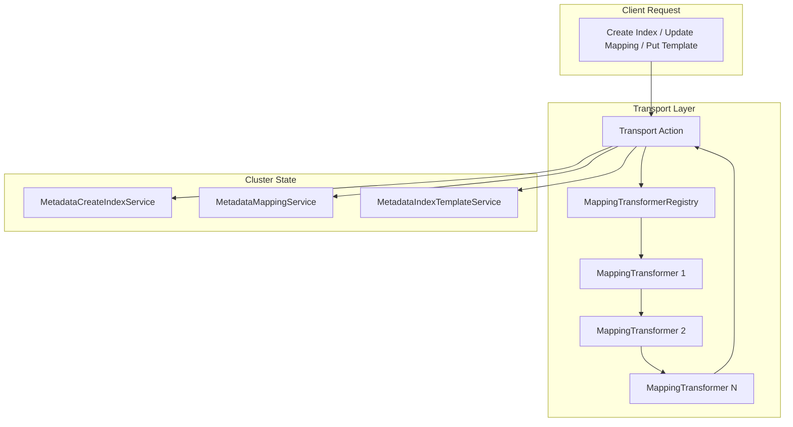
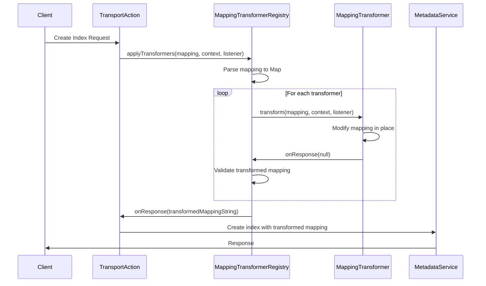

# Mapping Transformer

## Summary

OpenSearch 3.0.0 introduces the Mapping Transformer feature, a plugin extension point that allows plugins to transform index mappings during index creation/update and index template creation/update operations. This feature enables plugins to automatically generate or modify field mappings based on custom logic, simplifying complex setup workflows like neural search configuration.

## Details

### What's New in v3.0.0

The Mapping Transformer feature introduces a new extensibility mechanism in the OpenSearch core that allows plugins to intercept and transform index mappings at the transport layer before they are persisted.

### Technical Changes

#### Architecture Changes



#### New Components

| Component | Description |
|-----------|-------------|
| `MappingTransformer` | Interface for plugins to implement custom mapping transformation logic |
| `MappingTransformerRegistry` | Registry that collects and applies all registered transformers sequentially |
| `TransformContext` | Context object for future extensibility (currently empty, reserved for index settings, action type, etc.) |

#### New Plugin Extension Point

The `MapperPlugin` interface now includes a new method for registering mapping transformers:

```java
public interface MapperPlugin {
    // Existing methods...
    
    /**
     * Returns mapper transformer implementations added by this plugin.
     */
    default List<MappingTransformer> getMappingTransformers() {
        return Collections.emptyList();
    }
}
```

#### Supported Operations

The mapping transformer is applied to the following transport actions:

| Action | Class |
|--------|-------|
| Create Index | `TransportCreateIndexAction` |
| Put Mapping | `TransportPutMappingAction` |
| Put Index Template | `TransportPutIndexTemplateAction` |
| Put Component Template | `TransportPutComponentTemplateAction` |
| Put Composable Index Template | `TransportPutComposableIndexTemplateAction` |

### Usage Example

Plugins can implement the `MappingTransformer` interface to transform mappings:

```java
public class MyMappingTransformer implements MappingTransformer {
    @Override
    public void transform(
        final Map<String, Object> mapping,
        final TransformContext context,
        @NonNull final ActionListener<Void> listener
    ) {
        // Modify the mapping in place
        Map<String, Object> properties = (Map<String, Object>) mapping.get("properties");
        if (properties != null && properties.containsKey("my_custom_field")) {
            // Add generated fields based on custom field configuration
            properties.put("generated_field", Map.of("type", "keyword"));
        }
        listener.onResponse(null);
    }
}
```

Register the transformer in your plugin:

```java
public class MyPlugin extends Plugin implements MapperPlugin {
    @Override
    public List<MappingTransformer> getMappingTransformers() {
        return List.of(new MyMappingTransformer());
    }
}
```

### Processing Flow



### Error Handling

The `MappingTransformerRegistry` includes built-in error handling:

- Validates mapping JSON after each transformer to catch corruption early
- Identifies the faulty transformer if mapping becomes invalid
- Propagates transformer failures to the original request listener

## Limitations

- Transformers are applied sequentially, not in parallel
- The `TransformContext` is currently empty; future versions may include index settings and action type information
- Transformers modify mappings in place; there's no rollback mechanism if a later transformer fails
- No ordering guarantee between transformers from different plugins

## References

### Pull Requests
| PR | Description |
|----|-------------|
| [#17635](https://github.com/opensearch-project/OpenSearch/pull/17635) | Introduce mapping transformer to allow transform mappings during index create/update or index template create/update |

### Issues (Design / RFC)
- [Issue #17500](https://github.com/opensearch-project/OpenSearch/issues/17500): RFC - Introduce Mapping Transformer
- [Issue #803](https://github.com/opensearch-project/neural-search/issues/803): Proposal to support semantic field in neural search
- [Issue #1211](https://github.com/opensearch-project/neural-search/issues/1211): HLD of the semantic field

## Related Feature Report

- [Full feature documentation](../../../../features/opensearch/mapping-transformer.md)
