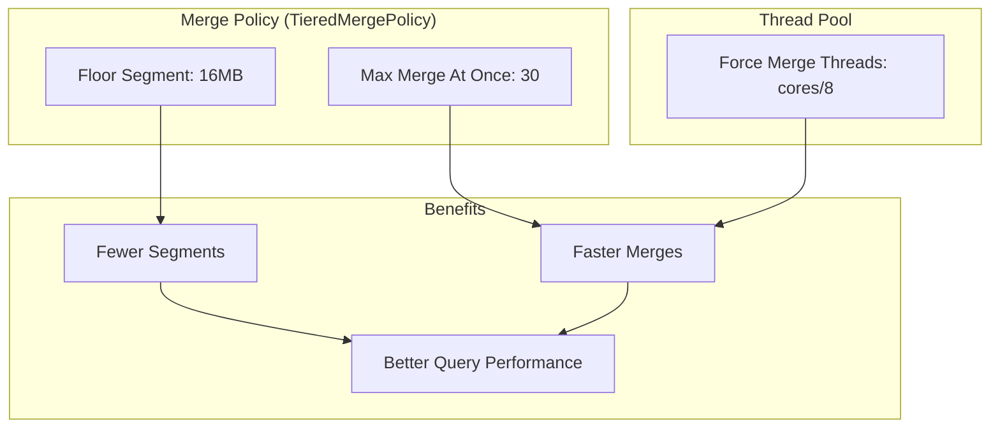

---
tags:
  - indexing
  - performance
  - search
---

# Merge & Segment Settings

## Summary

OpenSearch 3.0.0 introduces optimized default settings for segment merging, improving indexing performance out of the box. These changes align with recent Lucene recommendations and include increased floor segment size, higher max merge at once limit, and more force merge threads.

## Details

### What's New in v3.0.0

Three key merge-related defaults have been updated to improve indexing performance:

1. **Floor segment size increased from 2MB to 16MB** - Smaller segments are now merged more aggressively
2. **maxMergeAtOnce increased from 10 to 30** - More segments can be merged in a single operation
3. **Force merge thread pool scaled to 1/8th of CPU cores** - Force merge operations now utilize more CPU resources

### Technical Changes

#### Architecture Changes



#### New Configuration

| Setting | Old Default | New Default | Description |
|---------|-------------|-------------|-------------|
| `index.merge.policy.floor_segment` | 2MB | 16MB | Minimum segment size before merging |
| `index.merge.policy.max_merge_at_once` | 10 | 30 | Maximum segments merged in one operation |
| `cluster.default.index.max_merge_at_once` | N/A | 30 | New cluster-level setting for max merge at once |
| Force merge thread pool size | 1 | cores/8 (min 1) | Thread pool for force merge operations |

#### New Cluster Setting

A new dynamic cluster setting `cluster.default.index.max_merge_at_once` has been introduced:

- Allows cluster-wide tuning of the `maxMergeAtOnce` parameter
- Applies to all indexes without an explicit index-level override
- Can be updated dynamically without cluster restart
- Minimum value: 2

### Usage Example

```json
// Set cluster-level default for maxMergeAtOnce
PUT _cluster/settings
{
  "persistent": {
    "cluster.default.index.max_merge_at_once": 20
  }
}

// Override at index level if needed
PUT /my-index/_settings
{
  "index.merge.policy.max_merge_at_once": 15
}

// Remove index-level override to use cluster default
PUT /my-index/_settings
{
  "index.merge.policy.max_merge_at_once": null
}
```

### Migration Notes

- These are default value changes; existing indexes retain their current settings
- New indexes automatically use the optimized defaults
- No action required for most users
- Users who previously tuned these settings should evaluate if custom values are still needed

## Limitations

- Force merge thread pool size is calculated at node startup and cannot be changed dynamically
- The `cluster.default.index.max_merge_at_once` setting only affects indexes without explicit index-level overrides

## References

### Documentation
- [Index Settings Documentation](https://docs.opensearch.org/3.0/install-and-configure/configuring-opensearch/index-settings/): Official docs
- [Lucene PR #266](https://github.com/apache/lucene/pull/266): Lucene maxMergeAtOnce increase
- [Lucene PR #14189](https://github.com/apache/lucene/pull/14189): Lucene floor segment size increase

### Pull Requests
| PR | Description |
|----|-------------|
| [#17255](https://github.com/opensearch-project/OpenSearch/pull/17255) | Increase force merge threads to 1/8th of cores |
| [#17699](https://github.com/opensearch-project/OpenSearch/pull/17699) | Increase floor segment size to 16MB |
| [#17774](https://github.com/opensearch-project/OpenSearch/pull/17774) | Increase default maxMergeAtOnce to 30 and add cluster setting |

### Issues (Design / RFC)
- [Issue #17051](https://github.com/opensearch-project/OpenSearch/issues/17051): Increase maxMergeAtOnce parameter in OpenSearch 3.0
- [Issue #16935](https://github.com/opensearch-project/OpenSearch/issues/16935): OpenSearch 3.0 Core Release Tracker

## Related Feature Report

- [Full feature documentation](../../../features/opensearch/merge-segment-settings.md)
